# 数据资产与治理 — 测试报告 1/5：资产管理

> 本报告为"数据资产与治理"模块系列测试的第 1 份（共 5 份），覆盖**资产目录、资产概览、盘点上架、目录与标签** 4 个页面。总览与环境说明见 [00-汇总索引](数据资产与治理-测试报告0-汇总索引.md)。

| 项目 | 内容 |
|---|---|
| 测试日期 | 2026-10-01 |
| 测试账号 / 工作空间 | root / 默认空间 |
| 测试视口 | 1280 × 720 |
| 截图目录 | `docs/20261001/screenshots/`（a* 前缀） |

---

## 一、结论摘要

本组 4 个页面**主流程全部可用**，治理机制设计成熟度较高（上架预检、下架留痕、变更三态确认、规则试跑强制）。初测共发现 **3 个 P2 缺陷、2 个 P3 问题**。

> **修复状态（2026-10-01 晚）**：A1-01、A1-03、A3-01、A2-01 已修复并回归验证通过（见第六节）；G-A3 复测确认为自动化工具限制，非产品缺陷，撤销该项。

| 页面 | 主流程 | 问题 |
|---|---|---|
| 资产目录 /data-asset/catalog | ✅ | ~~A1-01 (P2)~~ 已修复、~~A1-03 (P2)~~ 已修复、~~G-A3 搜索清空~~ 非缺陷 |
| 资产概览 /data-asset/overview | ✅ | ~~A2-01 (P3)~~ 已修复 |
| 盘点上架 /data-asset/inventory | ✅ | ~~A3-01 (P2)~~ 已修复 |
| 目录与标签 /data-asset/taxonomy | ✅ | — |

---

## 二、缺陷清单

### A1-01 (P2)【已修复】资产目录点击资产行无任何详情反馈
- **复现**：资产目录 → 点击任意资产行（如"订单聚合天表"）。
- **实际**：仅行选中高亮，无详情面板/抽屉/跳转；用户无法查看资产详情（负责人、健康度构成、标签、血缘入口等），只能看行内展开的治理建议摘要。
- **建议**：行点击打开详情抽屉（"管目录不管内容"理念下，至少应展示台账字段全量与源域跳转）。
- **证据**：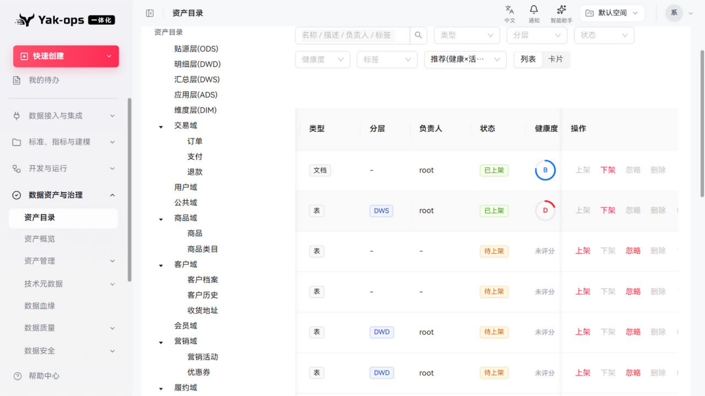
- **修复（2026-10-01）**：`catalog/index.tsx` 表格增加 `onRow` 点击跳转 `/data-asset/detail/{id}`（行内链接/按钮/勾选框/文本选择不触发），并加 `cursor-pointer`。回归：点击"订单表"行 → 跳转 `/data-asset/detail/15` ✅

### A1-03 (P2)【已修复】手工登记的资产无删除路径
- **复现**：资产目录 → 手工登记一个测试资产 → 尝试删除。
- **实际**："待上架"状态下"删除"按钮禁用；点击"忽略"（确认忽略成功，忽略按钮转为禁用）后"删除"仍禁用。错误登记的记录无法从台账清除，只能永久留痕（仅可忽略）。
- **建议**：为手工登记（manual:* 编码）资产提供"撤销登记"入口；或忽略态允许删除。物理表/模型等源域资产保持现有防误删策略合理。
- **证据**：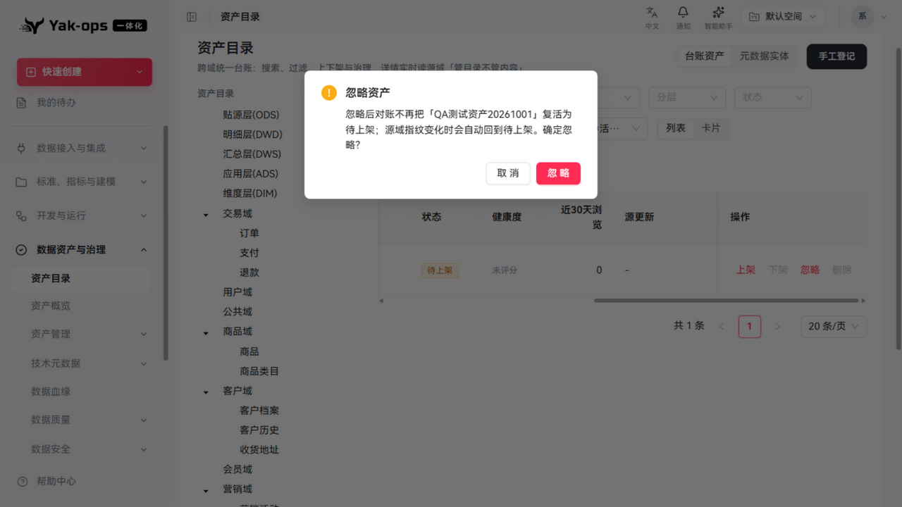、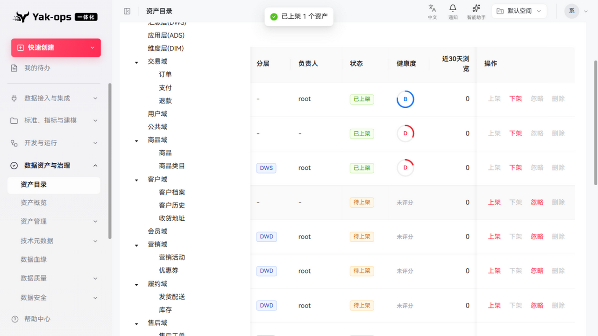
- **修复（2026-10-01）**：
  - 后端 `AssetAppService.delete`：新增 `MANUAL_DELETABLE_STATUS`（PENDING/OFFLINE/IGNORED）——手工登记无源域对象、不参与对账，不存在"源域仍存在"的误删风险；已上架仍须先下架。新增单测 4 项（PENDING/IGNORED 可删、PUBLISHED 须先下架、非手工 PENDING 仍拦截）。
  - 前端 `catalog/index.tsx`：删除按钮按 `isDeletable`（源类型+状态）判断可用，并补充删除确认弹窗（与忽略/下架的确认模式一致）。
  - 回归：MANUAL+IGNORED 资产删除成功（toast"已删除台账行"），测试残留数据一并清理 ✅

### A3-01 (P2)【已修复】变更确认"差异摘要"列显示空对象 "{}"
- **复现**：盘点上架 → 变更确认 tab。
- **实际**：差异摘要列全部显示字面量 `{}`，无任何差异信息；确认框文案"将用快照新值覆盖…展示字段"也无法说明具体变了什么。
- **建议**：渲染结构化差异（字段级 before → after），空差异显示"无字段变更（快照刷新）"。
- **证据**：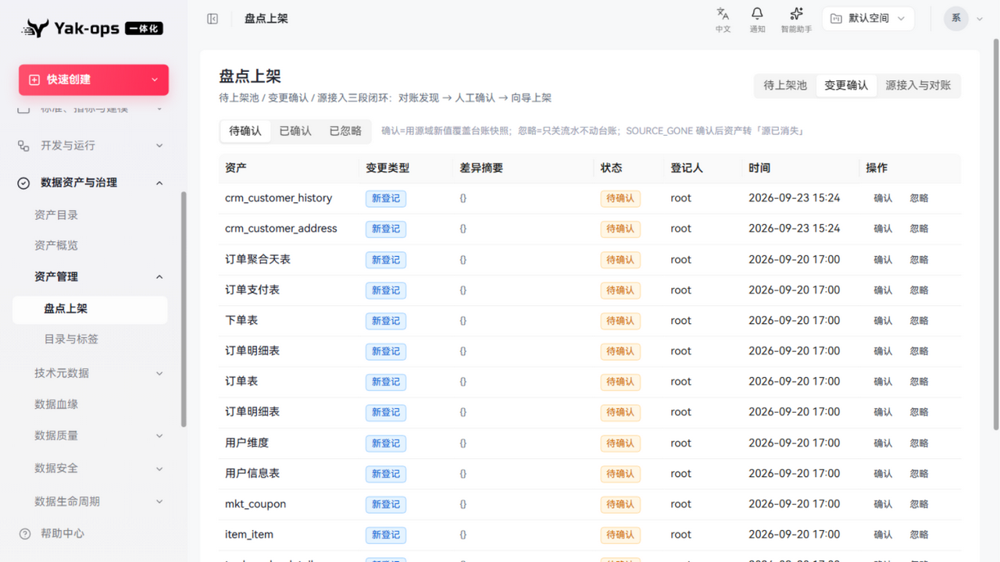
- **根因**：后端对 NEW/REAPPEARED 不落 diff（存 null），但 API 序列化把 null 归一成空对象 `{}`，前端空对象为 truthy 直接 `JSON.stringify`。
- **修复（2026-10-01）**：`constants.ts` 新增 `formatChangeDiff(changeType, diff)` 纯函数——按变更类型给出语义说明（NEW→"首次登记，无对比基线"、META_CHANGED 空 diff→"内容指纹变化，展示字段无差异"），有 diff 时渲染字段级"中文字段: 旧值 → 新值"（previousStatus/goneAt 走状态/时间翻译）；`inventory/index.tsx` 差异摘要列改用该函数 + Tooltip。新增单测 4 项。回归：新登记/元数据变化行均显示可读摘要 ✅ 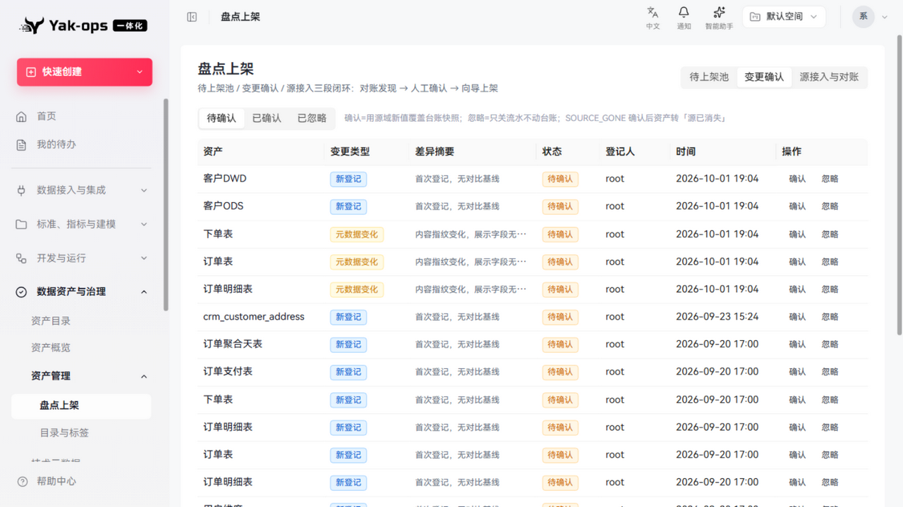

### A2-01 (P3)【已修复】概览分布图颜色语义不一致
- **实际**："按状态分布"四个状态条全部使用品牌粉色；而同页"按健康度分布"使用语义色（未评分=灰、D=红、B=蓝）。状态本身有语义（待上架=黄、已上架=绿、已忽略=灰），统一粉色削弱可读性。
- **证据**：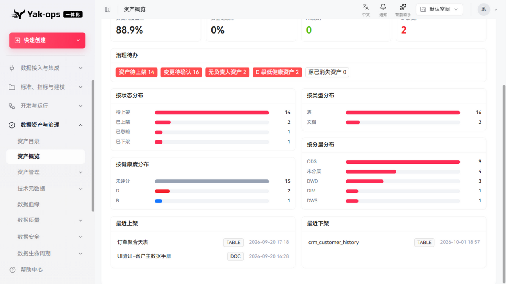
- **修复（2026-10-01）**：`constants.ts` 新增 `ASSET_STATUS_BAR_COLORS`（待上架橙/已上架绿/已下架灰/已忽略浅灰/源已消失红，与状态标签口径一致）；`overview/index.tsx` 状态分组改用语义色，类型/分层（无语义的分类维度）保留品牌色。新增单测 1 项。回归通过 ✅ 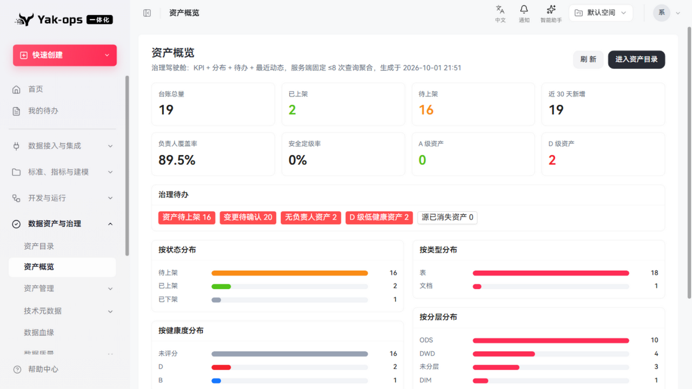

### G-A3 (P3)【复测撤项：非产品缺陷】搜索框编程清空后不触发刷新
- **初测现象**：脚本 `fill("")` 清空 + 点击搜索后仍显示旧关键字结果；使用输入框自带的 close-circle 清空按钮正常。
- **复测（2026-10-01）**：在资产目录实测四种方式——
  - `fill("")`：输入框值不变（自动化工具对 React 受控输入的清空限制）；
  - **逐字符退格 + 搜索按钮**：值清空、列表恢复全量（21 行）✅；
  - **allowClear X 按钮**：触发 onSearch 刷新，列表恢复全量 ✅；
  - antd Search 源码确认：X 清空走 `onSearch('', {source:'clear'})`，搜索按钮读取输入框实时值，两条用户路径均正确。
- **结论**：真实用户清空路径（X 按钮 / 键盘清空）均正常，初测观察为自动化工具限制。撤销该项，不修改产品代码。

---

## 三、通过项明细（含证据）

### 资产目录
- 台账资产/元数据实体双视图、左侧目录树（分层+业务域）、5 组筛选 + 排序 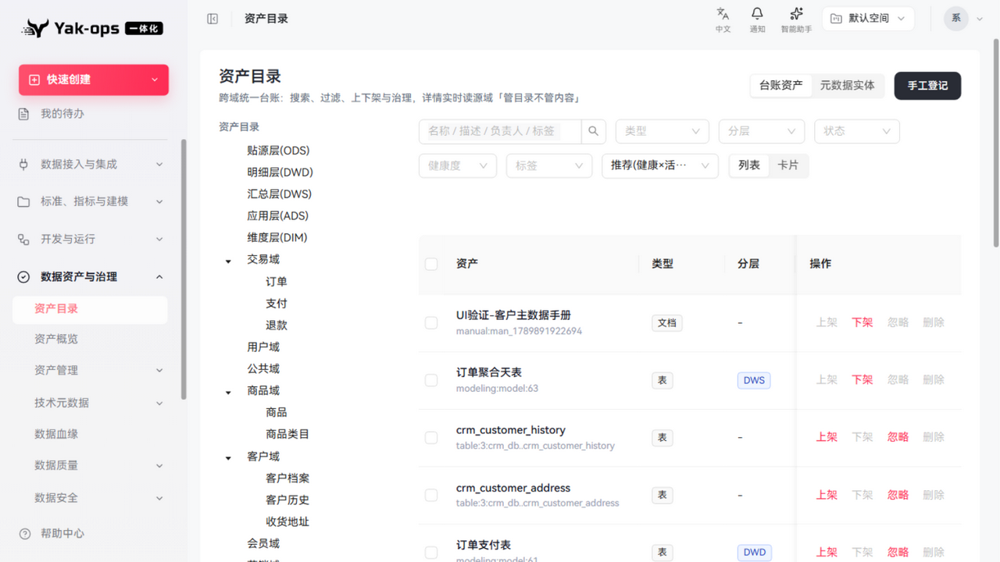
- 行内治理建议摘要（缺负责人/未入目录/建议安全定级）随 hover 展开
- **上架预检（亮点）**：对待上架资产点上架 → 预检发现 3 个缺口 → 支持就地补齐（负责人默认当前用户、目录树选择）→ "应用补齐并重检"后"未入目录"缺口消除 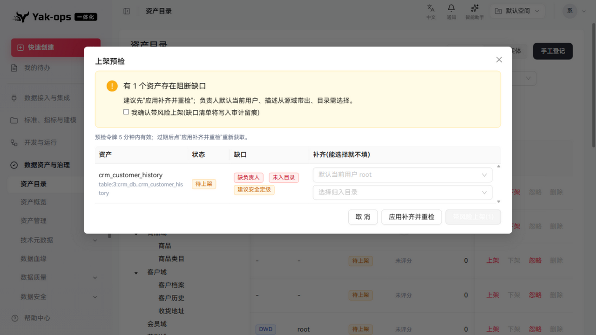、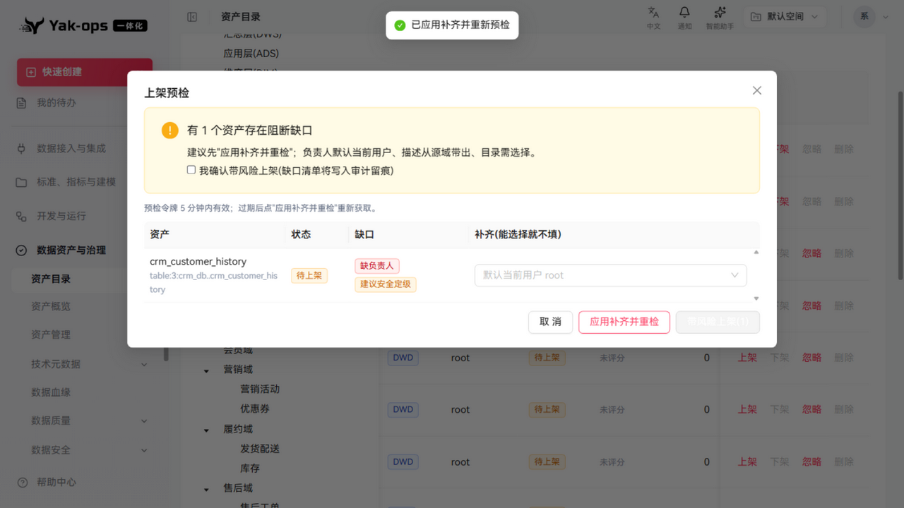
- **带风险上架（亮点）**：勾选"我确认带风险上架(缺口清单将写入审计留痕)"后可强制上架，toast"已上架 1 个资产" 
- **下架留痕**：下架必须填原因（必填、写入台账与审计）（见 t 前缀截图 a1_catalog_shelf_confirm）
- 状态机正确：已上架资产的"上架"按钮禁用、"下架"可用
- **手工登记**：表单完整（编码自动生成 manual:{code}、类型/负责人/访问入口/分层/目录），登记成功且可搜索到 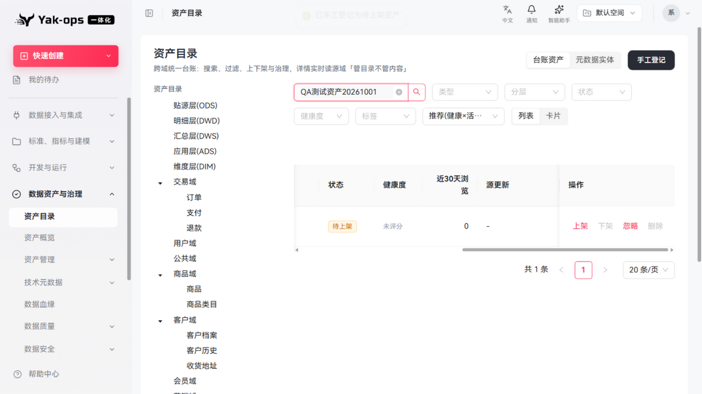
- 卡片视图正常渲染 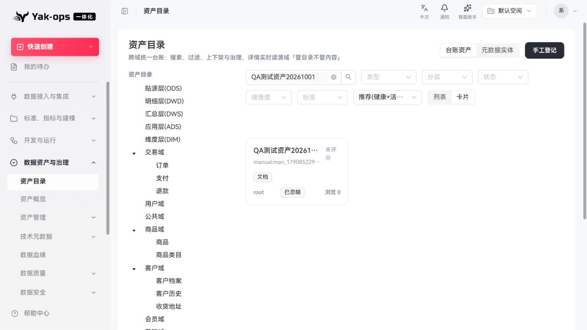
- 测试数据：QA测试资产20261001 已登记→忽略（无法删除，见 A1-03，残留 1 条已忽略记录）

### 资产概览
- 8 个 KPI（台账总量18/已上架2/待上架14/新增18/负责人覆盖率88.9%/安全定级率0%/A级0/D级2）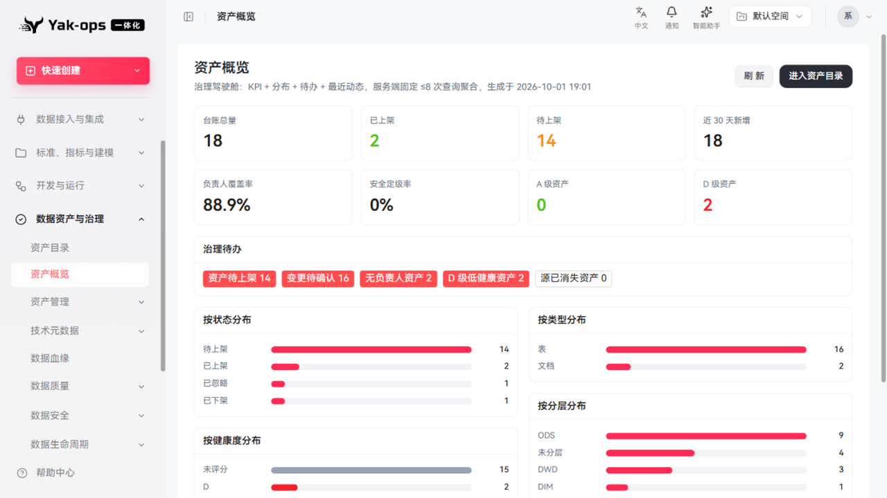
- 治理待办 5 类标签（资产待上架14、变更待确认16、无负责人2、D级低健康2、源已消失0）
- 分布图 4 组（状态/类型/分层/健康度）+ 最近上架/最近下架动态实时反映测试操作（下架的 crm_customer_history 出现在"最近下架"）

### 盘点上架
- 三段闭环（待上架池/变更确认/源接入与对账）描述清晰 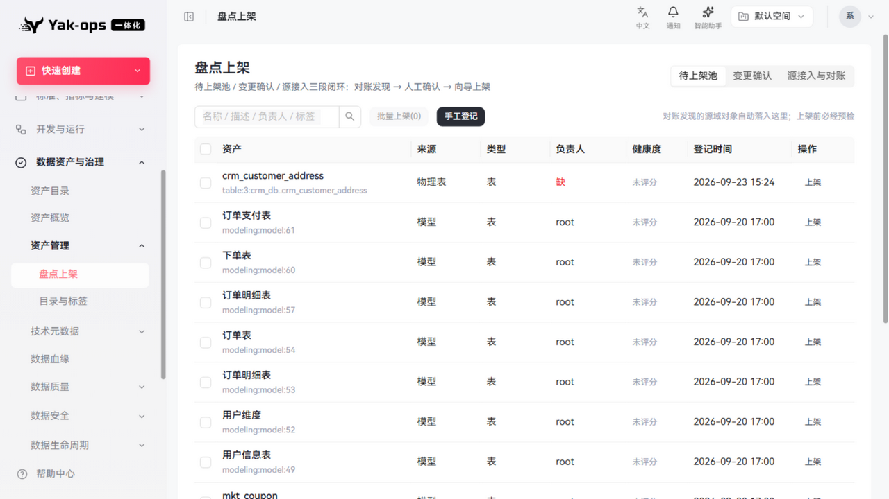
- 待上架池：来源标记（物理表/模型）、批量上架（0时禁用）、手工登记入口
- **变更确认（亮点）**：待确认/已确认/已忽略三态 + 规则说明（确认=覆盖快照、忽略=只关流水、SOURCE_GONE 转源已消失）；确认操作带确认框，成功后记录进入"已确认"且操作变"已处理" 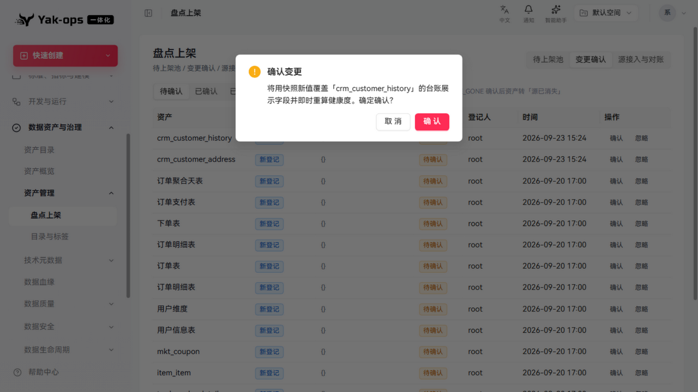、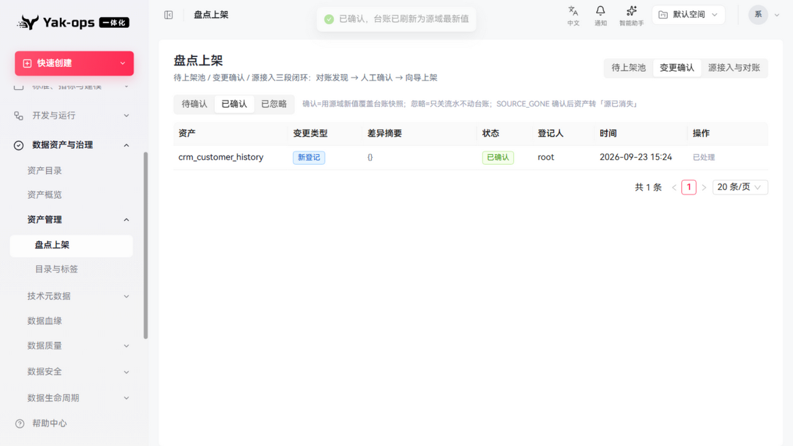
- **源接入与对账（亮点）**：8 个来源域的注册状态/支持Section/最近对账/扫描统计；"对账此源"异步受理（toast"对账已受理,后台执行中"）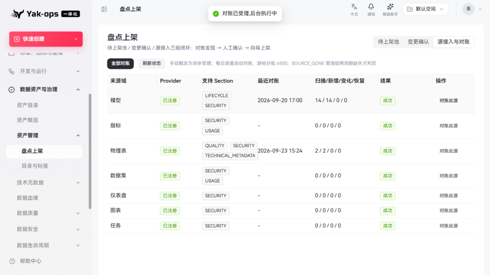

### 目录与标签
- 目录树/编目规则/标签字典三 tab 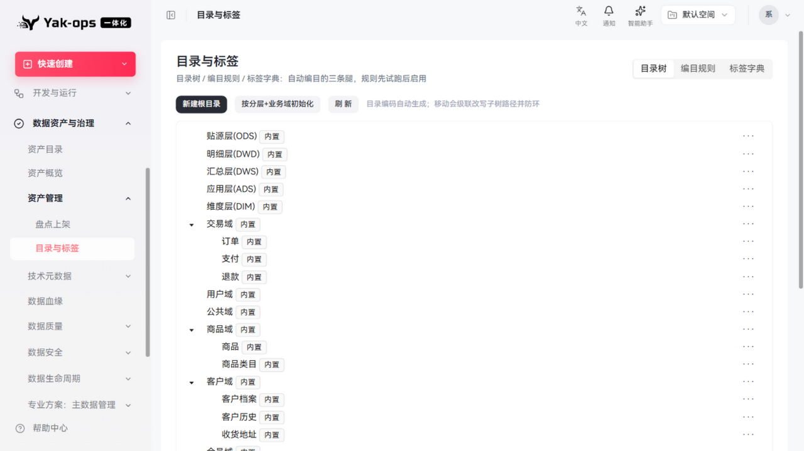
- 新建根目录（编码自动生成）→ 树即时更新 → 通过节点"···"菜单删除（非空目录拒绝）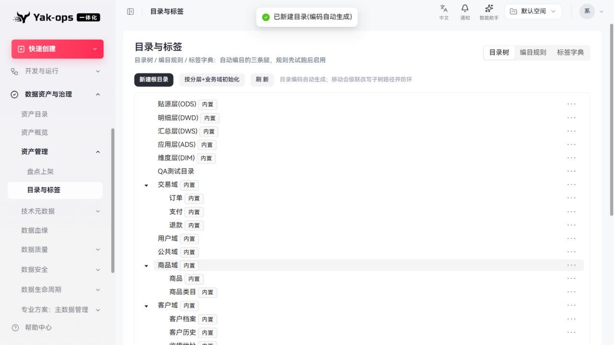
- **编目规则（亮点）**："规则必须试跑后才可启用(D10)"治理约束；试跑输出命中资产样例（命中20个，样例≤50）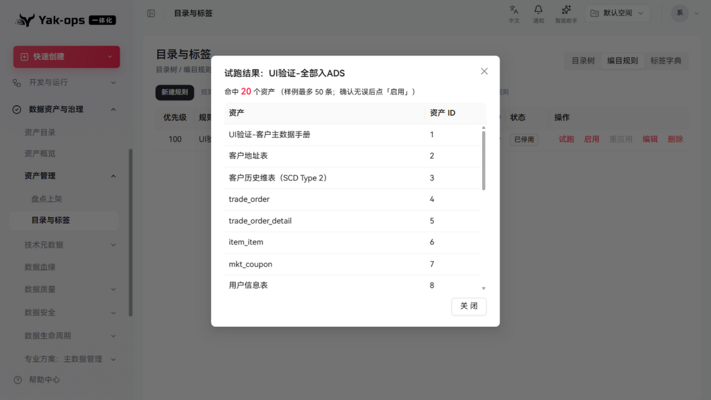
- 标签字典：预置标签展示、新建/编辑/删除 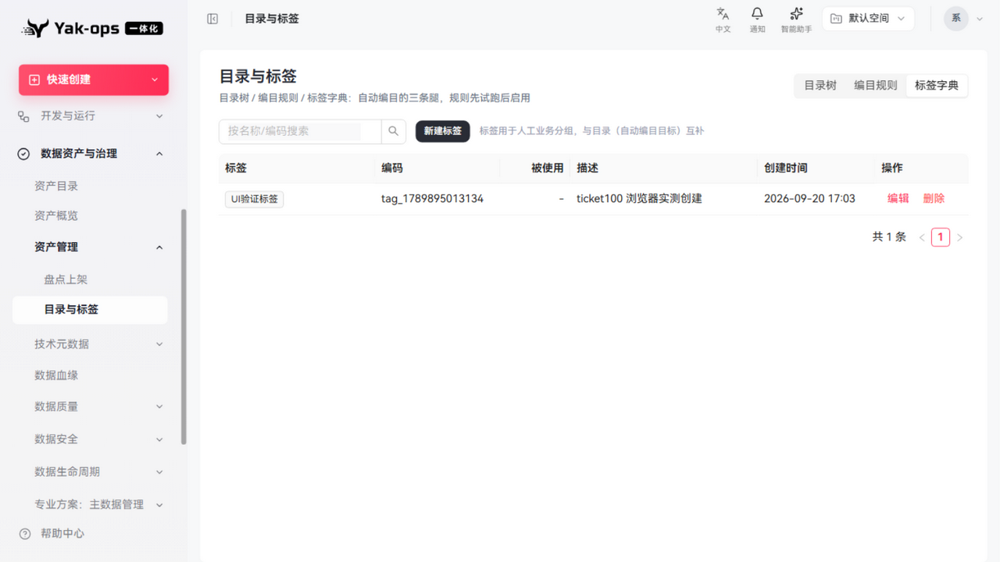

---

## 四、改进建议

1. ~~资产目录行点击接入详情抽屉~~（A1-01 已修复：行点击直达详情页）
2. ~~差异摘要结构化渲染（A3-01）~~（已修复：字段级中英文标签渲染）
3. 概览分布图统一色彩语义规范（A2-01 已修复状态组；类型/分层为无语义分类维度，保留品牌色合理）
4. ~~为 manual:* 资产提供撤销登记（A1-03）~~（已修复：未上架手工登记可删）
5. 健康分只展示结果不展示构成，建议详情页点击健康环查看扣分项

## 五、修复验证记录（2026-10-01）

| 项 | 修复方式 | 验证 |
|---|---|---|
| A1-01 | 前端 `catalog/index.tsx` 表格 `onRow` 点击跳详情（行内交互元素不触发） | 浏览器回归：点击"订单表"行 → `/data-asset/detail/15` ✅ |
| A1-03 | 后端 `AssetAppService` 放行未上架手工登记删除（新增 `MANUAL_DELETABLE_STATUS`）；前端删除按钮按源类型+状态启用并补确认弹窗 | 后端单测 17 项通过；浏览器回归：MANUAL+IGNORED 资产删除成功 ✅ |
| A3-01 | 前端 `constants.ts` 新增 `formatChangeDiff` 纯函数 + `inventory/index.tsx` 摘要列改用 | 前端单测 7 项通过；浏览器回归：`{}` 全部变为可读摘要 ✅ |
| A2-01 | 前端 `constants.ts` 新增 `ASSET_STATUS_BAR_COLORS` + `overview/index.tsx` 状态组语义色 | 浏览器回归：待上架橙/已上架绿/已下架灰 ✅ |
| G-A3 | 撤项（复测确认为自动化工具限制，X 按钮与键盘清空路径均正常） | 浏览器实测 4 种清空方式 ✅ |

**测试影响面**：
- 后端：`AssetAppServiceTest` 17 项 + 资产模块全套 150 项测试通过；`data-ops-boot` 已重新打包并重启（21:41 启动成功）。
- 前端：`constants.test.ts` 7 项通过；`tsc --noEmit` 资产模块 0 错误；biome 无新增告警。
- 残留测试数据：手工登记资产"QA测试资产20261001"已通过新删除入口清理（修复验证的一部分）。
