# 数据资产与治理 — 测试报告 2/5：元数据与血缘

> 本报告为系列第 2 份（共 5 份），覆盖**元数据概览、采集与对账、数据血缘** 3 个页面。总览与环境说明见 [00-汇总索引](数据资产与治理-测试报告0-汇总索引.md)。

| 项目 | 内容 |
|---|---|
| 测试日期 | 2026-10-01 |
| 测试账号 / 工作空间 | root / 默认空间 |
| 测试视口 | 1280 × 720 |
| 截图目录 | `docs/20261001/screenshots/`（m* 前缀） |

---

## 一、结论摘要

本组 3 个页面**主流程全部可用，未发现功能缺陷**；元数据采集的 dry-run 预演、运行历史、状态感知提示设计成熟。数据血缘图存在与模型工作台血缘同源的布局问题（M3-01，P3）。

> **修复状态（2026-10-01 晚）**：M3-01 已修复并回归验证通过（见第四节）；本组无遗留问题。

| 页面 | 主流程 | 问题 |
|---|---|---|
| 元数据概览 /data-metadata/overview | ✅ | — |
| 采集与对账 /data-metadata/collect | ✅ | — |
| 数据血缘 /data-analysis/lineage | ✅ | ~~M3-01 (P3)~~ 已修复 |

---

## 二、问题清单

### M3-01 (P3)【已修复】数据血缘图下游节点单列垂直堆叠
- **复现**：数据血缘 → 搜索"订单" → 选择"订单支付表"。
- **实际**：血缘图将 18 个下游节点垂直堆叠成一长列，需要大量滚动才能看全；左侧留白大。与模型工作台模型血缘（T6-02）为同一布局组件，属于全局性问题。
- **建议**：采用分层 DAG 布局（按深度分层横向展开）；节点聚合（同层同类型折叠显示 "+12 更多"）。
- **证据**：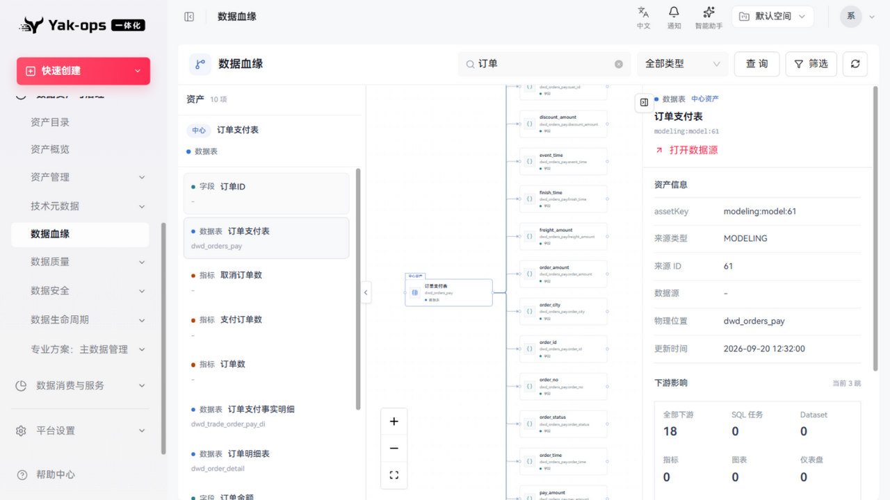
- **根因**：`features/lineage/graph-layout.ts` 同层节点恒用 108px 行距，18 个节点产生 1944px 内容高度；而数据血缘页 `fitViewOptions.minZoom` 为 0.5，缩放下限把整图夹住 → 节点被裁切、整图偏居画布右侧。同层节点原按"类型+名称"排序，与连接关系无关，深层图出现长边交叉。
- **修复（2026-10-01）**：共享布局组件 `features/lineage/graph-layout.ts`（数据血缘/模型血缘/指标血缘/Dataset/SQL 血缘五处共用）——
  1. 新增 `levelVerticalGap(count)`：单层内容高度超过 1240px 时按行距下限 92px（节点卡 78px + 14px 间距）压缩，避免重叠且控制整图高度；
  2. 新增 `reduceCrossings()`：两轮重心（barycenter）扫描，把连向同一父节点的子节点聚拢，减少长边交叉；
  3. `LineageWorkspace.tsx` 的 `fitViewOptions.minZoom` 由 0.5 对齐到画布 `minZoom` 0.22。
- **回归**：数据血缘（18 个下游整图完整呈现、无需滚动）✅、模型血缘 tab（下游 19 完整）✅、指标血缘（无回归）✅；新增单测 2 项（行距压缩下限 + 重心排序对齐父子序），布局套件 5 项全绿。
- **证据**：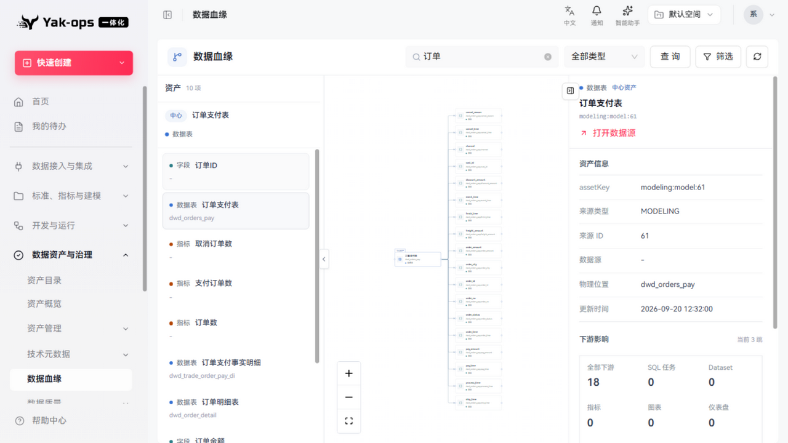、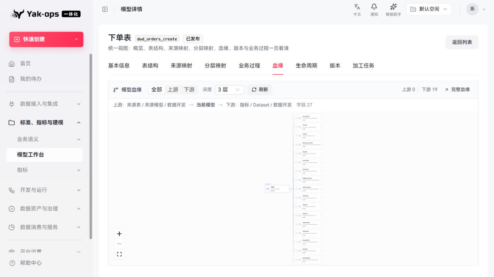

---

## 三、通过项明细（含证据）

### 元数据概览
- 4 个 KPI（目录实体 53、采集任务 2、近5次异常运行 0、未办结治理待办 0）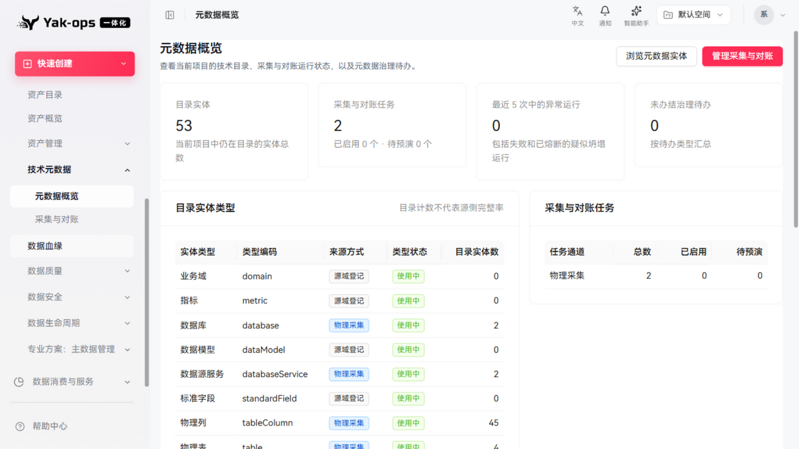
- 目录实体类型清单：11 种类型（domain/metric/database/dataModel/tableColumn 等），标注来源方式（源域登记/物理采集）与类型状态
- **"浏览元数据实体"跳转统一检索页（亮点）**：类型 tab 下钻（全部8/数据库2/物理表4…）+ 跨类型搜索 + explain 开关 + 高级筛选 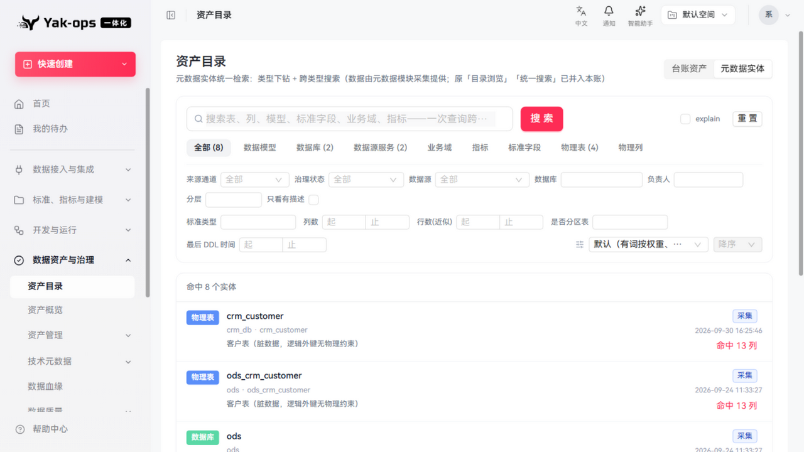
- 搜索"crm"命中 5 个实体，类型 tab 计数联动正确 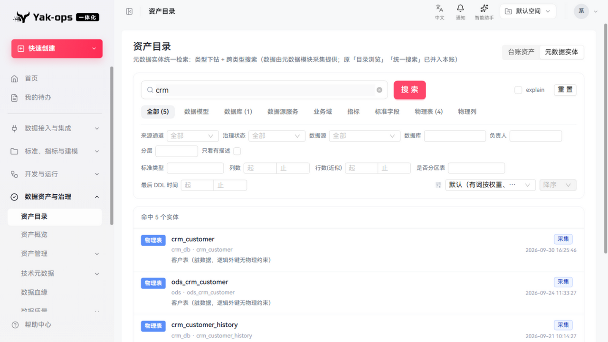

### 采集与对账
- 任务列表：2 个物理采集任务，通道/作用域/Cron/状态清晰 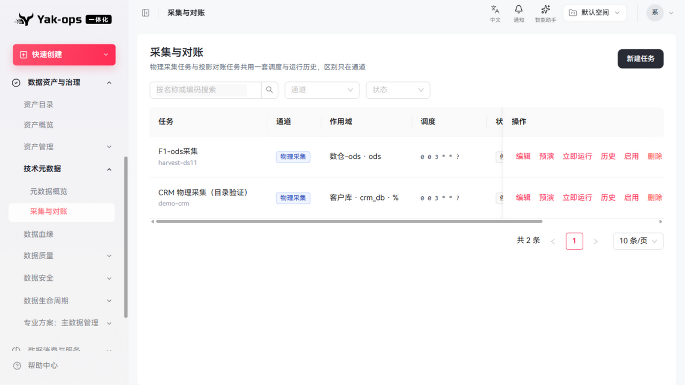
- **dry-run 预演（亮点）**：输出"共 37 · 新增 0 · 变更 0 · 未变 37"、耗时 188ms，toast"预演通过,现在可以启用该任务"——先预演后启用的安全流程 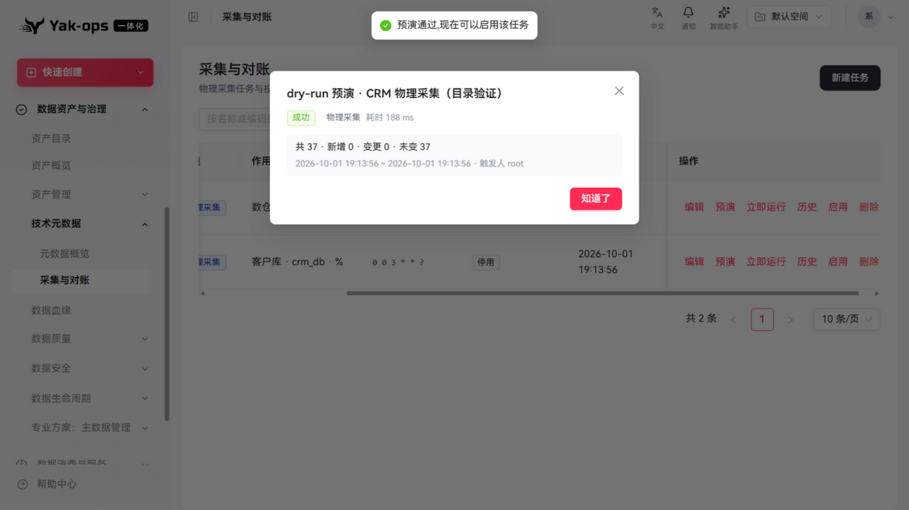
- **运行历史（亮点）**：抽屉展示 4 条历史（触发方式/状态/计数/耗时/操作人），且顶部提示"该任务当前停用，定时通道不会触发"——状态感知 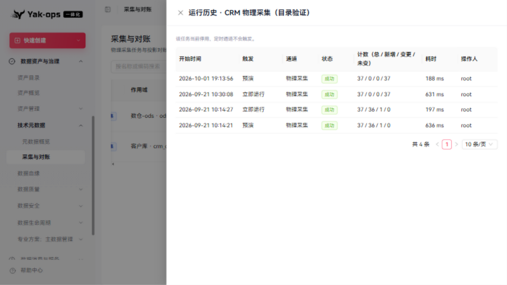
- 操作组完整：编辑/预演/立即运行/历史/启用/删除

### 数据血缘
- 空状态有品牌插画与引导文案 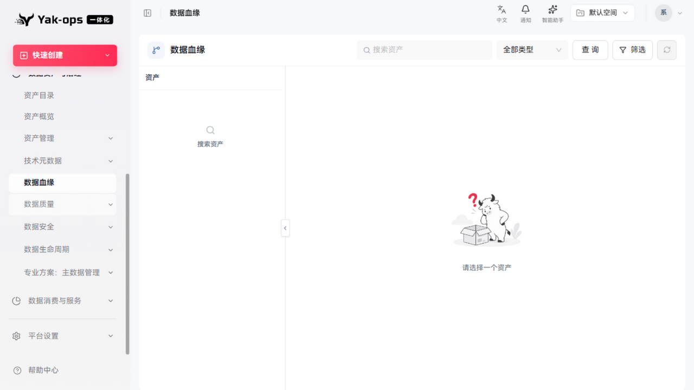
- 资产搜索：需输入关键词后点"查询"（无输入即查的即时搜索），返回多类型结果（字段/数据表/指标/数据集），每项带类型色标 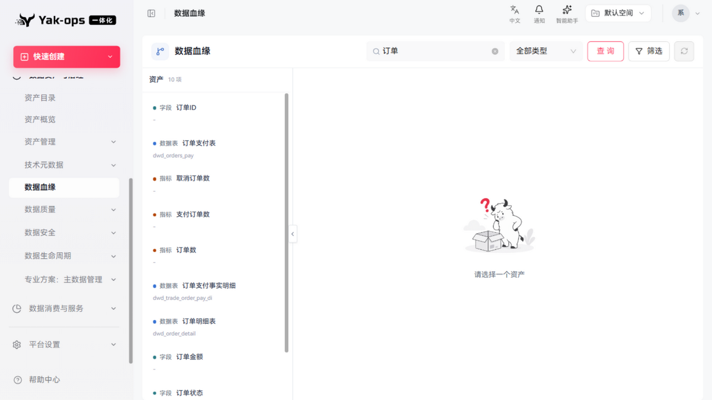
- 选中"订单支付表"后：左侧资产树展开其字段、中间血缘图、右侧详情面板（assetKey/来源类型 MODELING/来源ID/物理位置/更新时间）+ 下游影响统计（全部下游18/SQL任务0/Dataset0/指标0/图表0/仪表盘0）+ "打开数据源"跳转 

---

## 四、改进建议

1. ~~血缘图布局重构（分层 DAG），并与模型工作台、指标血缘统一组件~~（M3-01 已修复：统一布局组件增加行距压缩 + 重心排序，三处血缘共用生效）
2. 资产搜索支持输入即搜（防抖），减少一次"查询"点击。
3. "来源数据源：-"（订单支付表无数据源归属）建议在详情面板给出补录入口提示。
4. 超宽扇出（同层 >50 节点）可进一步做节点聚合（同类型折叠为 "+N 更多"），当前压缩已能整图呈现但单节点偏小。
