# 数据资产与治理 — 测试报告 3/5：数据质量

> 本报告为系列第 3 份（共 5 份），覆盖**质量总览、数据表监控、质量检查记录、规则模板** 4 个页面。总览与环境说明见 [00-汇总索引](数据资产与治理-测试报告0-汇总索引.md)。

| 项目 | 内容 |
|---|---|
| 测试日期 | 2026-10-01 |
| 测试账号 / 工作空间 | root / 默认空间 |
| 测试视口 | 1280 × 720 |
| 截图目录 | `docs/20261001/screenshots/`（q* 前缀） |
| 测试产生数据 | 注册表 crm_customer + 监控"QA监控-客户表行数检查"(ID 4) + 规则"表行数"(ID 6)；**已于 2026-10-02 通过新增的注销入口全部清理**（见 Q2-03 修复） |

---

## 一、结论摘要

数据质量是本模块**完成度最高的子系统**：注册表 → 建监控（四区块向导）→ 从模板加规则 → 测试运行 → 检查记录 → 详情报告的完整闭环全部走通，检查执行真实落库（61ms，通过）。初测发现 **1 个 P2、3 个 P3** 问题。

> **修复状态（2026-10-02）**：Q2-03、Q2-02、Q2-01、Q1-01 均已修复并回归验证通过（见第五节）；本组无遗留问题。测试残留数据（注册表/监控/规则）已通过新入口清理完毕。

| 页面 | 主流程 | 问题 |
|---|---|---|
| 质量总览 /data-quality/overview | ✅ | ~~Q1-01 (P3)~~ 已修复 |
| 数据表监控 /data-quality/table-config | ✅ | ~~Q2-01 (P3)~~、~~Q2-02 (P3)~~、~~Q2-03 (P2)~~ 已修复 |
| 质量检查记录 /data-quality/execution | ✅ | — |
| 规则模板 /data-quality/rule-template | ✅ | — |

---

## 二、缺陷清单

### Q2-03 (P2)【已修复】注册数据表后无"注销/移除"入口
- **复现**：数据表监控 → 注册数据表（选 crm_customer）→ 注册成功 → 查看该行操作。
- **实际**：操作列只有"新增监控 / 规则管理"，无注销/移除；误注册的表无法从监控列表移除。注册产生的监控与规则同样无删除入口（规则管理页仅见"测试运行/···"）。
- **影响**：测试或误操作产生的监控配置永久残留，长此以往监控列表会成为垃圾场（本环境已残留 1 表 + 1 监控 + 1 规则 + 1 条执行记录）。
- **建议**：提供"注销数据表"（级联确认其监控/规则）与监控/规则的删除能力。
- **证据**：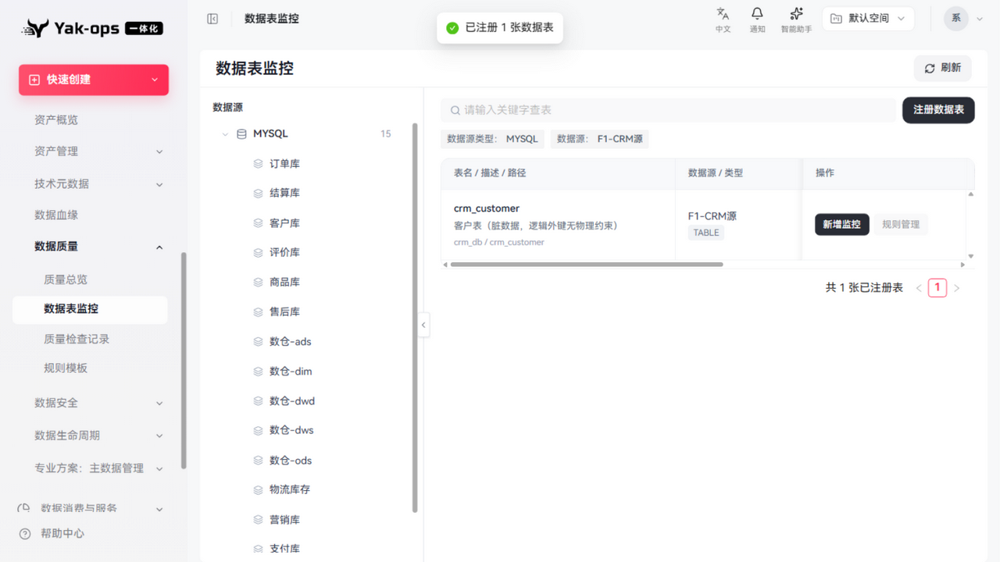
- **根因**：后端 `DELETE /quality/table-assets/{id}`（`QualityTableAssetManager.unregister`，含"已被监控使用则拒绝"保护）与前端 API `deleteQualityTableAsset` **均已存在，但从未被任何页面调用**——纯前端漏接线。
- **修复（2026-10-02）**：
  - 数据表监控操作列新增"取消注册"，接线到已有 API；`monitorCount > 0` 时按钮 hover 提示并给出引导 toast（"该表已配置 N 个监控，请先删除监控后再取消注册"），避免让后端抛错；成功后刷新列表。
  - 监控删除入口经核查已存在（监控详情页"更多操作 → 删除质量监控"，带确认框"删除后将保留历史执行记录"）；规则删除已存在（编辑监控 → 规则行"删除"）。初测未发现，属入口较深，非功能缺失。
- **回归**：crm_customer（含 1 监控）点击取消注册 → 正确拦截并提示；删除监控后再次取消注册 → 成功（toast"已取消注册「crm_customer」"），列表回到空态。测试残留数据一并清理 ✅
- **证据**：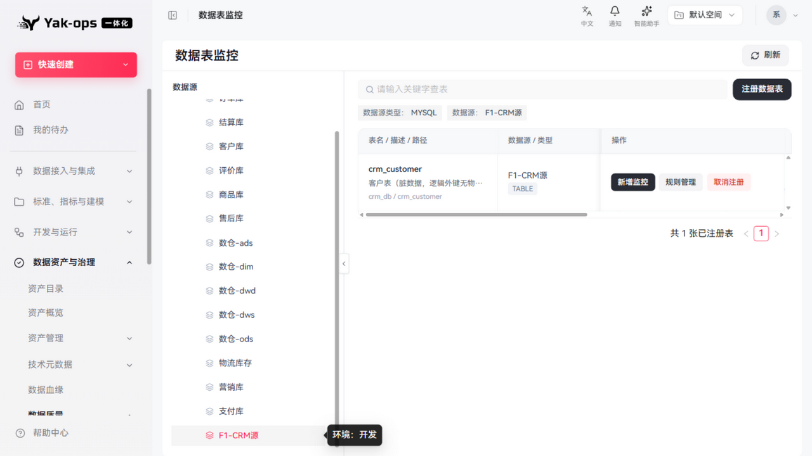、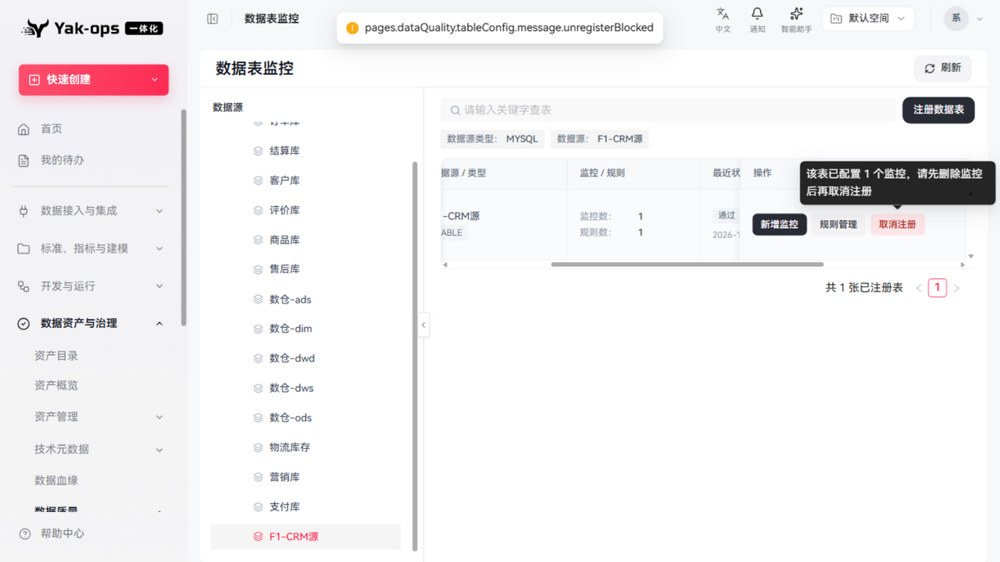、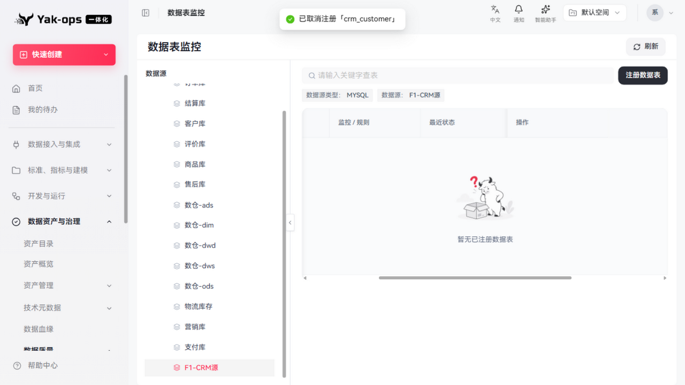

### Q2-02 (P3)【已修复】添加规则后"已选择 N 条"计数不刷新
- **复现**：新增监控 → 添加规则 → 选择"表行数"模板 → 确定添加。
- **实际**：规则表格已显示 1 条规则，但上方计数仍为"已选择 0 条"。
- **证据**：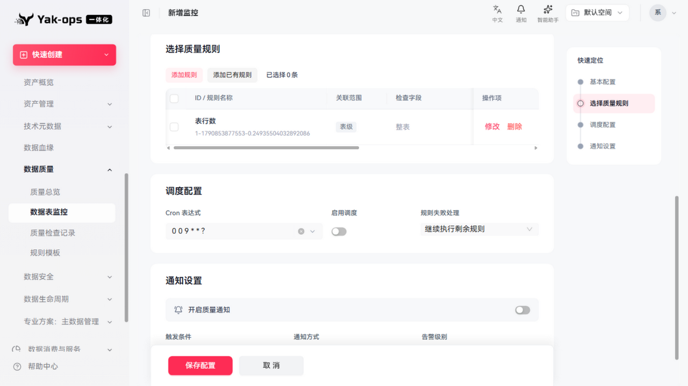
- **根因**：该计数绑定的是表格勾选框 `selectedRowKeys`，而勾选列**没有任何批量操作消费它**（无批量删除等），因此计数永远与"已添加规则数"无关，语义误导。
- **修复（2026-10-02）**：移除无语义的勾选列与该计数，改为显示真实的"共 N 条规则"（随增删即时更新）。抽屉内"已选择 N 条规则"计数保持不变。
- **回归**：编辑监控 → 规则区显示"共1条规则"（与实际 1 条一致）✅ 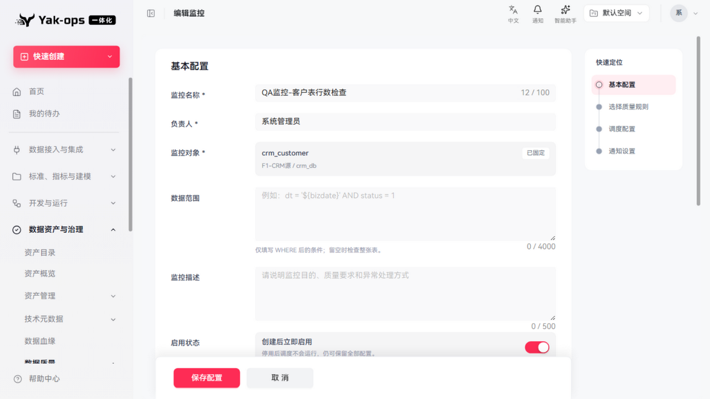

### Q2-01 (P3)【已修复】规则模板树展开时文本出现蓝色选中高亮
- **复现**：新增监控 → 添加规则 → 双击/点击展开"完整性"分类。
- **实际**：模板节点"表行数 TABLE_ROW_COUNT / 字段非空 COLUMN_NOT_NULL"文字出现浏览器默认的蓝色选中样式（文本被拖选），视觉异常。
- **证据**：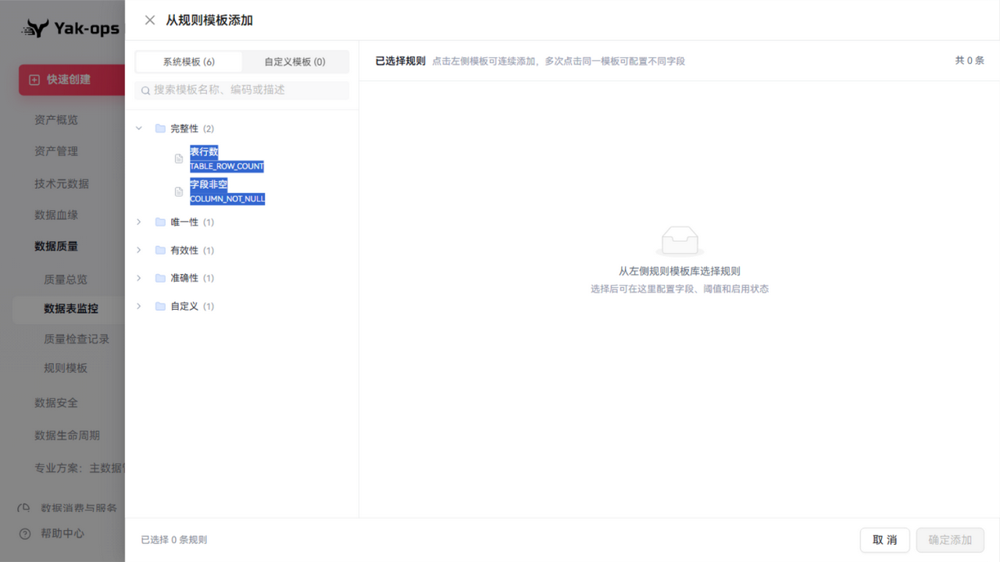
- **修复（2026-10-02）**：规则模板 `Tree` 根节点加 `select-none`（`user-select` 可继承，覆盖全部节点标题）；先试的 per-node 任意变体类未生效（Tailwind 未生成该组合类），故改用根节点方案。
- **回归**：展开分组后双击叶子节点 → 选中文本为空（无高亮）✅ 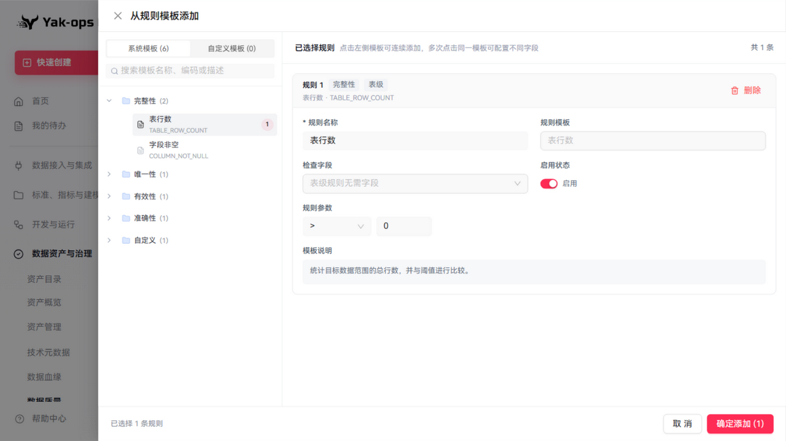

### Q1-01 (P3)【已修复】五维雷达图在数据稀疏时退化
- **实际**：当前仅"完整性"有执行数据（100%），其余四维"暂无执行数据"——雷达图退化为单点，五个维度卡片四个显示"--"。
- **建议**：无数据维度从雷达图中淡出或虚线示意；卡片聚合为"2/5 维度已启用检测"之类摘要。
- **证据**：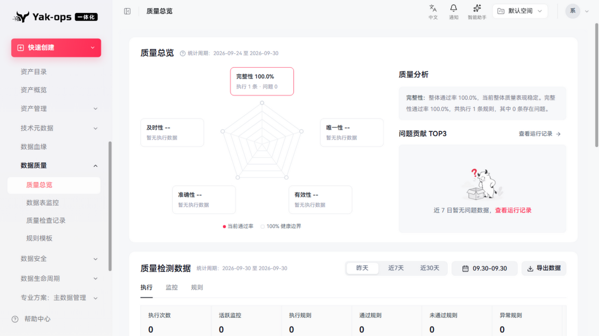
- **根因**：`hasCompleteRadar` 要求五维齐全才绘制面积——该约束本身合理（缺维度按 0 会误读为"质量差"），但缺少"为什么没有面积"的解释，界面看起来像坏了。
- **修复（2026-10-02）**：保留"五维齐全才画面积"的诚实语义，补齐可解释性与视觉区分——
  1. 有数据的维度轴点用品牌色实心高亮，无数据维度保持灰色空心；
  2. 图例下方按情况给出说明："仅 N/5 个维度有检测数据，五维齐全后展示雷达面积"或"暂无任何维度的检测数据…"。
- **回归**：质量总览显示"仅 1/5 个维度有检测数据，五维齐全后展示雷达面积"，完整性轴点高亮 ✅ 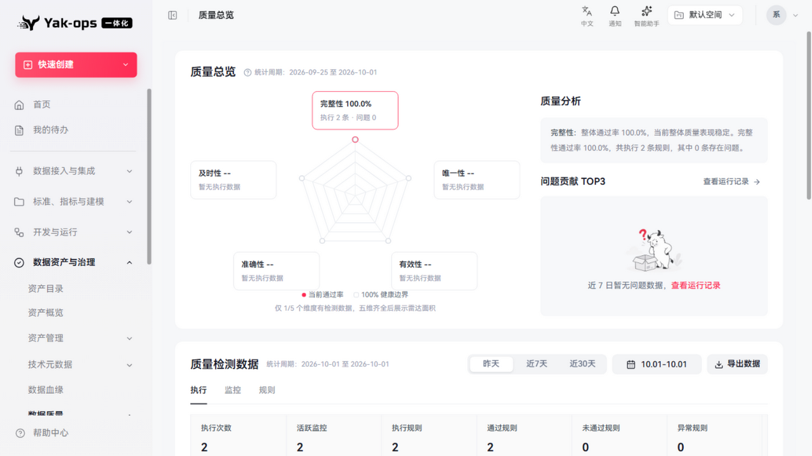

---

## 三、通过项明细（含证据）

### 质量总览
- 统计周期说明（2026-09-24 至 2026-09-30，每天12点更新）
- 五维雷达 + 各维卡片（完整性 100.0%、执行1条、问题0）
- 质量分析卡（整体通过率 100% 说明文案）+ 问题贡献 TOP3（空态引导"查看运行记录"）
- 质量检测数据：执行/监控/规则 tab + 昨日/近7天/近30天切换 + 导出数据 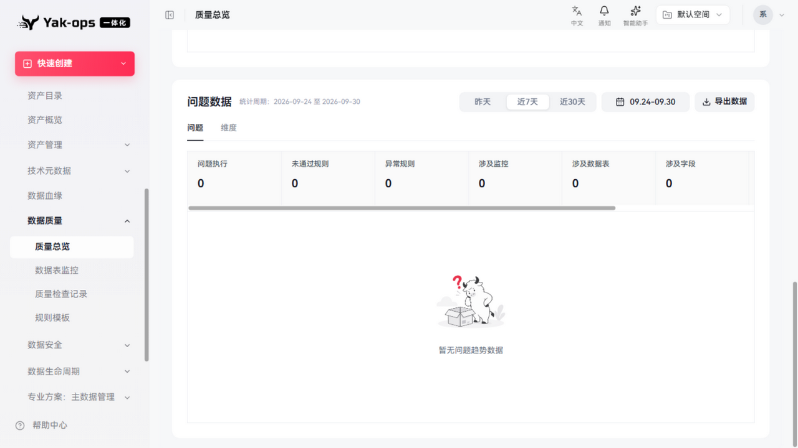
- 问题数据：6 指标卡 + 趋势空态

### 数据表监控
- 左侧数据源树（15个数据源）+ 右侧已注册表列表 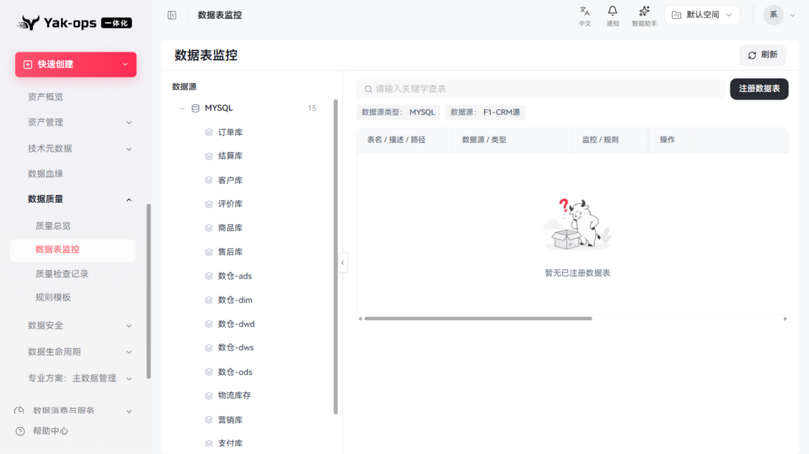
- **注册数据表（穿梭框）**：可注册表 3 张、已选择区、批量注册 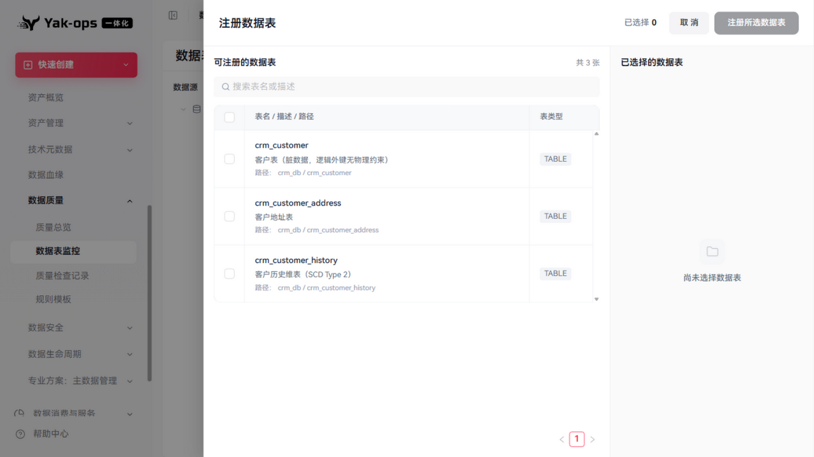 → toast"已注册 1 张数据表" 
- **新增监控向导（亮点）**：独立页面四区块（基本配置/选择质量规则/调度配置/通知设置）+ 右侧锚点快速定位；监控对象自动锁定 crm_customer；负责人默认"系统管理员"；启用状态开关 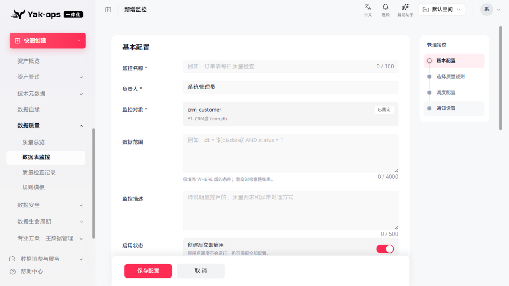
- **从规则模板添加规则（亮点）**：模板库按维度分类（完整性2/唯一性1/有效性1/准确性1/自定义1）；选中模板后右侧生成规则配置卡（名称可改、表级规则禁用字段选择、参数默认值、模板说明）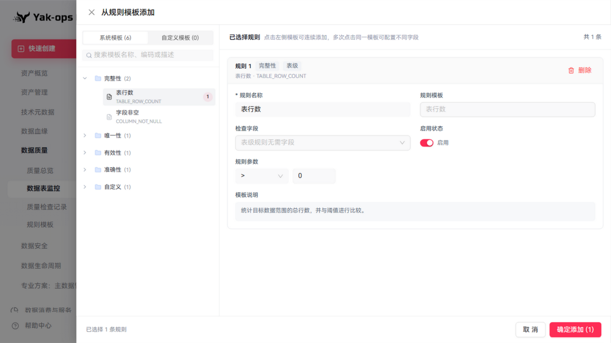 → 添加成功 
- 保存配置 → 跳转规则管理页（toast"质量监控已创建"）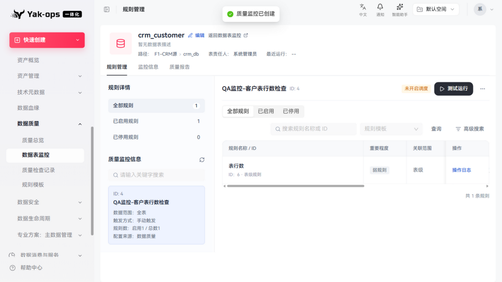
- **测试运行**：toast"质量检查已提交: QM-20261001192621949-6193D9"，"最近运行"时间即时更新 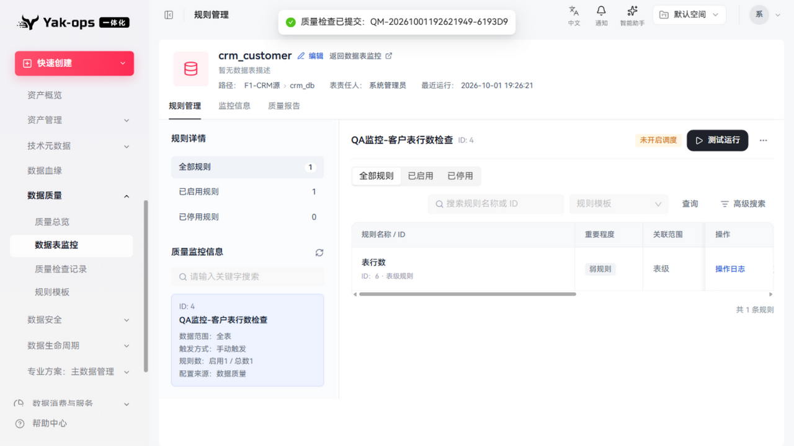
- 质量报告 tab：维度通过率环形图、重点关注（总规则1/已启用1）、各维度趋势、字段质量分析；默认"昨日"视角（当日运行不进当日报告，语义合理）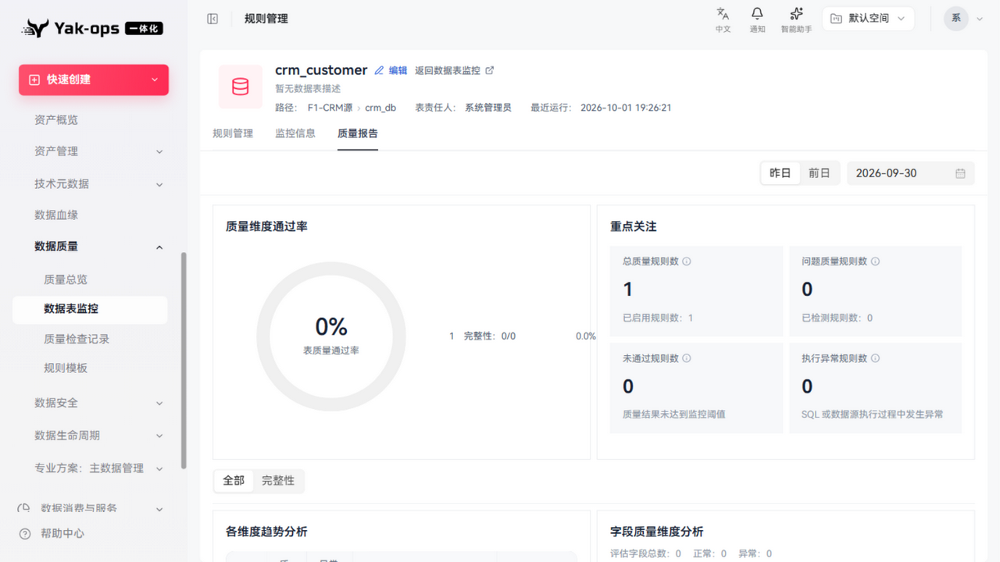

### 质量检查记录
- 规则视角/监控视角双视图、日期范围、数据源树过滤 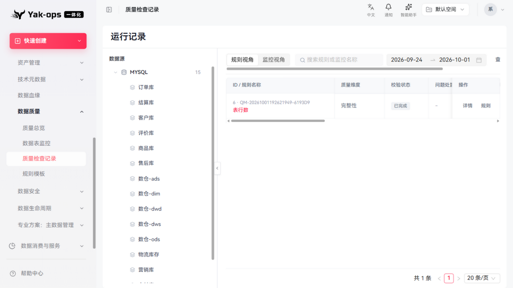
- 刚提交的检查记录出现（完整性/已完成）
- **检查详情（亮点）**：独立页（返回运行记录、切换同一监控运行记录下拉）、质量概览（规则1/通过1/问题0/耗时61ms）、执行情况（触发方式手动/触发人/入队与结束时间/监控ID）、规则检测结果、历史运行(1)/问题数据/原始日志 tab 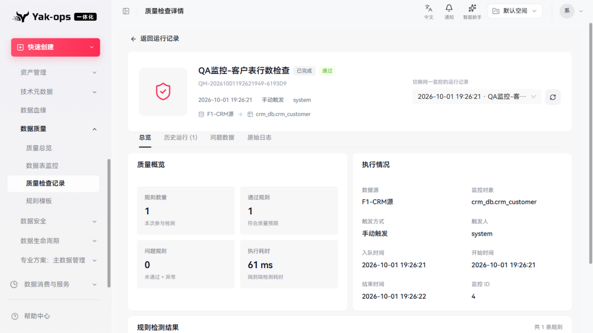

### 规则模板
- 模板库：维度筛选（全部6/完整性2/唯一性1/有效性1/准确性1/自定义1）、系统/自定义模板 tab、自定义模板类目管理 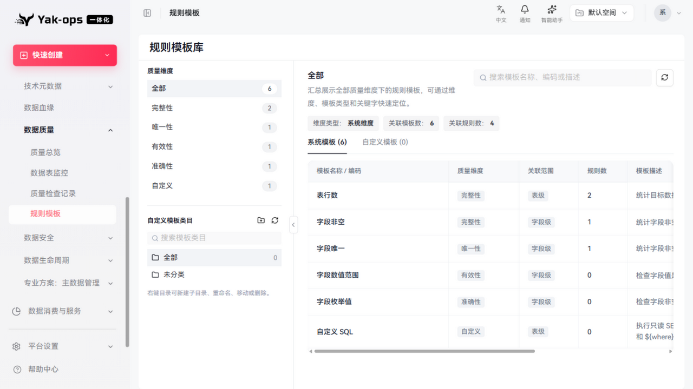
- 模板表：名称/编码、质量维度、关联范围（表级/字段级）、规则数、描述完整

---

## 四、改进建议

1. ~~补齐"注销数据表/删除监控/删除规则"能力（Q2-03）~~（已修复：数据表取消注册已接线；监控删除在详情页"更多操作"、规则删除在编辑器内均已具备）
2. 监控向导保存前增加"规则未选择"提示（当前 0 规则也能保存成功，监控无意义）。
3. ~~质量总览在维度数据稀疏时的视觉降级（Q1-01）~~（已修复：轴点高亮 + 缺数据说明）
4. 质量检查详情"原始日志"内容建议增加复制/下载（方便提工单）。
5. 数据表监控列表的"取消注册"与"新增监控/规则管理"三按钮在窄屏下建议收纳进"更多"菜单，避免操作列过宽（当前已 fixed right，宽 290px）。

## 五、修复验证记录（2026-10-02）

| 项 | 修复方式 | 验证 |
|---|---|---|
| Q2-03 | 数据表监控操作列接线已有 API `deleteQualityTableAsset`（后端 `unregister` 含监控引用保护）；`monitorCount>0` 前置提示引导 | 浏览器端到端：有监控时正确拦截并提示；删除监控后注销成功、列表回空态 ✅ |
| Q2-02 | 移除无语义的勾选列与 `selectedRowKeys` 计数，改为"共 N 条规则" | 浏览器回归：显示"共1条规则"，与实际规则数一致 ✅ |
| Q2-01 | 规则模板 `Tree` 根节点加 `select-none` | 浏览器回归：展开后双击叶子节点无文本选中 ✅ |
| Q1-01 | 保留"五维齐全才画面积"语义；有数据轴点品牌色高亮 + 缺失维度说明文案 | 浏览器回归：显示"仅 1/5 个维度有检测数据…"，完整性轴点高亮 ✅ |

**测试影响面**：
- 前端：`tsc --noEmit` 质量模块错误数保持 4 项（均为既有、非本次引入）；质量模块单测 12 项 + 血缘布局 5 项全部通过；改动文件 biome lint 无告警。
- 中英双语文案已同步补齐（`tableConfig.unregister` / `unregisterBlocked` / `message.unregistered` / `message.unregisterFailed` / `overview.partialRadarHint` / `overview.noDimensionDataHint`）。
- 残留数据：注册表 crm_customer、监控(ID 4)、规则(ID 6) 已全部清理（保留历史执行记录，符合删除确认框语义）。
