# 数据资产与治理 — 测试报告 4/5：数据安全

> 本报告为系列第 4 份（共 5 份），覆盖**数据安全总览、分级分类、数据访问策略、数据脱敏、访问审计、合规管理** 6 个页面。总览与环境说明见 [00-汇总索引](数据资产与治理-测试报告0-汇总索引.md)。

| 项目 | 内容 |
|---|---|
| 测试日期 | 2026-10-01 |
| 测试账号 / 工作空间 | root / 默认空间 |
| 测试视口 | 1280 × 720 |
| 截图目录 | `docs/20261001/screenshots/`（s* 前缀） |
| 测试产生数据 | 合规体检执行 1 次（通过），无数据变更残留 |

---

## 一、结论摘要

数据安全 6 页**主流程全部可用**；脱敏试算、合规体检、访问审计三大能力验证通过。初测发现 **4 个 P3** 问题，集中在可读性（内部 ID/hash 直出）与可访问性（无语义操作）。

> **修复状态（2026-10-02）**：S2-01、S6-01、S6-02、S4-02 均已修复并回归验证通过（见第五节）；本组无遗留问题。

| 页面 | 主流程 | 问题 |
|---|---|---|
| 数据安全总览 /data-security/overview | ✅ | — |
| 分级分类 /data-security/classification | ✅ | ~~S2-01 (P3)~~、~~S6-02 (P3)~~ 已修复 |
| 数据访问策略 /data-security/access | ✅ | — |
| 数据脱敏 /data-security/masking | ✅ | ~~S4-02 (P3)~~ 已修复 |
| 访问审计 /data-security/audit | ✅ | — |
| 合规管理 /data-security/compliance | ✅ | ~~S6-01 (P3)~~、~~S6-02 (P3)~~ 已修复 |

---

## 二、问题清单

### S2-01 (P3)【已修复】资产分级"等级"列显示内部 ID 而非等级名称
- **实际**：资产分级 tab 中唯一一条定级记录的"等级"列显示 `#6`（内部 ID），而安全等级字典中定义的是 L1–L5（公开/内部/机密/绝密/内部受限）。用户无法理解 #6 对应什么等级。
- **建议**：显示等级编码+名称（如"L5 内部受限"），并带序位色标。
- **证据**：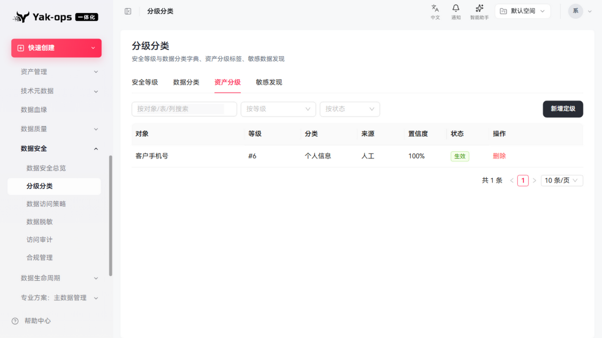
- **根因**：页面用 `listActiveSecurityLevels()`（仅启用中的等级）做名称解析，而该记录引用的等级（id 6 = L3 机密）当前处于**停用**状态，字典查不到 → 回退 `#${id}`。
- **修复（2026-10-02）**：`useDsecOptions` 额外经 `pageSecurityLevels` 加载**全量**等级字典（`allLevels`）专用于名称解析；新建/筛选下拉仍只用启用中的等级（保持业务语义）。资产分级与敏感发现两个 tab 的"等级/命中等级"列改为按全量字典解析。
- **回归**：等级列显示"机密"（该记录引用的停用等级 L3）✅ 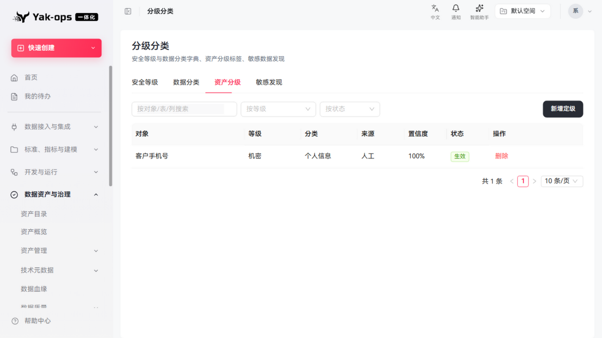

### S6-01 (P3)【已修复】合规体检"最近批次"显示 32 位 hash
- **复现**：合规管理 → 对 C001 规则点"体检" → 执行。
- **实际**：体检成功后头部显示"最近批次: 42fca4c44d854328bb971aea54ba8de"——技术 hash 对用户无意义；应显示批次号 + 时间（或点击查看批次详情）。
- **证据**：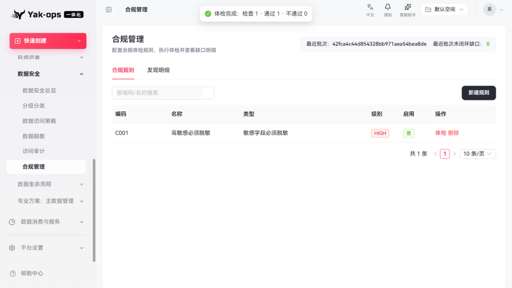
- **修复（2026-10-02）**：
  - 后端 `ComplianceService.latestSummary()` 补充返回 `checkedTime`（取最近一条发现的体检时间，1 行改动）；
  - 前端改为"最近体检：`{体检时间}` · 批次 `{batchId 前 8 位}`"，完整批次号放 Tooltip。
- **回归**：头部显示"最近体检：2026-10-01 19:38:49 · 批次 42fca4c4" ✅ 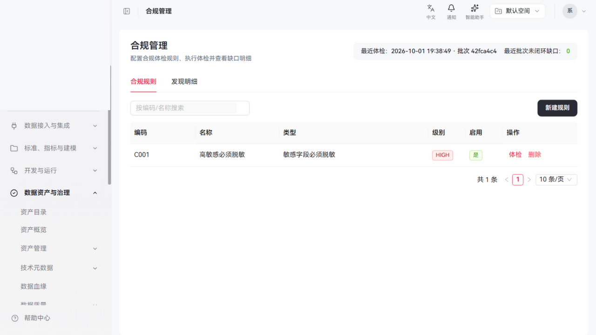

### S6-02 (P3)【已修复】合规规则操作为无语义文本
- **实际**：合规规则行"体检 / 删除"为纯文本（无 button 语义），键盘不可达；分级分类页同类问题。与指标标签页 T10-03 同源。
- **证据**：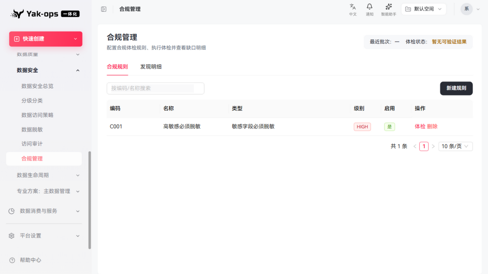
- **根因**：`Typography.Link` 未传 `href` 时渲染的 `<a>` 无 href，ARIA 角色为 generic 且不可聚焦——看起来是链接，键盘却到不了。
- **修复（2026-10-02）**：合规规则行（体检/删除）与分级分类页全部操作（安全等级的编辑/启停/删除、资产分级的确认/驳回/删除、敏感发现）统一改为 `Button type="link"`（渲染真实 `<button>`，可 Tab 聚焦、Enter 触发）。
- **回归**：合规规则"体检"可被 `getByRole("button")` 定位（1 个）✅；分级分类操作列为语义按钮 ✅

### S4-02 (P3)【已修复】脱敏算法下拉选项仅显示内部编码
- **实际**：算法下拉选项为"内置 · NULLIFY / KEEP_FORMAT / HASH / MASK_PARTIAL / REPLACE / FULL_MASK"，全部为英文技术编码；而算法字典表中 MASK_PARTIAL 有中文名"部分遮蔽"。下拉应显示中文名（编码为辅）。
- **证据**：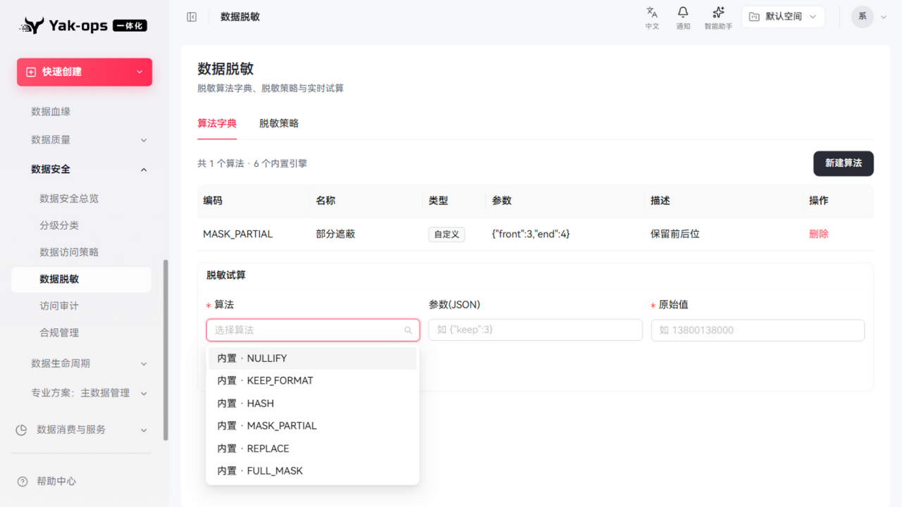
- **修复（2026-10-02）**：前端新增内置引擎中文映射（全遮蔽/置空/整串替换/保留格式遮蔽/哈希摘要/部分遮蔽，与后端 `MaskingEngine` 语义一致）；字典里同名算法的自定义名优先（MASK_PARTIAL 用字典的"部分遮蔽"），展示为"中文名（CODE）"。
- **回归**：下拉显示"整串替换（REPLACE）/全遮蔽（FULL_MASK）/置空（NULLIFY）/保留格式遮蔽（KEEP_FORMAT）/哈希摘要（HASH）/部分遮蔽（MASK_PARTIAL）" ✅ 

---

## 三、通过项明细（含证据）

### 数据安全总览
- 6 个 KPI（安全等级5、数据分类2、已定级资产1、生效访问策略1、脱敏策略1、合规缺口"暂无可验证结果"）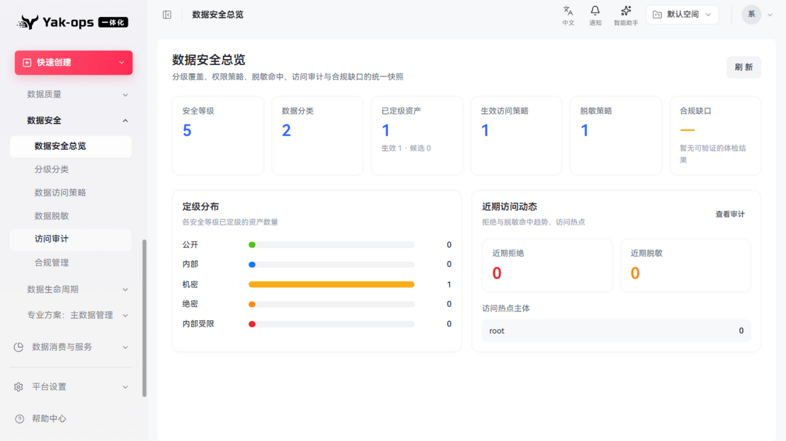
- 定级分布条形图（公开/内部/机密1/绝密/内部受限，五级色标）
- 近期访问动态（近期拒绝0/近期脱敏0/访问热点主体 root）+ "查看审计"跳转

### 分级分类（4 tab）
- 安全等级：L1–L5 五级字典（R1–R5 序位色标、关联安全标准、状态启停、编辑/启用/删除）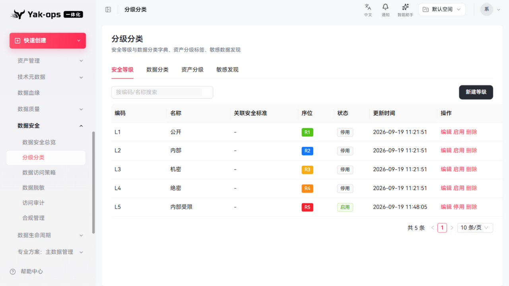
- 数据分类 tab、资产分级 tab（1条定级记录：对象/等级/分类个人信息/来源人工/置信度100%/状态生效）
- 敏感发现 tab：扫描字段 + 新建规则入口（空态引导）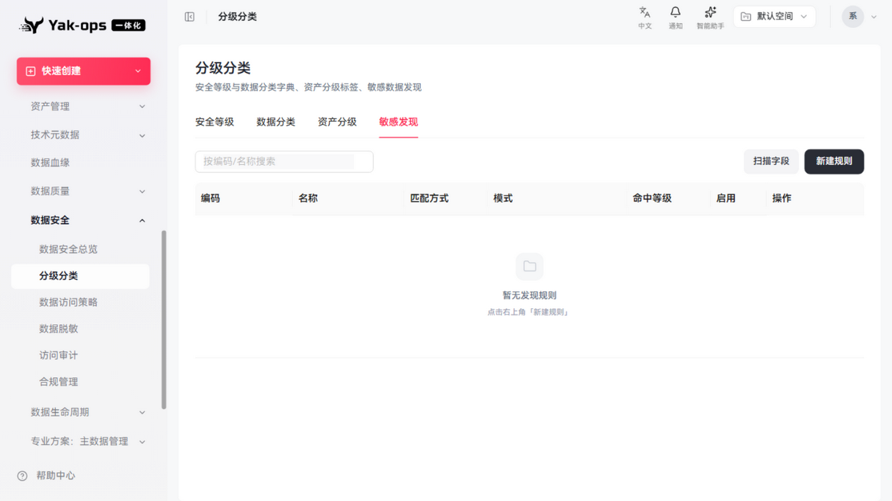

### 数据访问策略
- 权限管理：1 条预置策略（E2E-查订单表 / USER: tom / app_db.orders / 读取 / 允许 / 优先级0），停用/编辑/删除 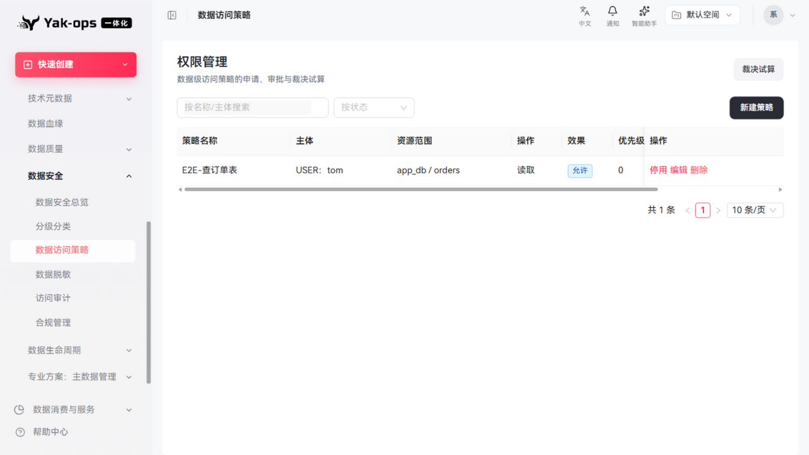
- "裁决试算"入口、新建策略、名称/主体搜索、状态筛选

### 数据脱敏（2 tab）
- 算法字典：MASK_PARTIAL 部分遮蔽（自定义类型、参数 {"front":3,"end":4}、描述保留前后位）+ 6 个内置引擎说明 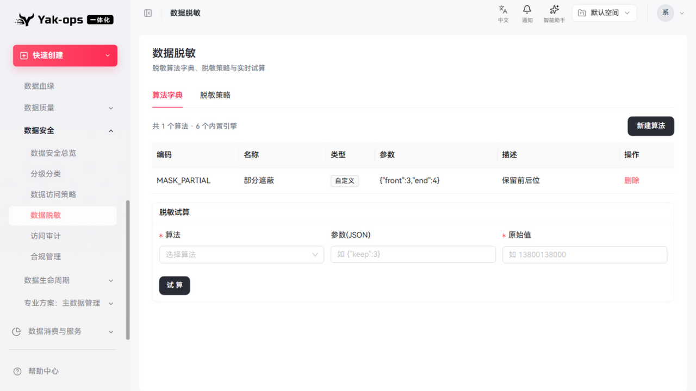
- **脱敏试算（亮点）**：选择算法后参数自动带出默认值 → 输入 13800138000 → 试算即时输出 `1*********0`（保留前3后4，与参数一致）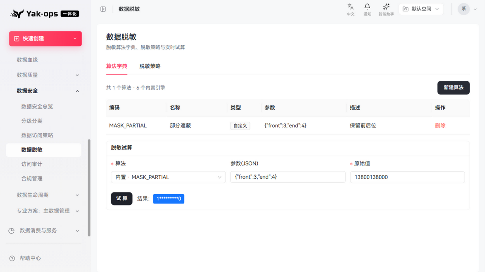
- 脱敏策略 tab 存在

### 访问审计
- 审计流水 6 条（时间/主体/操作 READ/等级 L3/裁决：需审批·放行/脱敏：明文/来源 SECURITY）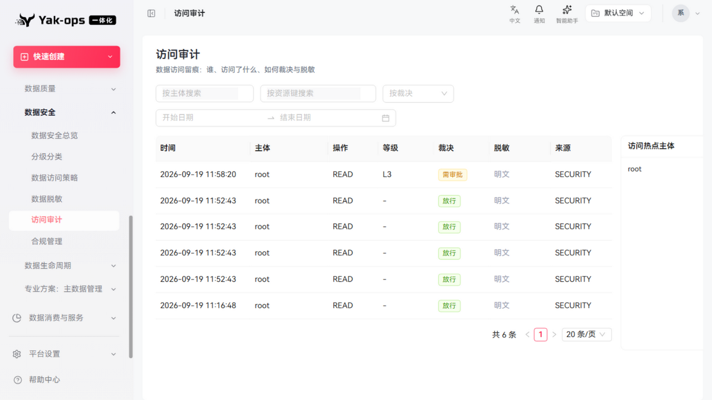
- 三组筛选（主体/资源/裁决）+ 日期范围 + 访问热点主体侧栏

### 合规管理
- 合规规则：C001 高敏感必须脱敏（敏感字段必须脱敏 / HIGH / 启用是）
- **体检执行（亮点）**：确认框 → 执行 → toast"体检完成：检查 1 · 通过 1 · 不通过 0"，头部更新"最近批次 + 最近批次未闭环缺口: 0" 
- 发现明细 tab、新建规则入口

---

## 四、改进建议

1. ~~内部标识人性化（S2-01 等级 ID、S6-01 批次 hash）~~（已修复；master_id hash 属主数据页 MD5-01，**也已于 2026-10-02 修复**）。
2. ~~全局梳理"伪按钮"（S6-02）~~（数据安全模块已改为语义化 button；指标标签页 T10-03 **同类也已于 2026-10-02 修复**）。
3. ~~脱敏算法下拉显示中文名 + 编码（S4-02）~~（已修复）。
4. 合规体检发现明细建议支持导出（等保/审计材料场景）。
5. 内部标识可读性建议沉淀为展示规范（「内部 ID 一律转业务名称 + 提供复制」）：S2-01 / S6-01 / MD5-01 / MD5-02 已逐点落地，缺的是统一规则，避免后续新页面重犯。

## 五、修复验证记录（2026-10-02）

| 项 | 修复方式 | 验证 |
|---|---|---|
| S2-01 | 名称解析改用全量等级字典（含停用），下拉仍只用启用等级 | 浏览器回归：等级列显示"机密"（该记录引用的停用等级 L3）✅ |
| S6-01 | 后端 summary 补 `checkedTime`；前端展示"最近体检：时间 · 批次前 8 位"，完整 hash 入 Tooltip | 浏览器回归：头部显示"最近体检：2026-10-01 19:38:49 · 批次 42fca4c4" ✅ |
| S6-02 | 合规规则与分级分类全部操作由 `Typography.Link`（无 href 时键盘不可达）改为 `Button type="link"` | 浏览器回归：体检可被 `getByRole("button")` 定位；分级分类操作列为语义按钮 ✅ |
| S4-02 | 前端内置引擎中文映射，字典自定义名优先，展示"中文名（CODE）" | 浏览器回归：六个算法全部中文名展示 ✅ |

**测试影响面**：
- 后端：`ComplianceService.latestSummary()` 补 1 个返回字段；安全模块 `mvnw test` 存在 **4 项既有失败**（MaskingEngineTest×2、AccessDecisionServiceTest×2，经基线对照确认与本次改动无关，未处理）。
- 前端：`tsc --noEmit` data-security 0 错误；改动文件 lint 无新增告警（分级分类页 DiscoveryTab 的 categories 未使用为既有告警）。
- 后端 jar 已重新打包并重启（09:29 启动成功）。
