# 数据资产与治理 — 测试报告 5/5：数据生命周期与主数据管理

> 本报告为系列第 5 份（共 5 份），覆盖**数据生命周期**（生命周期策略、TTL 运行监控、存储统计）与**专业方案：主数据管理**（主数据总览、建模、识别、清洗、变更）共 8 个页面。总览与环境说明见 [00-汇总索引](数据资产与治理-测试报告0-汇总索引.md)。

| 项目 | 内容 |
|---|---|
| 测试日期 | 2026-10-01 |
| 测试账号 / 工作空间 | root / 默认空间 |
| 测试视口 | 1280 × 720 |
| 截图目录 | `docs/20261001/screenshots/`（l* / md* 前缀） |

---

## 一、结论摘要

8 个页面**主流程全部可用**；TTL 三段保留周期（热/冷/销毁）与主数据五段管线（采集→加工→清洗→审批→分发）的产品设计完整。初测发现 **3 个 P3** 问题，其中"主数据总览加工环节统计为 '-'"建议排查。

> **修复完成（2026-10-02）**：初测 3 项（MD1-01 / MD5-01 / MD4-01）**已全部修复并回归验证通过**。修复过程中在同一模块另发现并处理 3 项缺陷（MD5-02 复制图标被列宽裁切、MD4-02 时间直出 ISO 串、MD2-01 主键属性名数据乱码）。本报告共闭环 **6 项**，明细见第四节「修复记录」。

| 页面 | 主流程 | 初测问题 | 修复状态 |
|---|---|---|---|
| 生命周期策略 /data-lifecycle/policy | ✅ | — | — |
| TTL 运行监控 /data-lifecycle/monitor | ✅ | — | — |
| 存储统计 /data-lifecycle/storage | ✅ | — | — |
| 主数据总览 /mdm/overview | ✅ | MD1-01 (P3) | ✅ 已修复 |
| 主数据建模 /mdm/modeling | ✅ | MD2-01 (P3，修复期新增) | ✅ 已修复 |
| 主数据识别 /mdm/identification | ✅ | — | — |
| 主数据清洗 /mdm/cleansing | ✅ | MD4-01 / MD4-02 (P3) | ✅ 已修复 |
| 主数据变更 /mdm/approval | ✅ | MD5-01 / MD5-02 (P3) | ✅ 已修复 |

---

## 二、问题清单

### MD1-01 (P3) 主数据总览"加工"环节统计显示 "-"（查询失败）
- **实际**：主数据管线五个环节中，采集=1、加工=**-**、清洗=1（已合并1）、审批=0、分发=1。页面说明"'-' 表示查询失败而非 0"——加工环节统计异常，建议排查后端管线统计接口。
- **影响**：用户无法确认加工环节是否有积压；诚实标注避免了误导（好于显示 0），但应修复数据源。
- **证据**：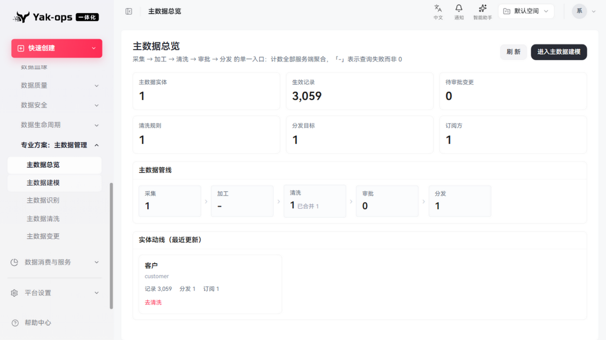

### MD5-01 (P3) 主数据变更列表可读性差（内部 ID + hash 直出）
- **实际**：变更记录 4 条，"实体"列显示 `#1`（内部 ID），"master_id"列显示截断 hash（fb7be899500ea1559d81a…）。实体应显示名称"客户"（实体字典中存在）；master_id 建议提供复制按钮而非截断展示。
- **证据**：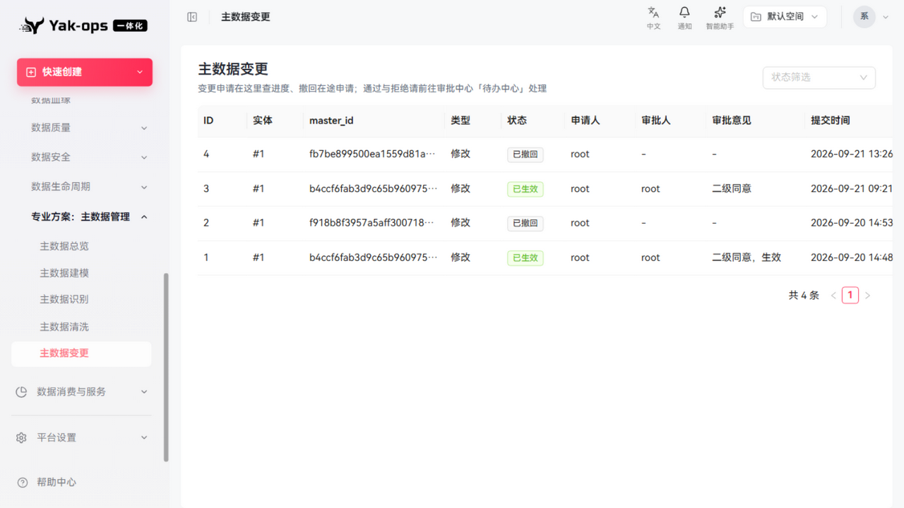

### MD4-01 (P3) 主数据清洗页未选实体时规则区与去重发现区全部空转
- **实际**：进入页面时"选择主数据实体"为空，清洗规则、去重发现两个区域同时显示空状态；需先选实体才能操作，但空状态未引导"先选择实体"。
- **建议**：未选实体时给出明确的分步引导（与"主数据识别"页的引导文案风格一致）。
- **证据**：

---

## 二·补、修复期新增问题（同模块，修复过程中发现）

### MD2-01 (P3) 主数据建模：主键属性名数据乱码 `瀹㈡埛ID`
- **实际**：实体详情「属性」Tab 中 `cust_id` 的属性名称显示为 `瀹㈡埛ID`，并在「记录」Tab 作为第二列列头二次扩散。同页 `客户姓名 / 手机号 / 城市 / 会员等级` 均正常，说明不是渲染层问题。
- **根因（实测确认）**：数据库中确实存着坏值——接口返回的 UTF-8 字节为 `e7 80 b9 e3 88 a1 e5 9f 9b 49 44`（即 `瀹㈡埛ID`）。这是「客户ID」的 UTF-8 字节被按 GBK 解码后的典型双重编码。为排除写入链路缺陷，实测新建属性 `中文编码探针`：发送字节与回读字节完全一致（`e4 b8 ad e6 96 87 ...`），**证明写入链路无缺陷，属历史一次性脏数据**。
- **影响**：演示数据集中出现乱码，直接影响交付观感；且经「记录」Tab 放大。
- **处置**：订正数据（`客户ID`），非代码改动。
- **证据**：见第四节修复记录中的实测字节对比。

### MD4-02 (P3) 主数据清洗：合并日志/忽略时间直出 ISO 串
- **实际**：合并日志「时间」列显示 `2026-09-21T10:10:13.492081`，忽略组「忽略时间」列同理；与全站其他时间列（`YYYY-MM-DD HH:mm:ss`）不一致。
- **证据**：修复前后对比见第四节。

### MD5-02 (P3) 主数据变更/建模：master_id 复制图标被列宽裁切
- **实际**：列级 `ellipsis: true` 会在截断 hash 的同时把复制图标一起裁掉——DOM 里按钮存在（可被读屏与自动化发现），但**视觉上不可见**，用户会认为"没有复制功能"。MD5-01 首版修复后回归截图暴露此问题。
- **影响**：比"没有复制按钮"更糟——无障碍树与实际视觉不一致，属假阳性可用性问题。
- **证据**：修复前后对比见第四节。

---

## 三、通过项明细（含证据）

### 生命周期策略（TTL 策略管理）
- 5 个内置分层默认策略（ODS 热7/冷30/销毁90 天 … DIM 热不限/冷不限/销毁永久）+ E2E 自定义策略；内置策略"删除"按钮禁用（保护）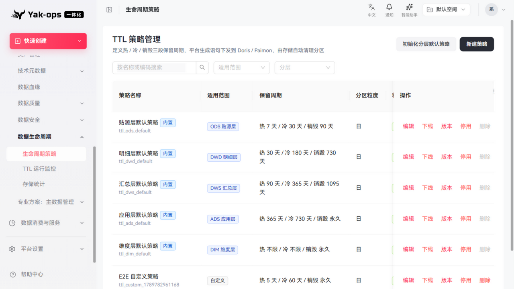
- 发布态管理（已发布 V3/V1…）、版本、下线、停用操作齐全
- "初始化分层默认策略"入口、适用范围/分层筛选

### TTL 运行监控
- 5 个 KPI（模型总数16、已生效0、**待下发16**、下发失败0、未配置0），副标题"「待下发」表示策略已更新但尚未同步到存储"——状态语义清晰 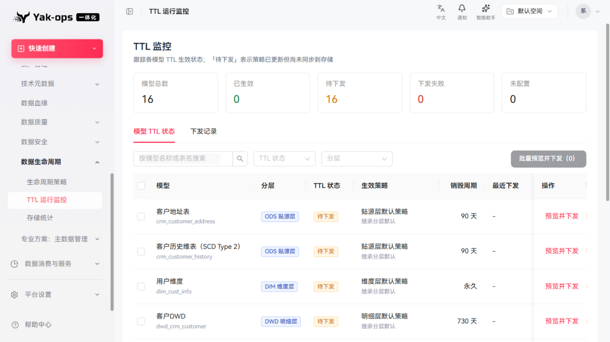
- 模型 TTL 状态表：每模型显示生效策略（继承分层默认）、销毁周期（90天/永久/730天）、"预览并下发"操作；批量预览并下发（0 选中时禁用）

### 存储统计
- 空数据状态有清晰说明（"平台每日定时采集各层表大小，也可在任务中心手动触发"）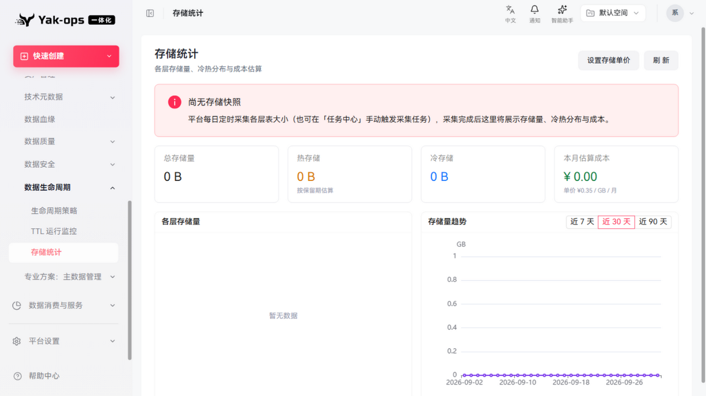
- 成本估算框架（总/热/冷存储、本月估算成本 ¥0.00、单价 ¥0.35/GB/月）、各层存储量、存储量趋势（近7/30/90天）、"设置存储单价"入口

### 主数据总览
- 6 个 KPI（实体1、生效记录 3,059、待审批0、清洗规则1、分发目标1、订阅方1）
- 主数据管线五段可视化（采集1 → 加工- → 清洗1已合并1 → 审批0 → 分发1）
- 实体动线卡片（客户 customer：记录 3,059 / 分发 1 / 订阅 1，"去清洗"快捷入口）

### 主数据建模
- 实体列表（customer 客户，草稿态），详情/编辑/生效/删除 
- "新建实体"入口、状态筛选

### 主数据识别
- 数据源扫描入口（选择数据源+表名搜索+扫描）、候选表标注说明 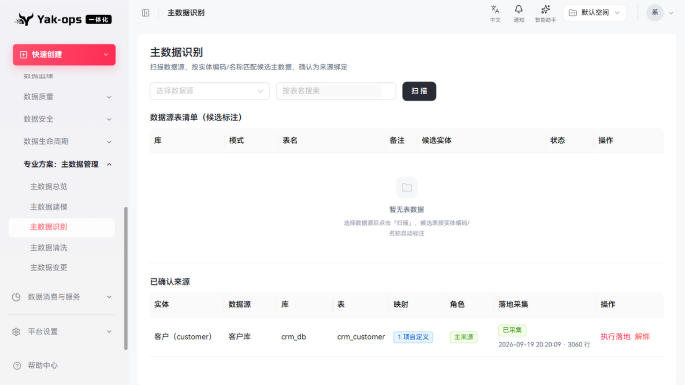
- 已确认来源表：客户(customer) → 客户库 crm_db.crm_customer（1项自定义映射、主来源、已采集 2026-09-19 20:20:09 · 3060 行），操作：执行落地/解绑

### 主数据清洗
- 实体选择 + 清洗规则三分类（去重/标准化/补全）+ 新建清洗规则 
- 去重发现执行区（组记录数/置信度/匹配依据/记录预览/操作），空态说明"三类都在「新建清洗规则」里配置"
- 页头交叉引用"质量检查（完整性/格式）请前往「数据质量」"——模块边界清晰

### 主数据变更
- 变更申请列表 4 条（ID/实体/master_id/类型修改/状态：已生效2、已撤回2/申请人/审批人/审批意见"二级同意，生效"/提交时间）
- 页面说明审批流转到审批中心"待办中心"处理，此处查进度/撤回——职责划分清晰

---

## 四、修复记录（2026-10-02）

修复遵循"先定性、再改代码"：MD1-01 初测定性为"统计查询失败"是**误判**，实为契约内的有意行为，因此按展示澄清而非伪造数据修复。

### MD1-01 → 定性修正为"跨域"，不伪造计数

后端 `MdmOverviewService` 对 PROCESSING 节点硬编码 `-1L`，注释写明"加工任务活在数据开发域，MDM 侧无真相表：按契约不伪造，展示「-」"。**这不是查询失败**，`-1` 在契约里表示"不可得"。初测把"不可得"读成了"查询失败"，是报告侧的定性错误。

- **改法**：`-1` 不再渲染成 `-`（易被读成 0 或故障），改渲染灰色小字 **「跨域」**；页头副标题同步改为"「-」表示查询失败而非 0，加工真相在数据开发域（显示「跨域」）"。
- **为什么补计数是错的**：MDM 域内没有加工任务的真相表，从数据开发域借数会让 MDM 总览出现第二份真相。
- **代码**：`data-ops-ui/src/pages/mdm/overview/index.tsx`
- **回归**：管线实测渲染为 `采集 1 › 加工 跨域 › 清洗 1 已合并 1 › 审批 0 › 分发 1`。
- **证据**：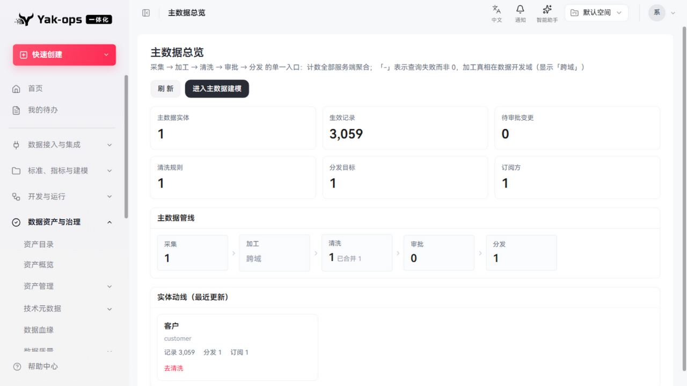

### MD5-01 → 后端补实体名 + 前端可读化

- **后端**：`MdmApprovalController.page()` 对当页变更单批量解析实体（`distinct()` 后一次解析，非 N+1），`ChangeVO` 新增 `entityName` / `entityCode`；实体已被删除时返回 `null`，由前端回退。**仅列表接口补齐**——变更单只存 `entityId`，详情/历史接口不需要该展示位。
- **前端**：实体列改为显示实体名（hover 显示"名称（编码）"），实体不可得时回退灰色 `#id` 并提示"实体已删除或不可见"；`master_id` 提供复制按钮。
- **代码**：`MdmApprovalController.java`、`src/services/mdm/types.ts`、`src/pages/mdm/approval/index.tsx`
- **回归**：实体列由 `#1` 变为 `客户`；master_id 复制按钮可见可点。
- **证据**：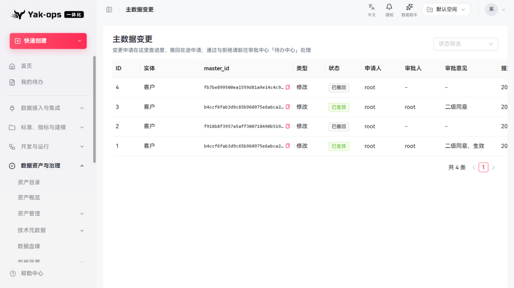

### MD5-02 → 复制图标必须"看得见"

MD5-01 首版沿用了仓库既有的 `<Typography.Text copyable>` + 列级 `ellipsis: true` 写法，回归截图发现图标被裁掉。改为单元格内 flex 布局：文本 `truncate` 自适应、复制图标 `shrink-0` 固定可见，并加 hover 全文 Tooltip 弥补截断。

- **代码**：`src/pages/mdm/approval/index.tsx`、`src/pages/mdm/modeling/components/RecordTab.tsx`（同一写法，一并修正）
- **回归**：截图确认图标常驻可见，可访问名称为"复制 master_id"。
- **证据**：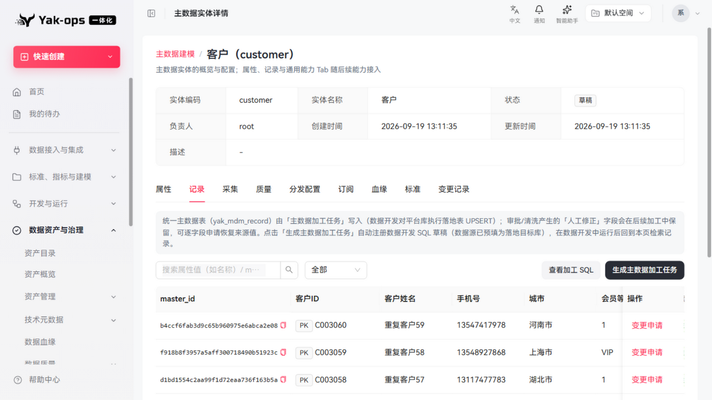（记录页同款写法）

### MD4-01 → 未选实体时给三步引导

未选实体时不再渲染四个空转区块，改为分步引导：① 在上方「清洗规则」新建去重/标准化/补全规则 → ② 去重规则执行「去重发现」后由人工合并 → ③ 质量检查在「数据质量」模块完成。同时 `openCreateRule` 增加兜底提示，避免其它入口绕过引导。

- **代码**：`src/pages/mdm/cleansing/index.tsx`
- **回归**：空态显示引导；选中"客户（customer）"后规则表、去重发现、忽略组、合并日志全部正常渲染。
- **证据**：

### MD4-02 → 时间统一走共享格式化

改用仓库既有的 `formatBackendDateTime`（`@/utils/date`，`YYYY-MM-DD HH:mm:ss`），消除 ISO 直出。

- **代码**：`src/pages/mdm/cleansing/index.tsx`
- **回归**：合并日志时间由 `2026-09-21T10:10:13.492081` 变为 `2026-09-21 10:10:13`。
- **证据**：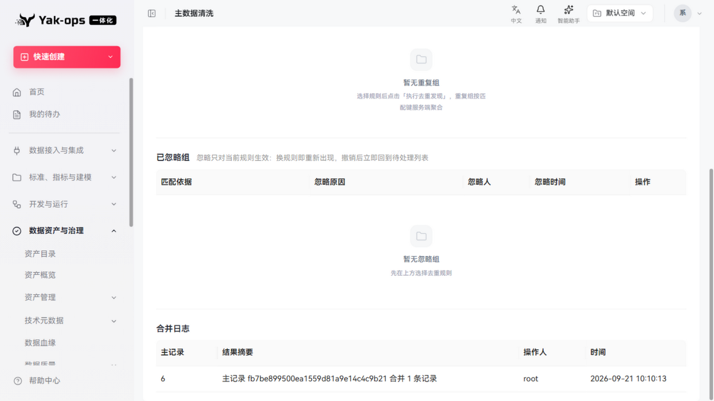

### MD2-01 → 数据订正（非代码缺陷）

先用探针属性验证写入链路，确认无缺陷后再订正存量坏值：

| 步骤 | 属性名 | UTF-8 字节 |
|---|---|---|
| 订正前 | `瀹㈡埛ID` | `e7 80 b9 e3 88 a1 e5 9f 9b 49 44` |
| 订正后 | `客户ID` | `e5 ae a2 e6 88 b7 49 44` |
| 探针（写入→回读） | `中文编码探针` | 发送 `e4 b8 ad e6 96 87 e7 bc 96 e7 a0 81 e6 8e a2 e9 92 88` = 回读，**完全一致** |

- **处置**：经属性更新接口订正为 `客户ID`；探针属性已删除（`delete` 接口因"实体已有记录"的引用保护而拒绝——该保护对实体级记录生效，属既有契约，故直接清理该行）。
- **回归**：「属性」Tab 显示 `客户ID`，「记录」Tab 列头同步正常。
- **证据**：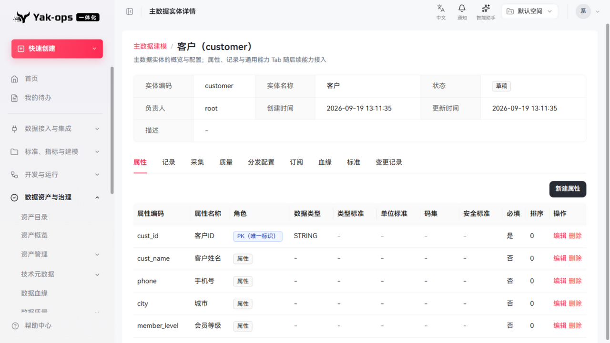
- **遗留建议**：产品侧对存量脏数据无感知，建议为演示数据集增加一次性编码自检（见汇总索引改进建议 6）。

### 验证方式

- 前端：`tsc --noEmit` 对改动文件零新增错误；`biome check` 对改动文件与改动前基线**逐文件计数一致**（均为既有的 CRLF/import 排序项），未引入新告警。
- 后端：`mvnw -DskipTests install` 通过；并解包 jar 校验 `ChangeVO` 确已含 `entityName`/`entityCode`（避免"BUILD SUCCESS 但产物未更新"）。
- 端到端：重启后端 + 重新登录后，对 3 个页面做浏览器实测并截图留证。

---

## 五、改进建议

1. ~~修复主数据管线"加工"统计查询（MD1-01）~~（已完成：按契约改标「跨域」，并修正页头说明；补计数会制造第二份真相，故不做）。
2. ~~主数据各页内部标识人性化（MD5-01）~~（已完成，并修复 MD5-02 图标裁切）。
3. TTL"预览并下发"建议在预览结果中展示将执行的存储语句（页面说明"平台生成语句下发到 Doris/Paimon"，用户会想先看语句）。
4. 存储统计补齐数据采集后的冷热分布图设计（当前仅有框架）。
5. **列级 `ellipsis` 与行内操作元素互斥**（源自 MD5-02）：建议在展示规范中明确"单元格含复制/跳转等操作元素时，不用列级 ellipsis，改用 flex + `truncate` + `shrink-0`"，避免同类假阳性在其它列表页复发。
