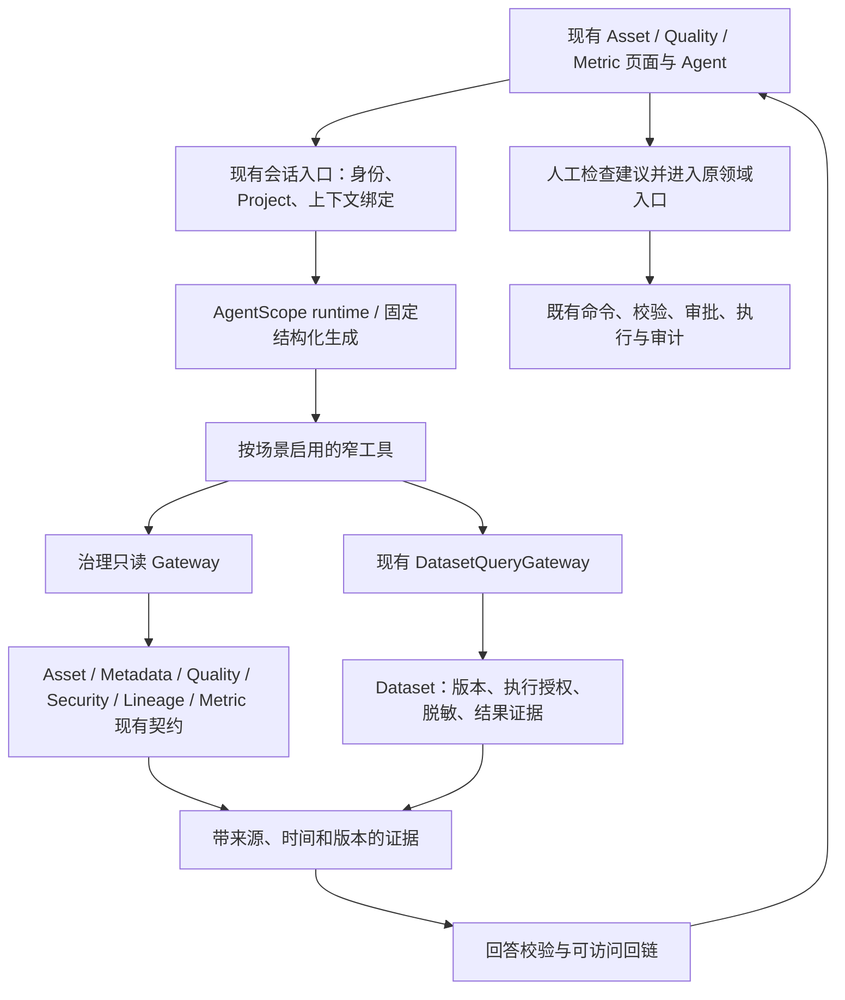

# AI 技术方案：可信上下文、受控工具与证据闭环

日期：2026-10-05  
文档类别：技术规划提案；新增接口、依赖与行为须经对应契约评审。

本文保留开发前的源码分析与方案，文中“当前缺口”以 `main @ 3e966e00` 为准。首版身份、版本及只读证据接口已按 F-009 实施；最新变化与未验证项见 [首版交付说明](./IMPLEMENTATION.md)。

## 1. 选型建议

保留 **AgentScope Java 2.0.2 作为当前唯一 Agent 运行时**。复用已存在的 ReAct 推理、工具注册、StateStore、流式事件、澄清与 Middleware，以及平台自行实现的轮次生命周期、查询审计与观测。框架事实和版本依据见 [框架调研](./FRAMEWORK_RESEARCH.md)。

短期不引入第二套 Agent 执行器。结构化抽取、分类或草稿生成不必全部经过开放式 ReAct：在当前 runtime 模型边界内用固定输入、固定 schema、有限次数重试即可。AgentScope 用于需要工具选择与多步探索的任务；既有业务流程负责最终授权、审批与执行。

LangChain4j 作为需要迁移时的对照候选；Spring AI 可在确有 provider / RAG 集成缺口时做专项 PoC，但先验证 Spring Boot 兼容性，不能把“同属 Java”当作即插即用。Spring AI Alibaba 的图编排属于有明确持久中断需求时的条件候选，不能直接用其 AgentScope starter 包装现有 2.x。LangGraph 引入跨语言服务与运维成本，当前没有证明这些成本必要的场景。

模型选型与框架选型分别评测：同一 runtime 可测试不同模型；同一模型可比较不同 runtime。先使用现有 OpenAI-compatible 接口，在 `runtime` 内验证工具调用、中文语义、结构化输出与超时行为，不仅看兼容 API 名称。不在业务域内暴露 provider 类型。

## 2. 当前实现基线与待验证缺口

仓库快照：`main @ 3e966e00`，Java21 / Spring Boot3.3.13 / AgentScope Java2.0.2。以下来自静态源码检查，不表示真实部署、模型或数据库已经通过验收。

| 当前事实 | 证据 | 对方案的影响 |
|---|---|---|
| SDK 已限制在 runtime 与明确工具豁免；Domain 保持 framework-free | [Agent Dependencies](../../data-ops-business/data-ops-business-agent/DEPENDENCIES.md)、[Architecture](../../data-ops-business/data-ops-business-agent/ARCHITECTURE.md) | 利用现有边界，避免为了换框架重写业务 |
| QUEUED/后台执行、事件投递日志、断线重放、澄清与取消已有契约 | [Agent Domain](../../data-ops-business/data-ops-business-agent/DOMAIN.md) | 不重复做消息历史/SSE/审批状态存储 |
| RUNNING 崩溃后 INTERRUPTED，QUEUED 可恢复执行 | 同上 | 事件续播不等于推理断点续跑；首期保持这份承诺 |
| 已有 Dataset 发现、字段、结构化查询、日期、Python、澄清与报告工具 | [toolset](../../data-ops-business/data-ops-business-agent/src/main/java/io/yak/ops/business/agent/toolset) | 扩展治理读取工具，不从零建设聊天分析 |
| 目录用 `datasetService.list()` 后筛 ONLINE，字段按当前详情读取 | [DatasetCatalogGateway](../../data-ops-business/data-ops-business-agent/src/main/java/io/yak/ops/business/agent/gateway/DatasetCatalogGateway.java) | 需验证有界发现、功能权限、对象可发现性和字段可见性；不能只依赖 ONLINE |
| 查询调用未传 subject，versionNo 也为 null | [DatasetQueryGateway](../../data-ops-business/data-ops-business-agent/src/main/java/io/yak/ops/business/agent/gateway/DatasetQueryGateway.java) | 需要明确可信主体与精确版本的传递；不能由模型提供身份 |
| 两参 query 转入三参并传 null；完整 Spring 装配含 Security Gate；Gate 拒绝 null subject | [DatasetQueryCoordinator](../../data-ops-business/data-ops-business-dataset/src/main/java/io/yak/ops/business/dataset/query/DatasetQueryCoordinator.java)、[DatasetQuerySecurityGate](../../data-ops-business/data-ops-business-dataset/src/main/java/io/yak/ops/business/dataset/query/DatasetQuerySecurityGate.java) | 预计当前 Agent 查询会在安全门禁启用时拒绝；须真实环境验证，不能关门禁解决 |
| 查询工具把返回的执行 SQL 附给模型，错误可能含异常文本 | [RunDatasetQueryTool](../../data-ops-business/data-ops-business-agent/src/main/java/io/yak/ops/business/agent/toolset/RunDatasetQueryTool.java) | 模型外发前检查 SQL/错误脱敏，不需 SQL 时只传 queryId 与允许的结果摘要 |
| Python 使用本地进程、`-I`、临时目录、并发信号量和超时强杀 | [PythonRunnerGateway](../../data-ops-business/data-ops-business-agent/src/main/java/io/yak/ops/business/agent/gateway/PythonRunnerGateway.java) | 这些不等于 OS 沙箱；治理首期保持默认关闭 |
| `AgentRuntime` 已接 Skill 动态加载和记忆提示；部分契约仍列未解决或规划中 | [AgentRuntime](../../data-ops-business/data-ops-business-agent/src/main/java/io/yak/ops/business/agent/runtime/AgentRuntime.java)、[Requirements](../../data-ops-business/data-ops-business-agent/REQUIREMENTS.md)、[Domain](../../data-ops-business/data-ops-business-agent/DOMAIN.md) | 记录契约/实现差异，先核对授权与证据，不将源码接线当成产品生效，不重复创建记忆/技能库 |
| StateStore 已按平台数据库装配官方 MySQL / PostgreSQL 扩展 | [AgentStateStoreWiring](../../data-ops-business/data-ops-business-agent/src/main/java/io/yak/ops/business/agent/runtime/AgentStateStoreWiring.java)、[pom](../../data-ops-business/data-ops-business-agent/pom.xml) | 复用现有双数据库接线；在试点实际数据库验证 schema、历史序列化与重启行为，静态装配不等于运行验收 |

这些缺口多属于平台接入与契约衔接，换框架不会自动解决。其中“Dataset 唯一数据事实”是当前 Agent 硬规则；本方案新增的是治理事实读取，不是第二个业务行查询入口。进入实施前必须将这类扩展写入 Agent Requirements / Domain，并明确新公共 corridor。

## 3. 目标结构与责任

以下是逻辑职责图，不要求新增 Maven module 或一套通用 AI 平台。



现有 `conversation / runtime / toolset / catalog / gateway / report / telemetry` 各自承担已声明职责。首期新增窄读取能力时，先证明现有子系统可承载；跨域只依赖明确公共 API/SPI，源域内部 Reader、Repository、DAO、PO 不因为便于取数就成为公共接口。

工具薄壳依赖 Agent-owned Gateway；Gateway 适配源域 public contract；runtime 处理 SDK、模型和事件映射；领域规则始终留在源域。若当前来源缺少所需公共读取 contract，先提供 owning-domain 只读接口并更新 Dependencies/guard，而不是让 Agent 直查表或调用 Controller。

## 4. 可信执行上下文

入口先验证登录身份、Project membership、会话归属、允许使用的场景和上下文对象，再绑定轮次。对象 ID 来自页面只作输入，仍须在服务端解析和授权。

执行上下文需要保留稳定 user identity、Project、sessionId、turnId、允许读取的对象引用、场景工具集与预算；具体模型需评审后定义。工具参数里不接受模型填入 `userId`、`roles`、Project、批准标记或审批结果。异步/线程切换的身份传播必须覆盖实际工具执行线程；不能只在提交线程设置 ThreadLocal。

Dataset 数据安全裁决继续使用现有已认证 USER 平面，读取真实 principal 与 roles；执行时重新校验当前权限，避免排队期间权限撤销仍沿用旧许可。USER identity 与 Agent 会话主体之间的映射必须明确、可测试。未来如果需要自主后台服务身份，单独冻结产品与安全契约，不能把 `AGENT` ConsumerRef 当 USER/ROLE 授权主体。

消费留痕先复用真实 Dataset Query 来源事件与 Consumption 的规范化机制；Agent 查询 trace 仅补充会话归因。若记录 `AGENT` ConsumerRef，其 owning identity 与 USER 执行主体的关系需独立说明；不制造第二条成功查询，不把澄清、发现、拒绝尝试算作成功 Usage。

## 5. 场景化工具与执行边界

下表中的新增工具名均为候选设计，不是当前已存在 API。

| 候选工具 / 既有能力 | 输入与输出 | 实际边界 | 阶段 |
|---|---|---|---|
| `search_governed_assets` | 有界 query/filter → 允许发现的稳定对象引用与摘要 | 既有 Asset 发现，必要时 Metadata public query | 首期 |
| `get_asset_context` | assetId + 所需分区 → 有权限且适用的来源事实 | 既有 Asset/Section public contract，分区分别校验权限 | 首期 |
| `get_lineage_impact` | 稳定对象、方向、有界深度 → 图证据与覆盖范围 | Lineage public query；Subscription/Usage 单独读取 | 首期 |
| `get_quality_execution_evidence` | execution identity → 冻结规则与执行结果 | Quality-owned read contract；没有公共边界先补窄接口 | 首期后半 |
| `get_published_metric_context` | metricId → 精确发布版本、口径与依赖 | Metric / Semantic 现有 SPI；无 target 不查询数值 | 第二期 |
| 现有 `list_datasets` / `get_dataset_fields` | 授权 Dataset 目录与版本字段 | Dataset public catalog，补权限/版本契约 | 首期修正 |
| 现有 `run_dataset_query` | 结构化参数 → 已授权、脱敏的结果与证据 | Dataset Query，绑定主体、字段与实际版本 | 首期修正 |
| 规则/描述/分类草稿生成 | 已授权事实 + 既有候选字典 → 有限 schema 草稿 | 固定生成与 schema/ID 校验，不拥有业务写入 | 第二期 |
| 受控命令接入 | 已审阅参数、版本依据、权限与幂等信息 → 源域结果 | owning-domain command / Approval，不能直接写表 | 第三期，独立治理批准后 |

工具集按任务最小化：资产解释不装配统计 Python 或业务命令；规则建议只允许读取模板和候选事实；查询场景不默认暴露所有治理配置。Skill 可以告诉模型如何使用已授权工具，但不能扩大工具权限或启用隐藏命令。MCP 是后续对外工具协议，首期同 JVM 调公共 contract 已足够。

模型被提示“不执行写操作”只能作为辅助。首期工具注册表本身没有业务写出口，服务端 Gateway 仍做授权与参数校验；报告保存是现有 Agent 产物，不代表允许修改治理事实。

## 6. 上下文与检索增强生成

首期先用有界目录搜索 + 事实读取，无需立即引入向量数据库。用户已在资产页时直接使用稳定身份获取授权事实；开放提问时先搜索，再读候选对象与版本。不能一次把全部目录、全部字段和全部执行历史塞入提示词。

确有同义词/文档召回问题时，增加检索增强生成（RAG）：索引已授权可用的标准、口径、操作指引与元数据摘要；以稳定 ID、Project、来源版本、ACL 范围和更新时间关联。结构化权限、发布与质量状态实时读取，不以向量文本中的旧值裁决。

检索必须在召回、重排、模型上下文、引用打开各阶段维护权限。删除、撤权、版本变化触发索引失效；读取前再做来源核对，过期文档不自动成为当前契约。索引、缓存和摘要应可删除重建，不是新的业务真相。

工具结果、注释、文档、Skill 和用户文本都可能含诱导指令。它们作为数据处理，不能改系统权限、工具集和执行规则；来源文本要求模型忽略限制时，由服务端限制保证无法越权。压缩后的会话摘要与长期记忆同样不能成为已审批事实或当前授权依据。

## 7. 证据与回答校验

建议输出携带以下语义；具体 DTO 由 Feature 技术设计冻结，不复制各域业务实体：

```text
来源引用 = ownerDomain + 稳定对象 ID + 可用的版本/执行/query identity
证据描述 = 来源时间 + 读取时间 + 覆盖范围 + 源状态 + 可访问详情入口
回答 = 已知事实及其证据引用 + 明确标注的推断 + 未知/阻断项 + 下一步
```

执行前由服务端解析、授权并登记可用证据；生成后核验引用来自本轮获准读取的证据集合、对象/版本匹配、链接由服务端生成。不存在的 ID、跨 Project 引用、无权打开的证据不允许出现在最终回答。数字结论对照结构化结果，汇总/同比等计算尽量由确定性程序完成；截断结果不能声称是全量统计。

Source state 保留原词汇：Asset 的 `OK / PERMISSION_DENIED` 和 Consumption 的 `READY / FORBIDDEN` 有各自边界。可以做有损程度明确的展示映射，但来源状态仍保留，不全局强行替换枚举。`EMPTY`、`UNAVAILABLE`、`NOT_APPLICABLE`、权限限制和字段未知不互相冒充。

规则草稿需要字段和模板白名单、参数 schema、合法范围、版本核验与 Quality-owned policy。分类草稿只能引用已有 level/category；模型自报 confidence 只作建议元信息，不能解释成统计准确率或决定敏感度。正式分级/规则/验证/发布仍由 owning domain 写入。

失败时先返回局部可用事实；无足够证据就给范围有限的解释、澄清或原处置入口。模型超时不影响原业务页面；不从未经治理的 SQL 或另一个 Project 补取数据。

## 8. 人工采纳与后续动作

第二期默认“草稿 → 带入原编辑器 → 人工提交”，先避免额外持久建议状态机。现有 Metadata 的 SUGGESTED 标签与 Security 的 CANDIDATE 分类可作为候选模型，但 AI 特有来源字段/枚举或新写接口需要明确需求变更，不能伪造 `discoveryRuleId`。

第三期若需在 AI 面板直接执行，应冻结 exact target/version、展示最终参数与影响范围，提交时重新授权与版本校验；需要 Approval 的动作复用现有流程和来源域 Handler。幂等键、版本冲突、取消、重复回调与审计需由对应执行入口保证。

现有澄清 HITL 仅解决信息不足，并不证明用户已经审核变更；现有 WAITING_INPUT 也不是通用审批挂起状态。不能把审批结果塞成一条工具消息就直接执行命令。框架 checkpoint 可帮助保存推理，但不会替代业务事务、幂等或审批生效规则。

发布、权限批准、数据修复、主记录合并和删除不进入首期。通用质量发布门禁等长期规则先完成产品治理，不能用模型“风险低”来代替批准。

## 9. 模型、隐私、观测和预算

默认仅向模型发送任务所需的授权元数据和最小查询结果。Data rows、SQL、日志、文档、对话与报告分别设定允许外发和留存范围；敏感判断来自既有 Security，不让模型自行决定数据是否可外发。模型 API key 不进入消息、数据库、SSE 或异常。

治理解释和草稿任务先使用当前模型；选型 PoC 用同一题集比较平台现有可用模型与候选模型，不预设某品牌一定最好。按场景记录质量、工具调用成功率、结构化解析率、成本和延迟。轻量描述草稿可用较小模型，复杂口径/异常解释可用较强模型；只有通过同一验收门槛才路由到相应模型。私有化模型先验证部署与工具调用，不能仅改 baseUrl 后宣称兼容。

复用 `AgentStepRecorder`、query trace、turn trace 与现有 OTel 接线。区分：Agent 内部执行观测、Security/业务动作审计、真实查询/消费 Evidence。记录模型/provider与配置版本、场景、工具版本、证据引用、耗时、tokens、失败类别与预算终止原因；默认不存完整敏感提示词和结果。

已有可关闭的 telemetry 不适合承载必需业务审计。观测缺失不等于执行成功；trace 记录失败不能伪造结果或抹去已发生事实。需要评测留样时，先脱敏并限定权限与期限，思考过程不作为用户可核验证据。

首期预算参数作为待压测候选：沿用现有 `maxIters=10`、turn timeout300秒、单模型调用120秒作为基线，交互解释通常应设更短场景期限；候选证据数量与结果行数保持有界。另需限制每用户/Project并发、轮次总 token、工具次数和月度成本。下游业务命令不得跟随模型自动重试；只读工具允许有限重试且留痕。

现有 Python 默认关闭。需要统计计算时优先确定性函数；开放生成代码前再做容器/受限身份、网络限制、CPU/内存/进程/输出限制、允许文件与数据范围、超时进程树清理及审计验收。框架支持 sandbox 不等于本项目已完成隔离。

## 10. 实施依赖与非目标

首期要先完成主体/Project传播、目录可见性、版本冻结、授权事实读取与证据校验的契约。治理工具新增依赖必须更新 Agent 及来源域 Dependencies/架构护栏，不扩大 SDK 白名单绕过问题。对外协议保持在边界，不把 AgentScope、Dataset内部类型或 HTTP VO 带进 Core Domain。

首期不需要新一级入口、通用 AI 工作流引擎、知识图谱数据库、无限制 MCP 工具接入或多 Agent 群体。也不迁移历史 StateStore/报告/查询日志；未来迁移 runtime 时，必须保证旧会话可读、旧证据可回溯，并明确是否只对新会话启用新运行时。
