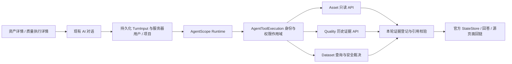

# AI 治理解读首版交付说明

日期：2026-10-05。产品范围：[F-009](../product/features/F-009-ai-governance-assistance.md)。状态：代码交付与自动化验证；产品真实环境验收尚未完成，Feature 保持 IMPLEMENTING。

## 1. 用户现在可以做什么

| 用户任务 | 入口和行为 | 结果来源 |
|---|---|---|
| 理解资产及治理状态 | 资产详情点击「AI 解读资产」，进入现有对话；快捷问题填入输入框，用户发送后开始推理 | Asset 台账和现有治理分区 |
| 理解一次质量执行 | 质量执行详情点击「AI 解读结果」，围绕实际 executionNo 解释结果和排查建议 | 已记录的 Execution / RuleExecution |
| 探索治理对象 | 在现有 AI 对话中搜索资产、读取资产及分区、读取质量执行 | 当前项目授权范围内的源域只读 API |
| 保留现有问数流程 | 发现数据集及字段后进行结构化聚合查询 | Dataset 负责版本、安全策略、脱敏和实际查询 |

入口需要 `agent:chat:run`。进入页面不会自动调用模型；切换历史会话或新建会话会清除入口目标及输入。源页面与 AI 页面仍位于现有导航中。

治理回答附带本轮引用 ID、源域、对象引用、证据状态、读取时间、源更新时间和内部回链。源域未提供更新时间时显示 `unknown`；读取时间不充当源更新时间。

质量回答使用历史结果中的实际值与预期值，不用当前 Monitor / Rule 覆盖过去的执行记录。保留 PASSED、NOT_PASSED、ERROR、RUNNING、NOT_RUN 的区别。首版不向模型发送执行 SQL、质量原始异常或连接配置。

## 2. 框架和技术落点

保留 AgentScope Java **2.0.2** 与 Spring Boot **3.3.13**；没有更换运行时、添加第二套 Agent、升级依赖版本或新增 Maven module。沿用官方 StateStore、现有 SSE、轮次队列、澄清恢复、取消及工具 trace。

| 边界 | 实现职责 |
|---|---|
| `GovernanceTarget` / `TurnInput` | 可选 assetId 或 qualityExecutionNo，二选一；随轮次持久化。旧 JSON 保持兼容，HITL 恢复继承原目标，客户端不得在恢复时替换目标 |
| `TrustedUserScope` / Boot 适配 | 每次工具调用读取账号状态和授权快照，确认项目可访问，绑定真实执行线程，退出恢复原上下文；ProjectAccessGuard 再确认项目成员关系 |
| `AgentToolExecution` | 身份只取服务器 RuntimeContext；检查 `agent:chat:run`，将后台异常转换为有限错误类别 |
| `AssetGovernanceQueryApi` | 复用 AssetAppService、AssetDiscoverService 和共享分区投影，源域检查 `data-asset:read`，保留原有适用矩阵及分区权限 |
| `QualityEvidenceQueryApi` | 源域检查执行读取和 Monitor 读取权限，返回项目范围内的历史执行及规则结果 |
| `GovernanceEvidenceGateway` | 通过公开 API 消费源域事实，限定输出字段、大小和集合数量，保留五态与局部失败 |
| `GovernanceContextMiddleware` | 用户指定目标时，在模型推理前通过同一工具守卫读取源证据，初始读取纳入现有工具观测 |
| `GovernanceEvidenceLedger` / `GovernanceAnswerGuard` | 本轮证据引用登记，拒绝伪造和旧轮引用，过滤模型提供的跳转链接，生成服务器回链，更新同一官方会话状态 |

新增工具为 `search_assets`、`get_asset_evidence`、`get_asset_section_evidence`、`get_quality_execution_evidence`，参数见 Agent [TOOL_CONTRACTS](../../data-ops-business/data-ops-business-agent/TOOL_CONTRACTS.md)。Agent 不直接访问 Asset / Quality DAO 或它们的内部执行对象。

Model 的 Quality / Technical Metadata 仍保持 NOT_APPLICABLE；Lifecycle 仍只适用于 Model。页面浏览、结构引用和实际消费各自保留含义，不互相推导。没有采用 PROPOSED PD-005/006/007 扩展产品规则。

## 3. Dataset 路径的前置修正

`get_dataset_fields` 在本轮登记实际 `versionNo` 与字段；`run_dataset_query` 必须使用该快照。查询前重新读取当前版本，版本变化或未发现字段时拒绝，要求重新发现，拒绝路径纳入查询审计。查询冻结发现版本，传入认证用户主体及源域解析的角色 code，由 Dataset 继续裁决权限和脱敏；用户、角色、项目和版本都不是模型可填写的查询参数。

目录最多 50 项，字段最多 200 项；查询沿用既有行数限制并限制模型输出展示长度。发现目录是当前项目和 action 权限下的 ONLINE 目录，不声称新增了对象级发现授权。查询回复删除原有 SQL 展示，保留 queryId、行数、截断标识、耗时、版本及查询证据。

## 4. 如何验证和使用

1. 编译并启动本次修改后的后端与前端，复用原有数据库和模型接入。原 Agent 数据库基线已初始化时，本次不需要新增业务表迁移。
2. AI 配置集中到 Boot 的 `src/main/resources/application-ai.yaml`，由 `application.yml` 通过 `spring.config.import` 自动加载，无需激活 `ai` profile。原有 `YAK_AGENT_ENABLED` 和 `yak.agent.model.*` 环境配置继续生效；模型密钥按原环境配置注入。Quality 未装配时质量工具明确返回 UNAVAILABLE。
3. 用同项目测试账号打开资产详情或质量执行详情，点击 AI 入口，选择快捷问题并发送。
4. 打开每条证据回链，对比源对象和历史执行；对 Model、无权限分区、异常规则分别验证表达。
5. 执行普通 Dataset 分析，核对查询审计、版本、主体与脱敏结果；撤销权限、发布新版本后验证拒绝或要求重新发现。

具体自动化命令和逐项环境验收见 [验证记录](./acceptance/2026-10-05/README.md) 及 [试点场景](./acceptance/2026-10-05/SCENARIOS.md)。

## 5. 已知边界和发布状态

自动化验证覆盖真正的 AgentScope 生命周期、Toolkit 注册与工具调用、线程身份、引用校验和 StateStore 一致性；模型及部分源接口使用固定测试替身。尚未生成真实模型回答的准确率、费用、P95 延迟或试点效果数据。

引用校验能确认引用是否存在于本轮，不能证明每一句模型结论都被证据支持。事实、假设与建议的语义质量仍需按场景人工评测；历史对话也不是新的授权证据。首版没有自动修复、业务写命令、分类生效、规则草稿或向治理域写回报告。治理轮次禁止保存分析报告和执行 Python；普通 Dataset 报告流程保留并要求引用本轮查询证据，Python 原配置与默认关闭行为保持原状。

为了避免未经校验的正文先被展示，当前正文增量统一等待最终结果后发布；工具与思考进度仍流式展示。这会改变普通分析的逐字显示体验。已验证 SSE 结果映射和澄清恢复，实际模型的等待体验仍需试点。

证据摘要沿用现有 trace，没有新增跨场景成本面板、项目灰度配置或用户反馈库。单轮预算沿用现有最大迭代、模型超时与轮次超时。浏览器验证已打开本地入口，页面正确跳转登录并保留含目标的 returnTo；由于没有测试账号登录态，尚未验证登录后的新页面和真实模型回答。运行中的用户服务未被重启。产品真实 E2E 与发布尚待完成，因此不标记 SHIPPED。

后续优先完成实际登录态试点和模型评测，再进入第二期质量规则/描述草稿与人工采纳流程。框架迁移仍以调研中的具体触发条件及同场景对测为依据。
