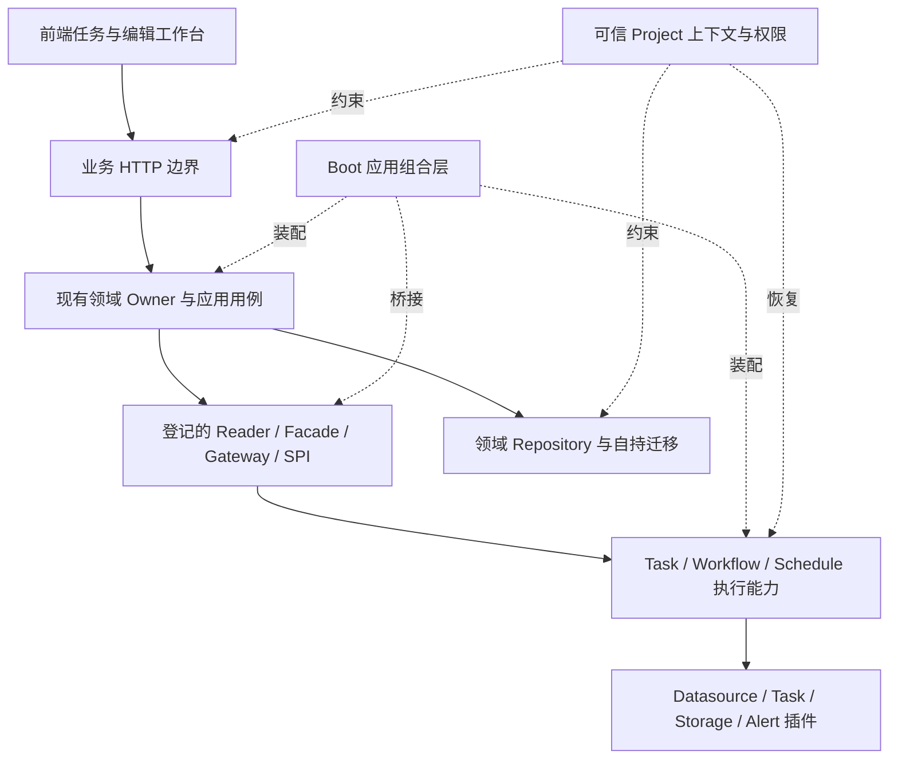

# DataOps 全项目架构分析与优化方案

日期：2026-10-03
分析基线：`main` / `9138491e9bd136a9d42f91b4dc786b1354c45eab`
性质：架构审查证据与建议，待拆分实施；本文不改变 Product Truth，也不是获批 Feature Spec。

## 1. 结论

建议继续采用**模块化单体 + 领域自持事实 + 插件化执行 + 应用组合层**。当前已有清晰的产品治理、多个模块的依赖矩阵、Workflow 持久化恢复和稳定扩展契约。优化重点是让这些边界真正覆盖所有变更路径。

优先级排序：

1. **P0：修复已失配的迁移契约检查，建立公共层和迁移的必跑门禁。**
2. **P1：收口跨模块 DAO 访问，调整共享持久化配置归属，控制 common 的领域持久化耦合。**
3. **P1：明确执行句柄的保留、重启与容量策略，统一前端请求语义，拆解高复杂度编辑器。**
4. **P2：按真实用例拆分后端大服务，统一读取可用性表达，改善发布包可复现性。**

每批只处理一个主要边界，保留现有稳定标识、公开接口与事实归属。需要改变业务行为的建议另走产品变更流程。

## 2. 用户与产品约束

| 必答项 | 本次回答 |
| --- | --- |
| User | 数据工程师、治理负责人、分析消费用户、平台管理员；架构改进的直接使用者包括开发与运维人员 |
| Problem | 跨模块实现细节泄漏、公共层变更扩散、编辑器状态复杂、迁移检查失配、运行容量与恢复契约不完整 |
| Capability | 提升现有能力的变更隔离、兼容升级、执行可靠性和前端可维护性 |
| User Journey | 保持现有 J1–J5 旅程，重点覆盖接入→开发→治理→消费，以及语义→模型→指标→发布→使用证据 |
| Expected Outcome | 局部变更由 owning subsystem 完成；失败与不确定性可见；已发布版本不被草稿修改影响；升级路径可验证 |
| Truth Owner | 仍由 Datasource、Metadata、Asset、Development、Workflow、Semantic、Modeling、Metric、MDM、Dataset、Data Service 等现有领域持有各自事实 |
| Producer / Consumer | 生产方通过已登记的 Reader / Facade / Gateway / API / SPI 提供事实，消费方做投影和编排；不直接读取生产方 DAO/表结构 |
| Existing capabilities to reuse | TaskExecutionGateway、Workflow engine/ledger/recovery、ProjectScope / CurrentProject / ProjectContextScope、SectionProvider、Consumption、Audit、插件 API、现有前端请求与品牌组件 |
| E2E acceptance evidence | 下文第 8 节列出实施验收；本次只做静态审查与文件一致性核对，未执行这些运行验收 |

权威依据：[PRODUCT_STYLE](../../../PRODUCT_STYLE.md)、[产品入口](../../product/README.md)、[Capability Map](../../product/CAPABILITY_MAP.md)、[User Journeys](../../product/USER_JOURNEYS.md)、ACCEPTED 的 [PD-001](../../product/decisions/PD-001-asset-governance-hub.md)、[PD-002](../../product/decisions/PD-002-governed-consumption-contract.md)、[PD-003](../../product/decisions/PD-003-business-semantic-metric-contract.md)，及相关 APPROVED / IMPLEMENTING 的 F-001、F-001-A/B、F-002、F-004、F-005、F-007、F-008。

PD-004 仍为 PROPOSED、F-006 仍为 DRAFT，不能据此扩大集成平台范围。历史 issue、review、backbone 脚本只提供证据。新增 Maven 业务模块、一级导航、业务状态机、第二份事实归属前必须经过产品治理。

## 3. 盘点方法与现状

### 3.1 范围与限制

- 扫描 `git ls-files` 中的当前源码、POM、CI、配置；分析框架、业务、插件、Boot、UI、发行包之间的静态关系。
- 全局盘点后对持久化、跨域调用、运行恢复、编辑器、CI 与迁移做定向代码阅读；不代表逐行审阅所有文件。
- Maven 图来自声明依赖，不是 effective POM；未计算全部 profile、继承、反射和 Spring 运行装配边。
- Java import 只匹配可解析的当前类，通配符等可能漏计；非 `.api/.spi` 的 import **不自动等于违规**，很多合法门面位于 `query`、`task`、根包。
- 行数包含空行和注释，用于寻找职责热点，不作为拆分硬指标。测试文件数不等于测试质量或覆盖率。
- 未运行全量 Maven verify、TypeScript 检查、数据库升级、负载测试或浏览器验收；本报告不宣称这些已通过。

可复现盘点：[inventory.mjs](./inventory.mjs)、[inventory.json](./inventory.json)、[evidence.mjs](./evidence.mjs)、[evidence.json](./evidence.json)。在仓库根目录运行两个 `.mjs`，输出仅写入本审查目录。

| 项目 | 当前结果 | 解读 |
| --- | ---: | --- |
| Maven Reactor 条目 | 77 | 包含聚合父 POM、API、插件；不能解释为 77 个产品域 |
| business 聚合直接子项 | 29 | sync 再分 offline / realtime |
| 当前生产 Java 文件 | 3,093 | 不含独立的 framework-legacy |
| Java 行数 | 248,138 | 包含注释和空行 |
| UI TS/TSX 非测试文件 | 1,184 | 208,208 行，包含声明文件 |
| 可解析跨 Maven 模块 import 次数 | 4,314 | 是引用次数，不是接口数量 |
| 声明编译依赖环 | 未发现 | 不能推出包依赖或运行装配也无环 |
| common 中 `/bean/po/` Java 文件 | 118 | 公共制品承担了大量领域持久化类型 |

### 3.2 应保留的架构

这是建议保持的职责关系，不表示图中节点必须新建 Maven module。

- Home 已有只读聚合边界，11 个内部声明依赖主要来自组合职责；不能因为依赖多就把它变成新的事实中心。
- Boot 的 37 个内部声明依赖符合装配职责；现有 Metric→Consumption 桥接放在 Boot 可避免业务模块反向依赖，适合继续使用。
- Datasource、Development、Job、Workflow、Lineage、Sync 等已经有可执行依赖护栏，适合扩展到其他领域。
- Workflow 恢复通过 `WorkflowRecoveryCoordinator` 重建已有执行事实，Agent 使用持久 QUEUED + CAS 认领；这些机制不应被新的通用运行中心取代。
- 跨模块使用松散 ID、不可变版本、SectionProvider 和 Consumption 投影的方向符合现有产品契约。

## 4. 具体优化项

### A01 / P0：迁移、契约测试与 CI 覆盖收口

**已确认事实**：以下四份 Flyway 契约测试引用的 SQL 文件，在对应模块当前 resources 中不存在：

| 模块 | 测试仍要求 | 当前实际文件 |
| --- | --- | --- |
| Agent | `V1__baseline_agent.sql`、V2、B2 | `V1__agent_baseline.sql` |
| Dataset | `V1__baseline_dataset.sql`、V2、V3、B3 | `V1__dataset_baseline.sql` |
| Data Service | `V1__baseline_data_service.sql`、V2–V4、B4 | `V1__data_service_baseline.sql` |
| Offline Sync | `V1__baseline_offline_sync.sql`、V2–V6、B6 | `V1__offline_sync_baseline.sql` |

这些测试包含 `containsExactly` / `Files.readString`，按当前文件布局无法满足断言或读取路径。这里是静态确认，未将它表述为已运行 Maven 得到的失败日志。完整名单见 `evidence.json.flywayMissingLiterals`。[E01–E04]

`Framework Integration` 有完整 `clean verify`，但 paths 主要限于根 POM、BOM、framework、release；普通业务、common、spi、core 变更并不必然触发它。其他 workflow 使用选择测试或路径筛选；例如 Metric 前置安装跳过测试，Consumption 选择名单不包含全部 Flyway 契约检查。[E05]

**方案**：

1. 单独 PR 修复四组测试的基线名称与内容检查，保留对 project_id、版本锁、consumer/access/evidence 字段的真实检查，避免只改文件名后删除断言。
2. 增加 always-on 的变更路由与架构检查：common/spi/core、根依赖管理、持久化配置变更触发全部相关消费者；SQL 变更必跑 owning 模块的迁移契约。
3. 每个 PR 有稳定命名的汇总 gate，失败/未执行不能被 paths 跳过误判为通过；业务变更按依赖影响闭包执行，合并队列或发布前跑完整 Reactor。
4. 架构 guard 使用已有矩阵/允许通道：先补 Modeling、MDM、Security、Lifecycle、Approval、Task Catalog 的跨域边界。它们已有行为测试，缺的是独立依赖护栏，不能称为“没有测试”。
5. 校验历史升级路径：当前迁移合并生成器改写 V1 并移除旧文件，对**已有旧迁移历史的数据库**存在校验兼容风险。先列出实际支持的起始版本，再在空库、当前基线库、受支持旧库上验证；没有部署历史证据时不能断言生产已经损坏。[E06]
6. 更新 MDM、Modeling、Asset、Lifecycle 的旧迁移说明。MDM 文档仍列 V2/V6/V17，Modeling 依赖说明仍讲 V18，菜单文档仍列 V2031/V2032；当前代码已归并为 baseline。这是事实漂移，不能用历史文档要求恢复旧实现。[E07]

**验收**：四组契约可执行；CI 触发矩阵包含公共层消费者；受支持数据库升级后 schema、关键数据和各历史表校验通过。历史版本未被正式支持时明确记录支持边界，不用自动 repair 掩盖校验错误。

### A02 / P1：让离线同步通过数据源拥有的业务端口访问数据源

**已确认边界泄漏**：`LinkUpJobSpecFactory`、`ColumnMappingLinkUpJobSpecFactory`、`OfflineJobDefinitionRepositoryAdapter` 直接 import `datasource.dao.DataSourceDao`，并使用共享 `DataSourcePO`。[E08]

DataSourceDao 明确是持久化模型接口；Datasource 契约限定 PO/DAO 在持久化边界。Offline 的现有 guard 主要保护内部包方向，不能阻止这三个跨域调用。DAO 实现已有 CurrentProject 校验，**本发现不是已证实的越权漏洞**。[E09]

**方案**：

1. 列清三处调用需要的资料：连接器类型、来源/目标配置、项目归属、启用与存在性检查、运行提交时的凭证解析。
2. 优先扩展现有 Datasource Reader/Gateway；确有差异时新增由 Datasource 拥有的窄端口，返回业务投影。不要原样包装全部 DAO 方法或输出 PO。
3. 逻辑定义构建只取非敏感资料与稳定引用；运行提交通过 existing outbound boundary 解析凭证，保持现有“不把凭证写入持久 JobSpec”的契约。
4. 分别迁移工厂与 repository adapter，新增精确 guard 禁止 Offline 对 Datasource DAO/Mapper/PO 的新增穿透。

**验收**：历史任务定义仍能构建；缺失/禁用数据源、跨项目 ID 和源目标配置有相同行为；任务快照、日志和审计不增加敏感字段；当前三处跨域 DAO import 归零。

### A03 / P1：共享持久化从业务域依赖转为应用装配依赖

**已确认的允许依赖债务**：`BusinessDatabaseConfiguration` 位于 datasource，却提供所有业务共享的 DataSource、SqlSessionFactory、事务管理器及多个兼容 bean alias。静态扫描有 23 次跨域导入该配置、101 次导入 Datasource enabled marker。MDM/Modeling 文档明确允许该平台惯例，因此不能直接判为违规。[E10]

其影响是：想使用共享业务库的模块，需要知道数据源模块的配置；数据源配置变更容易牵动整站。手写 typeAliases 列表和全局 XML 扫描也使装配细节与领域名单交织。当前 job/alert alias 字符串拼接缺少逗号，应在配置测试中核对，但不能据此直接推断所有 Mapper 运行失败。

**方案**：

1. 先固定现有 bean 名、条件开关、共享事务语义及模块独立测试用法，补应用启动/模块禁用/事务回滚的装配证据。
2. 用现有 `boot.config` 承担应用最终装配，复用 common 中已有 MyBatis 支持；业务模块只声明自己的 Mapper/Flyway 与所需 bean 契约。
3. 分步减少业务配置对 Datasource 持久化配置的 `@Import`；保留兼容入口和 alias，直到各模块及测试迁移完成。
4. Datasource 是否启用与共享业务库是否启用，应按既有配置含义分别表达；改动开关行为前同步契约并提供兼容策略。
5. 如模块确需脱离 Boot 独立复用，先证明该使用场景，再经治理评估小型基础设施制品。不要将整个数据库装配塞进负责插件运行机制的 core。

**验收**：开关组合可启动；没有重复 DataSource/事务管理器；共享事务原子性保持；各 Flyway namespace/history 独立；取消 Datasource 的业务功能不会意外取消其他已启用模块的存储。

### A04 / P1：控制 common 的领域持久化扩散

**现状**：common 有 282 个生产 Java 文件，其中 118 个在 `/bean/po/`；除共享契约，还依赖 MyBatis core、Validation、Schedule API 和 Alert API。SPI 又依赖 common，扩大了插件契约的依赖面。[E11]

多份模块文档将 PO 在 common 中定义为现有平台惯例，应该渐进调整。`common.api.metric.MetricQueryApi` 还用于避免 Modeling / Metric 的直接循环，不能把所有名称带业务词的接口一次搬回 owner 后引入回边。

**方案**：

1. 先按共享身份/值对象、稳定消费契约、领域 PO、技术适配四类建立清单；冻结新增跨域 PO 使用。
2. 先完成 A02 的公共 PO 消费清理，再选引用最少的一个领域，将 PO 迁回 owning 模块持久化边界；在同一 PR 更新 Mapper 与迁移/装配测试。
3. 迁移纯模块内部 PO 后逐步缩小 common。公开接口只返回领域拥有的投影，复用确实稳定的共享身份，不复制响应对象。
4. 对 Metric 查询这类跨向需要，保留现有稳定契约或使用已登记的 SPI 反向注册；用依赖图验证后再移动。不要为了“目录纯净”创建环。
5. SPI/插件 API 做最小 classpath 检查，禁止公共契约暴露 PO、Mapper、事务管理器和业务实现。

**验收**：首批领域持久化可独立修改；common PO 数量与外部 PO import 逐批下降；插件 API 不新增 ORM 类型；模块声明与包图保持无环。无需把现有 common 一次清空。

### A05 / P1：执行能力的容量、句柄与恢复契约

**已确认实现**：Job 的 `AbstractTaskExecutorAdapter` 使用 virtual-thread executor，以及 JVM 内 `executions` / `idempotencyIndex` / `idempotencyStarts`；启动竞争结束会清理 starts，但此类未定义 executions/index 的终态淘汰。[E12]

Workflow 已有持久化恢复，不能说整个项目只靠内存执行。需要明确的是插件本地 handle 的生命周期与持久账本的衔接，以及实际支持的单实例/多实例范围。[E13]

Agent 有持久排队与 CAS，同时使用 fixed thread pool，kick 的扫描和执行共用池；尚未显式定义队列上限与拒绝处理。Asset 对账有 JVM AtomicBoolean 互斥及单线程执行器。这些代码不能单独证明集群可安全并发，也不能据此宣称运行重复已发生。[E14]

**方案**：

1. 为每种执行类型登记：事实 owner、外部 executionId、项目上下文、幂等范围、取消确认、超时、重启后的真实行为、终态保留期。
2. 在现有 owner 内设置并发/队列与外部资源预算：SQL 连接、Python/Shell 子进程、网络调用分别限制；virtual thread 本身不构成数据库/进程容量上限。
3. Job 句柄终态分级保留：活跃状态不可淘汰；终态按配置上限/时间清理。幂等索引淘汰需结合 owning 持久账本和重试窗口，避免过期后重复提交副作用。
4. Agent 的 kick 合并重复唤醒、显式背压；投递失败不得使 dispatched 标记永久占用，持久 QUEUED 记录应可重新扫描。
5. 复用 ProjectContextScope 恢复后台执行上下文，记录 projectId / executionId / attempt / correlationId。不可借用请求线程残留上下文。
6. 先以重启与双实例实验确认能力。如果产品要求多实例，再设计带 owner/租约/失效条件的持久认领；增加状态或改变恢复语义须经过产品治理。

**验收**：突发负载下队列/连接/进程有限；终态句柄不无限增长；重启不伪造成功或自动重放不确定副作用；重复请求幂等；取消结果与实际执行一致；双项目后台上下文隔离。任何新状态命名先获批。

### A06 / P1：统一前端传输与状态管理边界

**已确认实现**：`utils/request.tsx` / `HttpUtils` 和 `@umijs/max.request` 并存；`app.tsx` 为 Max 补项目头，而统一 request 还处理业务错误、未认证事件、通知去重与协议差异。Workflow instances 使用 Max，definitions 使用 HttpUtils。[E15]

HttpUtils 目前保留 envelope 的 resolve 兼容路径，同时有 reject + unwrap 的 `getData/postData`。两个路径的调用约定不能仅凭 HTTP 200 推断业务成功。OpenAPI 配置仍含示例 schema 来源，并非受仓库当前后端契约约束的生成流程。[E16]

**方案**：

1. 新调用优先通过已有统一 request 边界：区分业务 envelope 与 transport、统一 Project header、401/403、取消和错误展示；老 envelope 调用逐页迁移并保留兼容。
2. Max / SSE / 下载等确需不同传输的入口，复用同一身份/项目/错误协议函数；不要用通用 JSON request 强行包装流式通道。
3. services 负责 DTO 与 HTTP 翻译；页面只消费明确类型的结果。将“空结果”“未启用”“无权限”“读取失败”与 loading 分开。
4. 增加 repo-owned 的 API schema 导出/校验流程，先选 Dataset 或 Workflow 验证 Java→DTO→TS 的差异检测。只对已稳定的 HTTP 契约生成类型，不生成领域所有权或把所有模块放入全局 API namespace。
5. 类型检查从 changed-surface 的零新增错误逐步扩展到整站；先生成本次 main 的可复现诊断基线，不沿用此前分支统计作为当前事实。现有 workflow 对部分路径之外诊断只告警，需补覆盖预算。

**验收**：同一失败请求不会继续成功链路；401 清理状态且只通知一次；403 不被解释成登录失效；项目头覆盖两种客户端；Abort 不报网络失败；协议错误可读；发布版本 DTO 差异能阻断 CI。

### A07 / P1：前端复杂编辑器按用例拆分

| 热点 | 静态规模 | 实际需要隔离的职责 |
| --- | ---: | --- |
| Modeling detail | 2,901 行 / 60 个 useState 调用 | 草稿结构、字段编辑、来源导入、派生预览、指标草稿、发布与审批 |
| FieldMappingSection | 2,931 行 | 映射草稿、表达式/字段选择、排序与校验、表格交互 |
| MDM cleansing | 1,481 行 / 30 个 useState 调用 | 规则编辑、重复组发现、合并预览、实际执行与结果反馈 |
| DataServiceNodeEditor | 1,309 行 / 28 个 useState 调用 | 节点草稿、SQL与参数、元数据选择、验证、绑定 |
| WorkflowDefinitionEditor | 1,190 行 / 20 个 useState 调用 | 图编辑、任务版本绑定、策略表单、保存与发布 |

这些数字来自词法计数，说明状态协调值得审查，不证明每个组件都有 bug。[E17]

**方案**：

1. Modeling 为首个试点：页面负责路由与布局；`ModelStructureDraft` 管结构与 dirty；导入/派生/发布分别有局部用例接口与 Dialog。现有 API 与保存数据形状保持兼容。
2. FieldMapping 以可测试的映射 draft/校验/序列化模型为核心，视图负责选择与展示；复用当前 connector definition 和 column ordinal，不另造字段身份。
3. 服务端状态、编辑草稿、短期 UI 状态分开管理；合并强相关字段为有类型的 draft/reducer，不把所有 useState 搬进一个巨型 hook。
4. 异步加载绑定 projectId、资源 ID 与请求代次；切换项目/对象后，旧响应不得覆盖新 draft。保持真实的未保存提示与版本冲突行为。
5. 当前 Asset→Metadata Explorer、MDM→QualityStatus、Development→DataService utils 等跨页面 import，将确实被多个领域使用的契约/组件放入现有共享职责位置；同域 pages import 无需机械搬迁。
6. 延续当前商业化样式与品牌 tokens；架构拆分 PR 保持可见交互一致，视觉调整另批验收。

**验收**：保存/取消/发布不丢字段；draft 与 published version 隔离；跨项目/对象切换不污染状态；字段排序与映射序列化稳定；只读状态不可写；编辑流按公开行为测试，避免只锁组件内部结构。

### A08 / P2：后端职责热点采用“稳定入口 + 内部专业角色”

**证据**：ModelDeriveService 1,456 行、16 个构造依赖，集预览、来源解析、聚合派生、指标草稿、持久映射与血缘登记；MdmCleanService 1,090 行，集规则 CRUD、去重发现、忽略组、合并与标准化/补全；Framework UserResourceServiceImpl 1,671 行，包含资源授权分配、控制等级、多个管理查询。[E18]

**方案**：

- **Modeling**：保留外部 derive/preview 门面；抽取不可变派生计划与纯字段选择规则，复用已有 DeriveLayerPolicy / Matcher / Mapping / PublishedStructureReader；写入协调器继续拥有同一事务中的模型、映射和登记。preview 与 derive 共用计划逻辑，执行时重新校验实时前置条件。
- **MDM**：按 Rule 管理、Dedup 读取计划、Merge 协调、Transform 计划四个用例划分；PK 不可变、expected version CAS、治理字段优先级仍由 F-007 和 owning repository 保证。把 `MdmDedupKeyRow` 从 DAO 输出转为清洗查询投影，缩小 application→持久化类型泄漏。[E19]
- **Workflow**：先围绕既有 persistence / recovery / event stream / dispatch 专业角色整理 Runtime 的协调入口；保持执行身份、attempt 和恢复真相。不能再拆出独立拥有运行状态的“总运行中心”。
- **Security framework**：保持公开 service API，优先隔离授权决策、批量分配写入与管理查询；保留事务、撤权失效与权限缓存一致性，补关键组合场景后再迁移。Framework 面向外部发布，不能跟随单个业务域重命名公共接口。
- **SQL lineage**：baseline parser 与 DerivedAware 子类都有 AST 分析路径和聚合函数集合；保留现有 parse / SchemaProvider 接口，先比较行为与重复代码，再在 Development 内共用 scope/column origin 解析；不把领域血缘解释塞进通用字符串工具。[E20]

**验收**：调用方继续使用稳定入口；preview/apply 口径一致；事务失败不残留部分模型/合并；CAS 竞争明确失败；SQL CTE/子查询 flatten 不产生虚假资产；扩展规则只修改对应角色与行为测试。类变短本身不算验收。

### A09 / P2：只读聚合可用性与查询预算统一

HomeCockpitReader 当前将缺失 Reader 和读取异常降级为 0，然后把多个域运行计数相加；Quality Reader 则提供 available 语义。这会让顶部摘要无法表达部分不可用。[E21]

**契约冲突说明**：Home REQUIREMENTS 明确记录 Cockpit 历史降级为 0，并要求提取重构维持兼容。因此该项属于**允许的兼容债务与单独行为优化候选**，不能在结构重构中直接改成 null 或新状态。

**方案**：先经行为契约批准，再以兼容附加字段表达各区域可用性、采集时间与缺失原因；各 owner 负责有界聚合，Home/Asset/Metadata 组合而不复制事实。用真实窗口与上限评估查询次数，再决定缓存；缓存键必须含项目、权限范围及事实版本，TTL/失效由 owner 明确。对 N+1 和查询耗时先测量再优化。

**验收**：一域失败不影响其他区域；真实 0 与不可用可区分；不使用替代字段冒充指标；页与游标有界；两项目缓存与权限隔离。

### A10 / P2：装配矩阵与发行包可复现

发行 assembly 直接读取 `../data-ops-ui/dist`，Boot 包与静态前端产物可能来自不同构建时刻；本次未验证实际发行物有混版，因此这是发布风险候选。[E22]

**方案**：CI 从干净目录构建 UI 与完整 Reactor，打包前校验前后端 commit/build id、前端产物存在性和 checksum；产物中记录版本、JDK、支持数据库起始版本及必要配置。增加应用启用组合的 smoke 测试，覆盖 Metric 等条件扫描以及关键 provider 缺失的真实行为。插件清单声明能力及 API 兼容范围，沿用现有注册表。Legacy Java 8/Boot 2 data-job 保持独立构建和兼容边界，不能因全局 JDK 21 升级顺带纳入当前 Reactor。[E23]

**验收**：同一 commit 可产出完整一致发行包；缺少 UI 产物时失败；最小/默认/关键模块关闭组合可启动；插件类型重复或不可用报告明确；历史兼容制品独立验证。

## 5. 各模块处理范围

以下覆盖 business 的 29 个直接子项及 sync 子项；没有发现的问题不因模块规模小就自动补齐功能。

| 模块组 | 当前边界判断 | 对应动作 |
| --- | --- | --- |
| audit | 已有稳定审计门面与事务助手 | 保持 fail-open 契约，纳入公共变更消费者测试 A01 |
| datasource | Reader/Gateway/DAO 与插件边界较完整 | A02 提供 owning 投影；A03 移交共享装配职责 |
| resource | 已有 Repository 与资源契约 | A03/A04 适配迁移；不改资源身份 |
| sync / offline / realtime | 已有 connector、cursor、revision、execution 边界 | A01/A02/A05；保护增量 checkpoint 与不可变 revision |
| job / task-catalog | 执行入口与目录职责分开 | A05；补目录对业务实现的依赖护栏 |
| data-development | 发布、执行、证据已形成多个角色 | A06/A07/A08；保持任务定义与证据归属 |
| workflow | 有 ledger、恢复、调度触发、backfill | A05/A08；先资源和恢复契约，再缩小协调类 |
| quality | 已有规则/执行/overview 及 guard | A05/A09；复杂 SQL 先保 ownership 和计划可读性，不按长度改回 XML |
| lineage | 已有 registration/query 与边界测试 | 保持登记/证据 owner；支持 A08 解析器验收 |
| metadata / asset | 原生事实与治理账本/投影分工成立 | A09 区域可用性、provider 预算；不新增第二份元数据或资产主真相 |
| semantic / modeling / metric | 稳定语义、模型与指标版本已经建立 | A01/A04/A07/A08；Metric 不新增查询引擎或 Data Product 主实体 |
| mdm | 保留主数据特有用例及 F-007 正确性 | A01/A07/A08；复用采集、执行、质量与服务 |
| dataset / data-service / consumption | owning object 与 governed projection 分开 | A01/A06；补 Consumption 本地依赖契约，沿用既有 golden 测试 |
| analysis / dashboard / digital-screen | 消费结果与展示配置 owner | A06 请求与类型；按真实复杂度选择拆分，不建新消费真相 |
| agent | 已有持久队列、CAS 与 orphan 收敛 | A01/A05；本架构分析包含运行层，未提议修改 AI 页面 |
| home | 只读聚合定位清晰 | A09；不新增 Home 表、command 门面或事实 owner |
| governance / security / lifecycle / approval | 各有现成用例与行为测试 | A01 补跨域 guard；审批/治理生命周期不合并为通用状态机 |
| alert | 通道/通知集成 | A05/A10；限定投递重试与容量，保留既有插件边界 |
| common / spi / core / bom | 共享概念、扩展契约、运行机制与版本管理 | A01/A04；按公开依赖面收敛 |
| framework / plugins | 框架发布与可替换技术实现 | A08/A10；保护独立发布 API，防止插件依赖业务实现 |
| boot / ui / dist | 应用装配、用户交互与交付 | A03/A06/A07/A10 |

## 6. 建议分批实施

| 批次 | 主要 PR 边界 | 前置条件 | 完成证据 |
| --- | --- | --- | --- |
| 1：恢复可信基线 | 四组迁移测试；文档事实；公共层 CI 路由；受支持升级路径登记 | 当前 main | A01 文件/内容断言、触发矩阵、数据库路径报告 |
| 2：跨域端口试点 | Datasource 非敏感投影；Offline 工厂/adapter 逐处迁移；跨域 guard | 批次 1 | A02 行为不变，3 处 DAO 穿透归零 |
| 3：平台装配与 shared 收口 | 先配置装配/alias，再一个低耦合领域 PO 迁移 | 批次 1/2 | 启动矩阵、事务、插件 classpath、PO 引用下降 |
| 4：运行可靠性 | 分执行类型定义预算、终态保留、恢复与投递拒绝 | 批次 1；恢复行为已确认 | 负载/重启/重复提交/取消/项目隔离证据 |
| 5：前端架构 | 请求协议统一；Modeling 试点；FieldMapping、MDM、Workflow 按序 | 批次 1；当前类型基线 | 编辑用例回归、零新增类型错误、异步响应隔离 |
| 6：内部角色与交付 | ModelDerive、MDM、Security、SQL lineage 分别拆；聚合语义另 PR；发行元信息 | 对应行为基线 | A08/A09/A10 各自验收 |

批次 3/4/5 可在接口基线冻结后由不同负责人独立推进。一个 PR 不同时混入 package move、DB schema、REST 破坏性变化、新业务状态和视觉换版。建议首轮承诺批次 1 + 2 + 一个 Modeling 编辑器试点，再根据实际改动扩散和回归成本确定后续排期；目前没有工作量测量，故不承诺整站完成日期。

## 7. 架构约束落地方式

- 业务公共入口清单写入各自 DEPENDENCIES：以精确 Reader/Facade/Gateway/SPI 为允许通道，不用“整个 api 包全允许”掩盖变更。
- 跨域禁止 DAO/Mapper/Repository implementation/PO 泄漏；迁移期精确列出旧引用，禁止新增，逐批清零。
- common/spi/core 不得依赖业务实现；plugin implementation 不得反向消费 business；Boot 可以组合两域的已登记端口。
- Controller 保持参数、权限、项目与返回映射职责；应用用例保持业务不变量和事务 owner；Repository 保持项目绑定与存储语义。
- Architecture guard 先复用现有源码扫描。反射/运行装配用启动测试补充；若通配符和字节码关系成为实际漏检问题，再评估额外工具。
- 指标按批记录：跨域 DAO/PO 引用、common PO、公开入口数量、相关变更触及模块数、不可用区分、队列/活跃句柄量、类型错误新增数、升级成功路径。不能用类行数下降证明用户结果改善。

## 8. 实施验收场景

| 场景 | 需要证明的结果 | 证据形式 |
| --- | --- | --- |
| 新安装 + 支持版本升级 | 各 namespace schema/关键数据与 history 一致，无 checksum 绕过 | 数据库快照、迁移日志、内容断言 |
| 接入→离线定义→运行 | 稳定数据源引用、凭证只在运行边界、历史 revision 可执行 | API/adapter 集成测试与脱敏日志 |
| 两项目 + HTTP/后台/恢复 | 非法项目请求被拒绝；后台绑定持久可信项目；无缓存/句柄串用 | 隔离与上下文清理测试 |
| Workflow 调度/重复请求/重启 | 保持唯一 execution/attempt；未知外部结果不伪造成功 | 现有账本 + 重启/故障注入 |
| 突发任务/取消/超时 | 排队与资源有界；真实取消；容量指标稳定 | 受控负载和执行结果 |
| 模型草稿→审批/发布→使用 | preview 与写入一致；草稿不修改已发布版本 | 用例测试与版本快照比对 |
| MDM merge/clean/source refresh 并发 | PK 不变、CAS 不静默覆盖、治理优先级与 source_ids 幂等保持 | F-007 对应集成回归 |
| Dataset/Data Service 消费 | 投影不复制真相；Access/Subscription/Usage 仍区分；失败可见 | 复用 Consumption golden 场景 |
| 编辑中切换项目/对象 | 旧请求不能覆盖新对象；dirty 与取消语义正确 | 前端交互测试/后续浏览器复验 |
| Provider 缺失/权限不足 | 聚合区域可独立不可用；真实零仍显示零 | read-side 故障测试 |
| 发行包冷启动 | UI/API 同 commit；启用组合正确；插件报告明确 | 干净构建、checksum、启动 smoke |

这些是后续实施验收要求。本次仅生成静态盘点及文档，未执行上述 E2E。

## 9. 证据索引

链接指向当前仓库文件，行号用于定位本次基线的阅读位置。

| 编号 | 文件 / 定位 |
| --- | --- |
| E01 | [AgentFlywayContractTest](../../../data-ops-business/data-ops-business-agent/src/test/java/io/yak/ops/business/agent/architecture/AgentFlywayContractTest.java)，19–25 行 |
| E02 | [DatasetFlywayContractTest](../../../data-ops-business/data-ops-business-dataset/src/test/java/io/yak/ops/business/dataset/architecture/DatasetFlywayContractTest.java)，19–30 行 |
| E03 | [DataServiceFlywayContractTest](../../../data-ops-business/data-ops-business-data-service/src/test/java/io/yak/ops/business/dataservice/architecture/DataServiceFlywayContractTest.java)，29–36 行 |
| E04 | [OfflineSyncFlywayContractTest](../../../data-ops-business/data-ops-business-sync/data-ops-business-sync-offline/src/test/java/io/yak/ops/business/sync/offline/architecture/OfflineSyncFlywayContractTest.java)；现存 SQL 见 evidence.json |
| E05 | [Framework Integration](../../../.github/workflows/framework-integration.yml)、[Consumption Checks](../../../.github/workflows/consumption-checks.yml)、[Metric Checks](../../../.github/workflows/metric-checks.yml)、[Development Checks](../../../.github/workflows/data-development-checks.yml) |
| E06 | [迁移合并生成器](../../../scripts/db/consolidate-flyway-migrations.py)，文件开头合并规则与 MODULES |
| E07 | [MDM Architecture](../../../data-ops-business/data-ops-business-mdm/ARCHITECTURE.md)、[Modeling Dependencies](../../../data-ops-business/data-ops-business-modeling/DEPENDENCIES.md)、[Asset Architecture](../../../data-ops-business/data-ops-business-asset/ARCHITECTURE.md)、[Lifecycle Architecture](../../../data-ops-business/data-ops-business-lifecycle/ARCHITECTURE.md) |
| E08 | [LinkUpJobSpecFactory](../../../data-ops-business/data-ops-business-sync/data-ops-business-sync-offline/src/main/java/io/yak/ops/business/sync/offline/engine/LinkUpJobSpecFactory.java)，8/393 行；另两处见 evidence.json |
| E09 | [DataSourceDao](../../../data-ops-business/data-ops-business-datasource/src/main/java/io/yak/ops/business/datasource/dao/DataSourceDao.java)、[DataSourceDaoImpl](../../../data-ops-business/data-ops-business-datasource/src/main/java/io/yak/ops/business/datasource/dao/impl/DataSourceDaoImpl.java)，80–86 行；[Datasource Dependencies](../../../data-ops-business/data-ops-business-datasource/DEPENDENCIES.md) §9 |
| E10 | [BusinessDatabaseConfiguration](../../../data-ops-business/data-ops-business-datasource/src/main/java/io/yak/ops/business/datasource/config/BusinessDatabaseConfiguration.java)、[MDM Dependencies](../../../data-ops-business/data-ops-business-mdm/DEPENDENCIES.md) |
| E11 | [common POM](../../../data-ops-common/pom.xml)、[SPI POM](../../../data-ops-spi/pom.xml)、[common package contract](../../../data-ops-common/src/main/java/io/yak/ops/common/package-info.java) |
| E12 | [AbstractTaskExecutorAdapter](../../../data-ops-business/data-ops-business-job/src/main/java/io/yak/ops/business/job/runtime/AbstractTaskExecutorAdapter.java)，47–61、160、341 行 |
| E13 | [WorkflowRuntime](../../../data-ops-business/data-ops-business-workflow/src/main/java/io/yak/ops/business/workflow/runtime/WorkflowRuntime.java)，474 行起；[WorkflowRecoveryCoordinator](../../../data-ops-framework/data-workflow/data-workflow-engine/src/main/java/io/yak/framework/workflow/engine/api/WorkflowRecoveryCoordinator.java) |
| E14 | [AgentTurnDispatcher](../../../data-ops-business/data-ops-business-agent/src/main/java/io/yak/ops/business/agent/conversation/AgentTurnDispatcher.java)、[AssetReconcileService](../../../data-ops-business/data-ops-business-asset/src/main/java/io/yak/ops/business/asset/reconcile/AssetReconcileService.java) |
| E15 | [request](../../../data-ops-ui/src/utils/request.tsx)、[HttpUtils](../../../data-ops-ui/src/utils/HttpUtils.tsx)、[app](../../../data-ops-ui/src/app.tsx)、[Workflow instances](../../../data-ops-ui/src/services/workflow/instances.ts)、[definitions](../../../data-ops-ui/src/services/workflow/definitions.ts) |
| E16 | [UI config](../../../data-ops-ui/config/config.ts)，178–190 行；类型 gate 见 E05 |
| E17 | [Modeling detail](../../../data-ops-ui/src/pages/modeling/detail.tsx)、[FieldMappingSection](../../../data-ops-ui/src/pages/integration/batch-link-up/detail/components/FieldMappingSection.tsx)、[MDM cleansing](../../../data-ops-ui/src/pages/mdm/cleansing/index.tsx)、[DataServiceNodeEditor](../../../data-ops-ui/src/pages/development/data-development/components/data-service/DataServiceNodeEditor.tsx)、[WorkflowDefinitionEditor](../../../data-ops-ui/src/pages/workflow/definition/components/WorkflowDefinitionEditor.tsx) |
| E18 | [ModelDeriveService](../../../data-ops-business/data-ops-business-modeling/src/main/java/io/yak/ops/business/modeling/derive/ModelDeriveService.java)，114/375/466/890 行；[MdmCleanService](../../../data-ops-business/data-ops-business-mdm/src/main/java/io/yak/ops/business/mdm/application/MdmCleanService.java)，360/583/599/812/847 行；[UserResourceServiceImpl](../../../data-ops-framework/data-security/src/main/java/io/yak/framework/security/service/impl/UserResourceServiceImpl.java) |
| E19 | [MdmRecordRepository](../../../data-ops-business/data-ops-business-mdm/src/main/java/io/yak/ops/business/mdm/infrastructure/repository/MdmRecordRepository.java)、[F-007](../../product/features/F-007-mdm-record-correctness.md)、[MDM Domain](../../../data-ops-business/data-ops-business-mdm/DOMAIN.md) |
| E20 | [SqlColumnLineageParser](../../../data-ops-business/data-ops-business-data-development/src/main/java/io/yak/ops/business/development/service/SqlColumnLineageParser.java)、[DerivedAwareSqlColumnLineageParser](../../../data-ops-business/data-ops-business-data-development/src/main/java/io/yak/ops/business/development/service/DerivedAwareSqlColumnLineageParser.java) |
| E21 | [HomeCockpitReader](../../../data-ops-business/data-ops-business-home/src/main/java/io/yak/ops/business/home/cockpit/HomeCockpitReader.java)，51–96 行；[Home Requirements](../../../data-ops-business/data-ops-business-home/REQUIREMENTS.md) Data semantics；[Quality Reader](../../../data-ops-business/data-ops-business-home/src/main/java/io/yak/ops/business/home/quality/HomeQualityOverviewReader.java) |
| E22 | [发行 assembly](../../../data-ops-dist/src/main/assembly/assembly.xml)、[dist POM](../../../data-ops-dist/pom.xml) |
| E23 | [Framework README](../../../data-ops-framework/README.md)、[Metric conditional scan](../../../data-ops-boot/src/main/java/io/yak/ops/boot/config/MetricModuleComponentScanConfiguration.java)、[Metric Consumption bridge](../../../data-ops-boot/src/main/java/io/yak/ops/boot/metric/ConsumptionMetricObservedUsageProvider.java)、[ProjectContextScope](../../../data-ops-core/src/main/java/io/yak/ops/core/project/ProjectContextScope.java) |

## 10. 本次交付与工作区状态

已切到远端最新 main 并执行 `pull --ff-only`，基线为 `9138491e`。原 UI 工作区保存到 stash，旧本地 main 两个未推送提交保存在 `codex/preserved-local-main-20261003`；原 untracked 数据和其他证据目录保留。

本次只新增本目录的方案、静态盘点脚本与结果，未修改业务源码、数据库、Issue 或远端分支。此任务要求分析方案，未提交新的实施 PR。

## 实施记录

本文件保留初始 main 分析基线；后续代码实施、支持边界与验收结果见 [runtime-and-migration-contracts.md](runtime-and-migration-contracts.md) 和 [implementation.md](implementation.md)。
