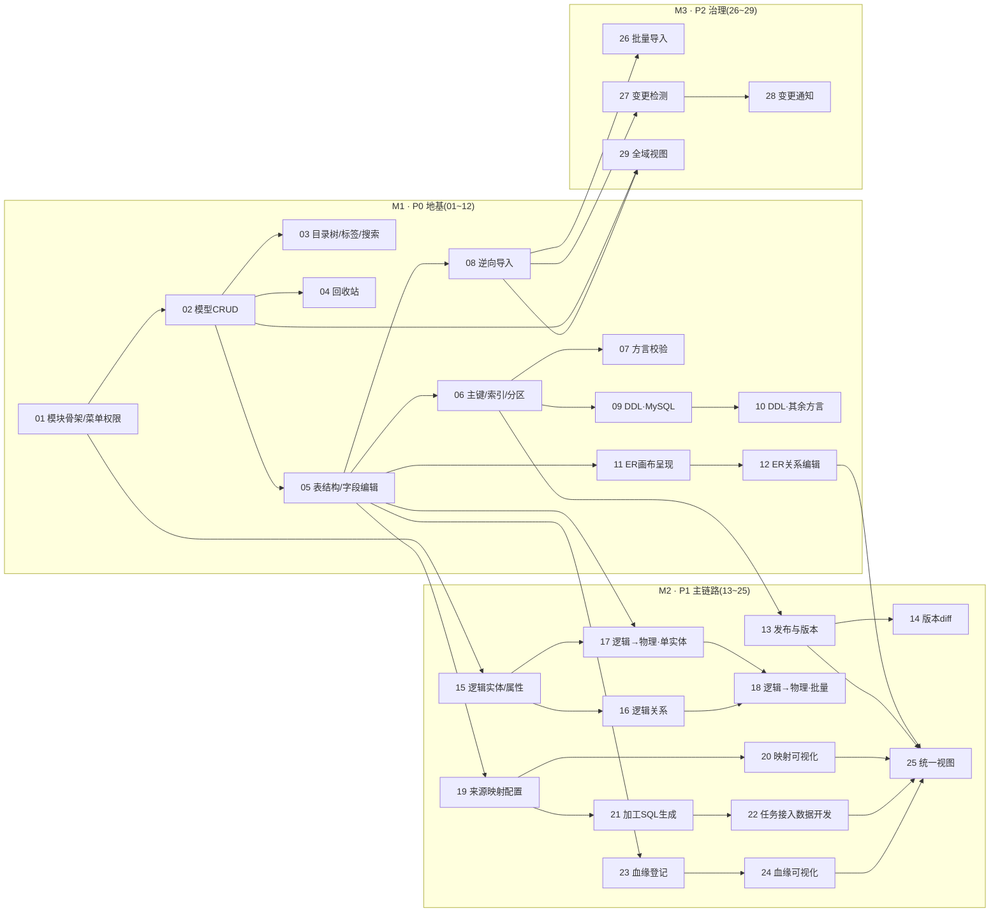

# 数仓建模开发计划与跟踪

> 来源:[modeling-requirements.md](./modeling-requirements.md) v1.0(需求侧 10 项决策 D1~D10 已确认)
> 拆分方式:tracer-bullet 垂直切片,每个 ticket 贯通 表结构 → API → UI → 可验收
> Tickets 目录:[docs/model/issues/](./issues/)(一个 ticket 一个文件,编号即依赖拓扑顺序,也是建议开发顺序)
> 状态:计划基线 v1.0(2026-09-09);**v2.0 重构(2026-09-18)** 见 [modeling-v2-design.md](./modeling-v2-design.md),重构 tickets 58~62

---

## 0. 硬性开发约束(不可打破)

> **本节为硬性要求,适用于数仓建模相关的所有 ticket、所有开发者与所有 AI 代理,绝不允许打破。与任何交付进度冲突时,以约束为准。**

### 0.1 契约先行(Contract-First)

1. **所有功能开发必须先有契约文件,才有对应的代码。** 契约文件未更新(后端)或未确认(前端)之前,不允许编写任何业务代码。
2. **后端**:每个 `yak-ops-business-*` 模块根目录维护契约文件集 —— `README.md`、`DOMAIN.md`、`ARCHITECTURE.md`、`DEPENDENCIES.md`、`REQUIREMENTS.md`、`REVIEW.md`。每个 ticket 开工的**第一步**是更新本次涉及的所有模块的契约文件:
   - `DOMAIN.md`:领域概念、实体、不变量;
   - `ARCHITECTURE.md`:模块内结构与分层;
   - `DEPENDENCIES.md`:对其他模块的依赖方向与原因;
   - `REQUIREMENTS.md`:本 ticket 引入/变更的行为要求;
   - `README.md` / `REVIEW.md`:入口说明与评审要点。
   契约变更与对应代码在**同一个 PR** 中提交评审,契约 diff 先于代码 diff 被审阅。
3. **新建模块**(如建模模块):契约文件集是 ticket 01 的**第一个交付物**,先于任何 Java/SQL/前端代码存在。
4. **跨模块改动**:ticket 涉及多个模块时(如 22 涉及数据开发、23/24 涉及血缘、27 涉及数据源),每个被涉及模块的契约文件都要先行更新,遵循目标模块的既有契约与扩展点。

### 0.2 前端契约文件只读

1. **`yak-ops-ui/` 下所有 `.md` 文件不允许修改,只允许阅读和遵守。** 包括但不限于:`docs/navigation-menu-contract.md`、`docs/security-contract-matrix.md`、`docs/business-security-contract-matrix.md`、`docs/bi-editor-engineering.md`、`FRONTEND_CODE_STYLE.md`,以及各页面目录下的 README。
2. 前端实现必须**符合契约并通过契约测试**(如 `navigationMenuContract.test.ts`):每个可见路由声明稳定 `menuCode`,业务菜单行进 Yak Ops 自有 Flyway,不得触碰 `system-*` 命名空间;权限编码不得在未取得后端证据前写入路由/菜单。
3. **如新功能与现有前端契约冲突、或契约未覆盖新场景**:不得擅自修改契约文件,必须停下并在 ticket/评审中上报,由契约维护方更新契约后方可继续开发。

### 0.3 项目全局规范(强制适用)

| 规范 | 位置 | 关键要求 |
| --- | --- | --- |
| 后端代码风格 | `CODE_STYLE.md` | 全部 Java 代码遵守 |
| 前端代码风格 | `yak-ops-ui/FRONTEND_CODE_STYLE.md` | 全部前端代码遵守 |
| 项目空间数据边界 | `docs/architecture/PROJECT_SCOPE.md` | project_id 只取服务端可信上下文;异步任务必须能独立恢复项目上下文;不建物理外键 |
| 首页/总览契约 | `docs/home-overview-contract.md` | 统计服务端聚合;禁止无界 list() 后内存统计;独立容错,"查不到"≠0 |
| 菜单授权契约 | `yak-ops-ui/docs/navigation-menu-contract.md` | 稳定 menuCode;契约测试必须通过 |
| 数据库迁移 | 各业务模块自持 Flyway | 建模自建 `db/migration/yak-modeling`、语义自建 `db/migration/yak-semantic`,均 V1 起编;菜单注册追加 yak-security 时建模取 ≥V2018、semantic 取 ≥V2019 |

---

## 1. 里程碑

| 里程碑 | 阶段 | Tickets | 出口判据(演示场景) |
| --- | --- | --- | --- |
| M1 地基:模型资产最小闭环 | P0 | 01~12 | 把存量库表导入成平台内模型资产:目录可管理、结构可编辑、关系画布可视、DDL 脚本可出 |
| M2 主链路:设计→落地→加工→溯源 | P1 | 13~25 | 逻辑建模 → 一键生成物理模型 → 配置映射 → 生成 SQL 任务在数据开发执行 → 血缘可溯 → 模型一页看清全貌 |
| M3 治理:管得住 | P2 | 26~29 | 整库批量导入、源端结构变更自动发现并通知、项目空间内全域模型视图 |
| M4 业务语义主线 | P0.5/P1 | 30~47(语义 30–42 见 [../semantic/dev-plan.md](../semantic/dev-plan.md),方案见 [../semantic/m4-integration.md](../semantic/m4-integration.md);建模消费 43–48 见本表) | 标准→业务过程→派生建模→映射/血缘→资产→反哺的完整业务闭环 |

## 2. 依赖图

无阻塞关系的 ticket 可并行(如 03/04/05 在 02 完成后可同时开工;15 与 05 无依赖可并行)。

## 3. 状态总表

> 状态流转:`ready-for-agent`(可开工)→ `in-progress`(进行中)→ `in-review`(待评审)→ `done`(完成)。
> **工作前沿**:从"所有阻塞均已完成"的 ticket 中领取;完成一个 ticket 后勾选其文件中的验收项并同步本表。

| 编号 | Ticket | 阶段 | 阻塞于 | 状态 | 负责人 | 模块 |
| --- | --- | --- | --- | --- | --- | --- |
| 01 | [模块骨架与菜单权限接入](./issues/01-module-scaffold-menu.md) | P0 | 无 | in-review | | modeling |
| 02 | [模型实体 CRUD](./issues/02-model-crud.md) | P0 | 01 | in-review | | modeling |
| 03 | [目录树/标签/搜索](./issues/03-catalog-organization.md) | P0 | 02 | in-review | | modeling |
| 04 | [回收站](./issues/04-recycle-bin.md) | P0 | 02 | in-review | | modeling |
| 05 | [表结构与字段编辑](./issues/05-table-field-editing.md) | P0 | 02 | in-review | | modeling |
| 06 | [主键/索引/分区](./issues/06-pk-index-partition.md) | P0 | 05 | in-review | | modeling |
| 07 | [方言合法性校验](./issues/07-dialect-validation.md) | P0 | 06 | in-review | | modeling |
| 08 | [逆向导入](./issues/08-reverse-import.md) | P0 | 05 | in-review | | modeling |
| 09 | [DDL·MySQL](./issues/09-ddl-mysql.md) | P0 | 06 | in-review | | modeling |
| 10 | [DDL·其余方言](./issues/10-ddl-dialects.md) | P0 | 09 | in-review | | modeling |
| 11 | [ER 画布呈现](./issues/11-er-canvas-render.md) | P0 | 05 | ready-for-agent | | modeling |
| 12 | [ER 关系编辑](./issues/12-er-relation-edit.md) | P0 | 11 | ready-for-agent | | modeling |
| 13 | [发布与版本](./issues/13-publish-versions.md) | P1 | 06 | ready-for-agent | | modeling |
| 14 | [版本 diff](./issues/14-version-diff.md) | P1 | 13 | ready-for-agent | | modeling |
| 15 | [逻辑实体/属性](./issues/15-logical-entities.md) | P1 | 01 | ready-for-agent | | modeling |
| 16 | [逻辑关系](./issues/16-logical-relations.md) | P1 | 15 | ready-for-agent | | modeling |
| 17 | [逻辑→物理·单实体](./issues/17-logical-to-physical-single.md) | P1 | 15, 05 | ready-for-agent | | modeling |
| 18 | [逻辑→物理·批量](./issues/18-logical-to-physical-batch.md) | P1 | 17, 16 | ready-for-agent | | modeling |
| 19 | [来源映射配置](./issues/19-mapping-config.md) | P1 | 05 | in-review | | modeling |
| 20 | [映射可视化](./issues/20-mapping-visualization.md) | P1 | 19 | ready-for-agent | | modeling |
| 21 | [加工 SQL 生成](./issues/21-processing-sql.md) | P1 | 19 | ready-for-agent | | modeling |
| 22 | [任务接入数据开发](./issues/22-processing-task-integration.md) | P1 | 21 | ready-for-agent | | modeling |
| 23 | [血缘登记](./issues/23-lineage-registration.md) | P1 | 05 | in-review | | modeling |
| 24 | [血缘可视化](./issues/24-lineage-visualization.md) | P1 | 23 | ready-for-agent | | modeling |
| 25 | [统一视图](./issues/25-unified-model-view.md) | P1 | 12, 13, 20, 22, 24 | in-review | | modeling |
| 26 | [批量导入](./issues/26-bulk-import.md) | P2 | 08 | ready-for-agent | | modeling |
| 27 | [变更检测](./issues/27-change-detection.md) | P2 | 08 | in-review | | modeling |
| 28 | [变更通知](./issues/28-change-notification.md) | P2 | 27 | ready-for-agent | | modeling |
| 29 | [全域视图](./issues/29-project-overview.md) | P2 | 02, 08 | ready-for-agent | | modeling |
| 43 | [字段分层映射(派生自动记录)](./issues/43-layer-field-mapping.md) | P1 | 35, 19 | in-review | | modeling |
| 44 | [按业务过程派生建模](./issues/44-process-derived-modeling.md) | P1 | 35, 36, 37, 43, 05 | in-review | | modeling 消费 |
| 45 | [标准字段级血缘](./issues/45-standard-field-lineage.md) | P1 | 43, 23 | in-review | | modeling |
| 46 | [变更影响分析](./issues/46-change-impact-analysis.md) | P1 | 45, 27 | in-review | | modeling |
| 47 | [业务过程主线视图](./issues/47-process-mainline-view.md) | P1 | 44, 25 | in-review | | modeling 消费 |
| 48 | [建模助手 agent 技能](./issues/48-modeling-assistant-skill.md) | P2(backlog) | 44, agent 接线票 | backlog | | 跨模块(agent+semantic+modeling) |
| 49 | [派生按目标分层解析上游](./issues/49-layer-aware-derivation.md) | P1 | 44, 36, 37 | in-review | | modeling |
| 50 | [维表约定字段(代理键 + SCD)](./issues/50-dim-scd-conventions.md) | P2 | 49 | in-review | | modeling |
| 51 | [DWS 结构化聚合](./issues/51-dws-aggregation.md) | P2 | 49, 43 | in-review | | modeling |
| 52 | [ADS 应用绑定与多上游 join](./issues/52-ads-application-binding.md) | P2 | 51 | in-review | | modeling |

> **语义主线(30–42)的进度与决策见 [../semantic/dev-plan.md](../semantic/dev-plan.md)**,本表只保留建模侧(01–29、43–48)与语义主线的消费关系。

范围外(本期不做,见需求文档 4.9):脚本直接执行、一键同步字段、分层/主题域、血缘自动登记、diff 同步、多库落地、本体/语义关联。

## 4. 关键口径与假设

| # | 口径 | 来源 |
| --- | --- | --- |
| A1 | **一个模型 = 一张物理表**(一表一模型,ER 画布中模型即实体) | 拆分时确定的统一口径 |
| A2 | 单个逻辑模型 → 单个目标库、单个方言 | 决策 D10 |
| A3 | 加工任务 = 映射生成 SQL,交数据开发任务体系执行,建模侧不建执行引擎 | 决策 D2 |
| A4 | 血缘不自动登记,引导用户选择 | 决策 D7 |
| A5 | 变更感知仅覆盖模型引用的源表,提示后仅通知 | 决策 D4 |
| A6 | 首期模型组织用目录树 + 标签,分层/主题域下一期 | 决策 D6 |
| A7 | M4 语义主线整合(决策 A/B/C/D/E 与状态总表 30–42)见 [../semantic/dev-plan.md](../semantic/dev-plan.md) 与 [../semantic/m4-integration.md](../semantic/m4-integration.md) | 2026-09-16 拆出 |

## 5. 跟踪约定

1. 每个 ticket 一个文件,包含:What to build(用户视角端到端行为)、Blocked by、硬性约束、验收清单。
2. 领取 ticket 后**先读硬性约束(第 0 节)与涉及模块的契约文件**,再开工;完成一项验收就勾选一项。
3. 状态与负责人变更同步更新第 3 节状态总表;ticket 文件的 Status 字段与总表保持一致。
4. 如后续迁移到 GitHub Issues:按本表逐条建 issue,以 issue 链接替换"阻塞于",并在本表回填链接;不要关闭或改动需求文档。
5. 拆分调整(合并/再拆):修改 ticket 文件 + 重排编号需保持"编号即拓扑顺序";新增 ticket 追加编号,不插号。

## 6. 变更记录

| 日期 | 版本 | 变更 |
| --- | --- | --- |
| 2026-09-09 | v1.0 | 初版:29 个 ticket(P0×12 / P1×13 / P2×4)+ 硬性开发约束(契约先行、前端契约只读、全局规范) |
| 2026-09-10 | v1.1 | 完成 01~05 并按双轴 review 修复:跨项目归属校验、恢复悬挂目录回退、编码唯一 DB 兜底(V6)、审计辅助类提取、分页批量装配、回收站原目录列、模型基础信息编辑端点 |
| 2026-09-10 | v1.2 | 吸收 M4 需求(new_requirement/new_issue):评审结论固化于 m4-integration.md(四项整合决策),新增修订版 ticket 30~47 并更新里程碑(M4)与状态总表;后续完成 06/07/09 |
| 2026-09-14 | v1.3 | 确认模块拆分(决策 E,固化于 m4-integration.md 第 8 节):新建独立 yak-ops-business-semantic(30~37 主体),modeling 经 SPI 消费(38/39/43/44/45),跨模块修正归属(40/41/42/46/47,42 改推送式、46/47 后端归 modeling);30~47 票据按归属重写;19/23/25 增补 std_* 预留验收项;新增假设 A8/A9;agent 模块 semantic 依赖已清零(`io.yak.ops.business.semantic` 包根空闲,命名无冲突) |
| 2026-09-15 | v1.6 | 字段库表结构优化落地:std_code_id→std_code_set_code(引用码集)、新增 data_type 快照/status/source/version、process_field 增加 is_required+created_by;REQUIREMENTS 补 data_type 提示刷新/码集停用处理/version 乐观锁/role×is_required 派生映射 4 条约束;ticket 44 验收补默认勾选映射;数据标准页面按 FRONTEND_CODE_STYLE review 修复(bug+规范) |
| 2026-09-15 | v1.5 | semantic 消费链路全部实现:08 逆向导入(解锁)、39 标准套用 DWD、38 ODS 套用、40 沉淀双入口、41 推荐、42 推送统计、19 来源映射、43 分层映射、23 血缘登记、45 标准字段血缘、25 统一视图、47 主线视图、27 变更检测、46 影响分析、44 派生建模;至此 30~47 全部 in-review | semantic issues 复审(docs/semantic/issue-review-2026-09-14.md):12 处缺口补充进 30/31/32/33/35/37/40/43/44 验收项(审计/PROJECT_SCOPE/前端接线/模板对齐/版本快照/删除校验×2/分层预置/重名校验/layer 引用源/血缘联动);新增票 48(建模助手 agent 技能,P2 backlog);新增 docs/semantic/ 文档(README/module-design/复审记录) |
