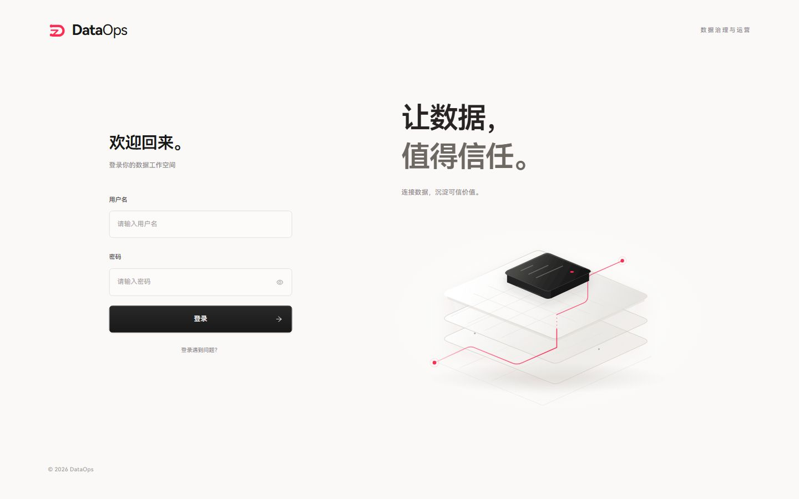
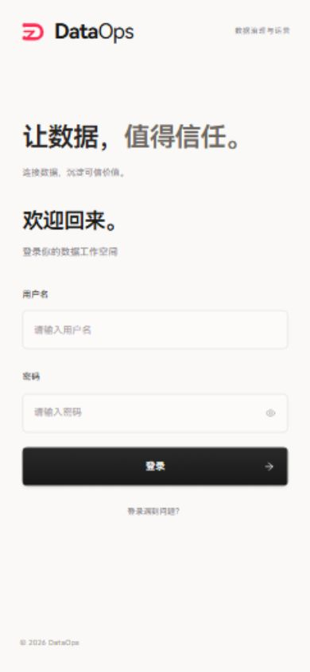

# 登录页 D 版接入验证

Date: 2026-10-04
Type: Implementation / Acceptance Evidence

用户在视觉评审后明确选定最终 D 版，并要求替换现有登录页、增加细微交互。这份记录是实现证据，不是新的 Product Decision 或 Feature Spec。

## 产品上下文与实现范围

| 必答项 | 本次判断 |
| --- | --- |
| User | 已有账号的数据生产、治理和消费使用者。 |
| Problem | 原登录入口缺少与当前红白黑品牌一致的商业质感；具体订单卡片会限制未来的行业表达。 |
| Capability | 既有用户名/密码登录的视觉和操作体验。 |
| User Journey | 进入 `/login` → 填写账号 → 提交认证 → 加载当前用户 → 返回原本访问的站内安全路径。 |
| Expected Outcome | 简洁、清晰、行业无关的登录入口，具备明确的输入、校验和提交反馈。 |
| Truth Owner | 身份、账号状态、权限及会话仍由现有 Security/account 服务拥有。装饰图没有业务事实或认证状态。 |
| Producer / Consumer | Security/account 产生认证结果和当前用户信息；现有前端状态与登录表单消费这些结果。 |
| Existing capabilities to reuse | `login`、`initialState.fetchUserInfo`、共享 Cookie 请求客户端、`getSafeReturnTo`、认证失败复位、统一通知、Ant Design Form 和 YakButton、`BRAND_CSS_VARIABLES`。 |
| E2E acceptance evidence | 真实 React 页面浏览器验证与下方截图；认证结果、重复提交、用户加载、错误提示及跳转使用现有测试入口回归。未使用真实账号完成后台认证 E2E。 |

产品语义沿用现有 Product Vision、ACCEPTED PD-001/PD-002；没有新增模块、导航、业务状态机或第二份业务真相。没有发现专门约束本次登录视觉更新的 APPROVED / IMPLEMENTING Feature Spec。

## 最终实现

- 暖白背景、近黑主操作、品牌红小范围点缀，桌面使用左侧表单与右侧价值表达。
- 行业无关的 SVG 数据分层图形作为装饰，直接随正式组件打包；不展示样例订单、运行指标或安全认证承诺。
- 密码显示切换、大写锁定提示、空值校验后聚焦首个错误字段、输入后清除认证错误。
- 提交过程中显示状态、禁用表单；提交事件与处理函数共同防止重复请求。
- 按钮、输入框和帮助入口提供焦点与悬停反馈；装饰图随鼠标轻微移动，触屏和减少动态效果偏好下关闭移动。
- 手机隐藏图形，保留价值标题和完整表单；页面内部可以纵向滚动。
- 登录帮助说明联系现有平台管理员。没有增加密码重置、注册或 SSO 接口。

认证 API、Cookie 策略和原有安全跳转策略保持原有契约。DataOps 标记仅接入本次批准的登录页设计，没有修改其他页面的共享品牌资产。

## 验证

| 检查 | 证据 / 结果 |
| --- | --- |
| 真实页面 | 本地开发服务 `/login`，不是 HTML 原型。 |
| 桌面 / 手机 | 1440×900、1024×768、390×844；图形加载正常，手机隐藏图形，表单和帮助入口可用。 |
| 操作 | 浏览器检查空表单校验及首字段焦点、密码显示/隐藏、登录帮助打开/关闭。 |
| 认证回归 | `LoginPanel.test.tsx`、`redirect.test.ts`、`request.test.tsx` 共 16 项通过。包含失败与锁定错误、重复提交保护、当前用户加载和安全返回路径。 |
| 类型 | `npm run check:types` 通过；保留仓库原有 139 条类型诊断，没有增加类型债。 |
| 格式 / 静态检查 | 修改的登录组件与测试通过 Biome lint；Git diff 无空白错误。 |
| 生产构建 | `npm run build` 通过，并生成前端构建清单。 |

## 原型归档

视觉评审的 A–E HTML、生成脚本、调研引用和截图已保存到本地 Git 分支 `codex/login-design-prototypes-20261004`，提交 `ffa3269089756b85d637c8dbe2326d1aa3ea72e3`。分支中的 `data-ops-ui/src/pages/login/prototype/README.md` 记录选定 D 的结论和各轮背景；正式页面不包含评审切换器或预览提交逻辑。

原型副本仍保留在当前任务的可视化工作目录中，可继续作为设计参考。未推送归档分支或发布页面。
