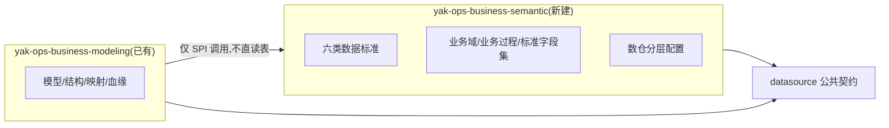

# M4 · 业务语义主线:整合方案与合并排期

> 输入:[new_requirement.md](./new_requirement.md)(派生建模需求)、[issues/new_issue.md](./issues/new_issue.md)(初版 30~47 ticket)
> 本文档是需求评审的结论固化:分析结论、四项修正决策、语义主线整合方案、与现有 P0/P1 的合并排期。
> 状态:v1.1(2026-09-14,增补决策 E 模块拆分),已与需求方对齐;v1.0(2026-09-10)

## 1. 评审结论

**方向认可**:派生建模、闭环原则、标准即规矩,是数据治理领域的成熟方向;new_issue 的 ticket 拆分与现有 01~29 的六个交汇点(08/05/19/23/27/25)标注准确。**但按初版字面执行会形成两条平行的语义主线**(逻辑模型 vs 业务过程字段集、来源映射 vs 分层映射、模型血缘 vs 标准字段血缘、两个建模入口),违反需求自己的"不重复建设"原则。因此先定整合方案,再排 ticket。

## 2. 核心整合决策(动工前必须遵守)

**决策 A —— 单一语义管道**:业务过程 + 标准字段集是逻辑建模的一种**语义来源**,不是第二条主线。派生建模(44)= 用标准字段集与上层模型**初始化物理模型草稿**,汇入现有编辑器(05/06)、保存管道(02)、映射表(43)、血缘(23 扩展 45)。全系统保持一个编辑器、一套模型存储、一条血缘管道。

**决策 B —— 冷启动反转**:标准库的主要填充手段是"逆向导入 → 沉淀为标准"(40),预置(31)只做骨架;38(自动套用)允许低命中率(失败降级原值并提示)。40 提前到 P0.5(依赖 32+08),不等 39。

**决策 C —— 消费者驱动界面**:六类标准**表结构一次建齐**(便宜、预留合理)。原定 32 管理界面首期只开命名+类型;**2026-09-14 用户确认六类管理界面全量开放**(后端校验与表结构本就按六类建齐,开放界面无额外成本),决策 C 剩余约束仅"界面随消费者演进"。

**决策 D —— 映射是派生的自动记录**:43 不是手工维护的配置矩阵,而是 44 派生动作的**自动写入记录**(标准字段 → 各层字段的继承关系);43 的编辑仅为补录修正。血缘(45)基于该记录,天然成立。

## 3. 修订后的闭环链路

```text
数据标准(30~32:六类表结构,六类管理界面全量开放)
   ↓ 被引用
业务域(33)→ 业务过程(34)→ 标准字段集(35:全局字段库+过程引用)→ 关联源表/模型(36)
   ↓ 定位
数仓分层管理(37:只存 std_naming_id 引用,不复制规则)
   ↓ 派生(决策 A)
44 按业务过程派生:选域→过程→带出字段集+上层模型→选层→预填→调整
   → 产出物理模型草稿(汇入 05/06 编辑器)
   → 自动写入 43 字段分层映射(决策 D)
   → 自动建立 45 标准字段血缘(走 23 血缘管道)
   ↓ 产出
47 业务过程主线视图(各层覆盖/状态/链路)
   ↓ 反哺
42 引用/绕过统计 → 40 沉淀为标准(逆向导入+字段编辑双入口)→ 标准优化
```

## 4. 依赖与范围修正(相对 new_issue)

| Ticket | 修正 |
| --- | --- |
| 30 | 验收追加:**同步给 05 字段表加 std_* 引用列并透传 DTO**(M4 前置,一次 V migration) |
| 31 | 预置只做骨架(命名前缀、少量类型映射);不承诺全量预置 |
| 32 | 界面首期仅命名+类型;码值/单位/口径/安全随消费场景开界面 |
| 35 | 改为**全局标准字段库 + 业务过程引用**(字段不随过程复制) |
| 38 | 明确冷启动降级预期;不得阻断逆向导入 |
| 40 | 依赖改为 32+**08**;入口双置:逆向导入审阅处 + 字段编辑处 |
| 43 | 定位改为**派生自动记录**(表结构先行,"自动写入"验收由 44 交付;编辑=补录) |
| 44 | 依赖改为 35/36/37/43 + 05;产出为物理模型草稿,不新建独立编辑器 |
| 39/41 | 保留 P1;41 注明推荐可升级为 agent 技能(与数据智能体协同) |
| 其余(33/34/36/37/45/46/47) | 依赖不变 |

## 5. 合并排期(交错,不整体插队)

```text
近期 P0 收尾:08 逆向导入 → 10 DDL 其余方言 → 11/12 ER 画布
   ↓ (08 同时是 36/38/40 的前置)
插入批 P0.5:30(含 05 预留列)→ 31 → 32(命名+类型)→ 33 → 34 → 35 → 36 → 37 → 38
                                              ↘ 40(沉淀,依赖 08)
P1 合并批:13~18 逻辑建模 → 19/20 映射 → 44 派生(复用 17 落点)→ 43 自动记录完善
          → 21/22 加工任务 → 23/24 血缘 → 45 → 41/42 → 25 统一视图 → 47 → 46
```

理由:M4 的价值大量依赖 19(43 的语义源)、23(45 的管道)、25(47 的底座),整体插队会把这些推走;而 30~38 与 P0 收尾无冲突,08 本身就是 36/38/40 的前置,顺路完成。

## 6. 对 new_requirement 五个重点问题的回答

1. **标准/业务过程/字段映射职责边界**:清晰。标准=规矩(类型/命名/码值/单位/口径/安全),业务过程=要什么(字段集+源表),映射=怎么落(各层物理化)。守住一条线:**35 存语义类型(std_type_id),43 存各层物理类型(layer_data_type),不得混用**。
2. **分层管理 vs 命名标准**:不重复。37 只存 `std_naming_id` 引用,不复制 rule_expr。
3. **业务过程与标准字段集关系**:关系合理,归属改为引用(全局字段库),避免跨过程复制。
4. **43 是否足以支撑继承与血缘**:按"手工配置"不足以(会失真);改为派生自动记录后足够,编辑仅补录。
5. **落地路线与预留**:阶段划分认可;"现在预留 std_* 字段否则伤筋动骨"说法夸大——全量替换存储加列是一次 migration 的事,但顺手做(并入 30)成本最低。

## 7. 与数据智能体(agent 模块)的协同

41(标准推荐)在 new_requirement 中已预留"后续可升级为 AI"。M4 的语义层(业务过程/标准字段/分层配置)正是数据智能体最缺的业务上下文:有语义依托的"建模助手"(字段推荐/映射建议/派生预填)远强于裸元数据问答。建议将"建模助手"列为 agent 模块改造后的首批技能,随 41/44 的落地同步接入。

## 8. 决策 E —— 模块拆分:semantic 独立模块(2026-09-14 已确认)

数据标准不混入 modeling,新建独立模块 `yak-ops-business-semantic`。与第 2 节决策 A 的关系:决策 A 说的是**管道统一**(全系统一个编辑器/一套存储/一条血缘),不是模块打包;semantic 独立成模块不违背决策 A。理由:标准的消费方不止建模(集成/开发/质量/服务/资产),它是被依赖的全局上游;生命周期不同(标准全局版本化、建模按项目推进)。

### 8.1 模块边界与依赖

| 模块 | 拥有 | 对外提供(SPI,全部只读或写自有数据) |
| --- | --- | --- |
| yak-ops-business-semantic(新建) | 六类数据标准、业务域/业务过程/标准字段集、业务过程↔源表关联、数仓分层配置 | StandardQueryApi / StandardRecommendApi / StandardCaptureApi / StandardUsageApi / ProcessApi / LayerConfigApi |
| yak-ops-business-modeling(已有) | 模型/结构/映射/血缘/版本 + std_*、process_id 等松散引用 | 现有 API + 影响分析(46)/主线视图(47)聚合 |



依赖规则:
- **仅 modeling→semantic 单向**;semantic 不 import modeling(compile-time 禁止,DEPENDENCIES.md 声明)。
- semantic→datasource:仅公共契约(36 连通性校验、37 库/数据源引用),不违反单向约束。
- **跨模块数据引用 = 松散 ID**(std_type_id/std_naming_id/std_code_id/std_unit_id/std_caliber_id/std_security_id、process_id、layer_id、std_field_id、std_process_field_id),无物理外键;展示名经 semantic SPI 批量解析——modeling 不解析语义内容、不 join semantic 表。
- 30 落地 modeling 侧预留列 V8(与 01 先例一致的"结构引用预留"一次 migration 做完)。

### 8.2 票据归属(相对第 4 节的修正)

| Ticket | 归属 | 修正点 |
| --- | --- | --- |
| 30~35、37 | semantic | 30 = 模块骨架票(Maven 接线+契约集+六类表+菜单 ≥V2019+错误码 42001+);迁移目录 yak-semantic 自持 |
| 36 | semantic(+datasource 契约) | **删除"业务过程模型关联表"**——模型↔过程归属是 modeling 数据(44 写 process_id);已建模型经 modeling API 只读展示(前端组合) |
| 38/39 | modeling 消费 | 经 SPI 查询,不直读表;采纳/覆盖事件为 42 上报源 |
| 40 | 跨模块 | semantic `StandardCaptureApi` + modeling 双入口 UI;两侧契约先行 |
| 41 | semantic(SPI) + modeling(UI) | `StandardRecommendApi`;agent 技能复用同一 SPI |
| 42 | 跨模块(**修正:推送式**) | 引用/绕过行为发生在 modeling,semantic 不得反向读 modeling 表 → modeling 埋点上报(`StandardUsageApi`,异步容错)→ semantic 聚合展示 |
| 43/44/45 | modeling | std_* / process_field_id / std_field_id 松散引用;展示名经 SPI 解析 |
| 46 | modeling(**修正**) | 血缘与 std 引用都在 modeling,影响分析引擎后端归 modeling;semantic 详情页**前端跳转**(带 stdId),无后端反向依赖 |
| 47 | modeling(**修正**) | 过程清单经 `ProcessApi`;覆盖/状态/血缘聚合在 modeling;UI 挂 25 扩展;semantic 过程详情页前端跳转 |

### 8.3 项目空间归属(scoping,新增假设 A8)

semantic 全部业务表**带 project_id(PROJECT_REQUIRED,与平台一致)**;"数据标准是全局规范层"指**模块级全局**(独立于建模、全平台模块可消费),不是跨项目共享行。预置标准 = 平台级模板表(无 project_id)+ 幂等"初始化预置标准"端点(31)。未来若需跨项目共享标准库,再加"平台标准库 + 项目订阅"扩展,本期不做。

### 8.4 风险与权衡

1. **契约同步成本翻倍**:跨模块票(40/41/42/46/47)两侧契约都要先行——已在各票验收项显式列出。
2. **SPI 演进漂移**:semantic SPI 只加不改(兼容策略),breaking 变更需评审;modeling DEPENDENCIES.md 记录消费的 SPI 清单。
3. **过早拆分回退成本低**:若最终仅 modeling 消费,semantic 并回 modeling 只是包移动(实体/SPI 结构不变)——先拆是低后悔决策。
4. **方案 B 触发条件**(标准与业务域拆两模块):出现第二个独立演进标准能力的团队/独立发布节奏时再拆,当前不拆。
5. **命名已无冲突**:旧 future 分支语义层代码已从 agent 模块移除(2026-09-14),`io.yak.ops.business.semantic` 包根空闲;旧语义功能残留(V2017 迁移、ontology/semantic-calibers 页面)已经负责人确认删除(2026-09-14)。

### 8.5 展开文档

- 模块设计与方法级 SPI 契约:[docs/semantic/module-design.md](../../semantic/module-design.md)(ticket 30 契约文件集的直接输入)
- 30~47 issues 复审记录(12 处缺口补充 + 新增票 48):[docs/semantic/issue-review-2026-09-14.md](../../semantic/issue-review-2026-09-14.md)
- 索引:[docs/semantic/README.md](../../semantic/README.md)
