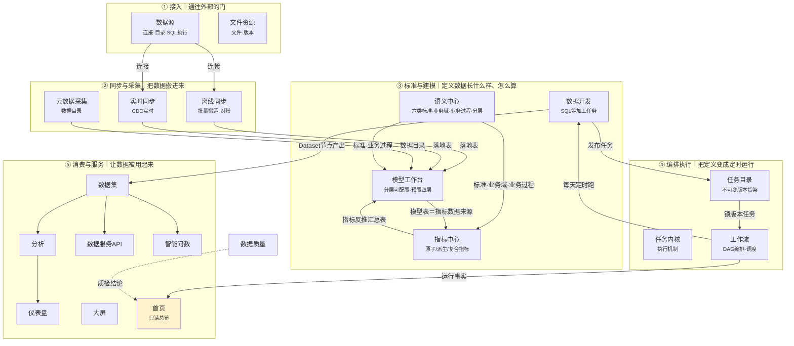
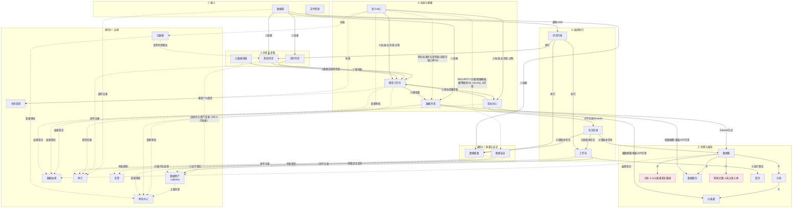

# 04 · 主脉与模块交互图（给用户和产品经理）

> 状态：v0.2（经第一次 review：修图二血缘主语/分层口径/乱象标注；新增违禁词 CI 检查）
> 日期：2026-09-21
> 用法：**图一看懂产品全貌，图二看清模块交互与已知乱象**。配《05-模块交互与乱象清单》使用（清单是图的文字版+影响分析）。
> 说明：图是 Mermaid 格式，在 VS Code / GitHub / Typora 直接渲染；也可用浏览器打开同目录 `主脉图.html`。

---

## 图一 · 主脉图：一条数据的旅程

**读图三句话**：
1. 数据从左上流向右下：接进来 → 搬进来 → 定规矩建模型 → 定时跑 → 被用起来；
2. 中间③最重：先有标准（语义），再有指标，再有表（模型），再有加工任务——**顺序不能反**；
3. 指标和建模之间是双向箭头（唯一一对）：建汇总表听指标的，指标的数据来源来自模型。

---

## 图二 · 交互全景图：模块间谁传给谁什么 + 已知乱象

**图例**：实线＝主数据流（标注传的是什么）；虚线＝治理/横切交互；⚠️＝已发现的乱象或待办（详见 05 清单）。

**乱象标注说明**：
- **大屏与仪表盘重复嫌疑**：两者资产生命周期机制疑似各写一套，待核实（核实后定合并或下沉共用）；
- **智能问数未过准入闸**：176 个文件的大模块直接进构建，未声明主轴位置与消费契约；
- **元数据目录并入资产目录**：这不是乱象，是 M2-2「目录三聚一」已拍板设计的落地（V2037），数据出处标注已于 2026-09-21 补上（详见 05 清单 R-2）。
- **指标中心入口**：已于 2026-09-21 从「消费与服务」迁至「标准与建模」组，与主轴③一致（随前端构建生效）。
- **指标无 MTR→APR 边**：不是遗漏，是 2026-09-22 缺口单 08 裁决（方案 B「指标定义不过审批闸」，见 05 清单 R-12）；重启条件与 R-4 发布模型联动，过闸时新增 METRIC_PUBLISH 流程码而非继承资产层。

---

## 这张图怎么用

1. **新人/产品经理**：只看图一，五分钟建立全貌；
2. **吵架仲裁**：模块边界、该谁传给谁什么，见图二+05 清单——**用图说话，不凭印象**；
3. **需求评审**：新功能先在图二上找到落点，能标出来龙去脉才允许进开发（对应 D-5 上线前检查）。
